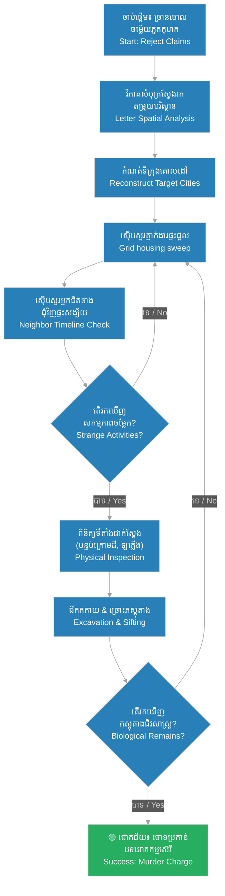

# Frank Geyer's Investigative Methodology (វិធីសាស្ត្រស៊ើបអង្កេតរបស់លោក Frank Geyer)

**Author:** ichamrong  
**Date:** 2026-06-05  
**Tags:** #frank-geyer #investigation-methods #forensics #crime-history  
**Category:** Biographies  
**Read Time:** ~10 min  

---

## 📌 មាតិកា (Table of Contents)
- [សេចក្តីផ្តើម៖ បុព្វបុរសនៃការស៊ើបអង្កេតវិទ្យាសាស្ត្រ (Intro: The Pioneer of Scientific Investigation)](#0)
- [១. ដំណាក់កាលទី ១៖ វិភាគសំបុត្រ និងតម្រុយបរិស្ថាន (1. Phase 1: Decoy Letter & Environmental Analysis)](#1)
- [២. ដំណាក់កាលទី ២៖ នីតិវិធីស្វែងរកជាប្រព័ន្ធតាមផ្ទះជួល (2. Phase 2: Systematic Housing Grid Sweeps)](#2)
- [៣. ដំណាក់កាលទី ៣៖ ស៊ើបសួរអ្នកជិតខាង និងតាមដានសម្ភារ (3. Phase 3: Landlord Interviews & Tool Tracking)](#3)
- [៤. ដំណាក់កាលទី ៤៖ ការជីកកកាយ និងច្រោះភស្តុតាង (4. Phase 4: Cellar Excavation & Ash Sifting)](#4)
- [៥. ដំណាក់កាលទី ៥៖ យន្តការសហការឆ្លងដែនសមត្ថកិច្ច (5. Phase 5: Cross-Jurisdictional Protocol)](#5)
- [៦. ដ្យាក្រាមវដ្តស៊ើបអង្កេតរបស់លោក Geyer (Geyer's Investigative Loop Diagram)](#6)
- [សេចក្តីសន្និដ្ឋាន (Conclusion)](#7)
- [🔗 ឯកសារទាក់ទង (Related Topics)](#8)
- [ឯកសារយោង (References)](#9)

---

## សេចក្តីផ្តើម៖ បុព្វបុរសនៃការស៊ើបអង្កេតវិទ្យាសាស្ត្រ (Intro: The Pioneer of Scientific Investigation)

> **«ការ​ស៊ើបអង្កេត​មិនមែន​ជា​ការ​ទាយ​ទុក​មុន​នោះ​ទេ ប៉ុន្តែ​វា​គឺ​ជា​ការ​ផ្គុំ​បំណែក​ព័ត៌មាន​តូចៗ​រហូតដល់​លេចចេញ​ជា​រូបភាព​ពិត។» — Frank Geyer**  
> *(“Investigation is not about guesswork; it is about assembling microscopic pieces of information until the truth reveals itself.” — Frank Geyer)*

នៅ​ចុង​សតវត្សរ៍​ទី ១៩ ក្នុង​យុគសម័យ Gilded Age ប្រព័ន្ធ​ប៉ូលីស​ភាគច្រើន​ដំណើរការ​ដោយ​គ្មាន​លក្ខណៈ​វិទ្យាសាស្ត្រ និង​ពឹងផ្អែក​តែ​លើ​សាក្សី​ភ្នែក​ឃើញ ឬ​ការ​សារភាព​ដោយ​បង្ខំ។ លោក Frank Geyer បាន​ផ្លាស់ប្តូរ​ផ្នត់គំនិត​នេះ​ទាំងស្រុង ដោយ​ការ​បង្កើត​វិធីសាស្ត្រ​ស៊ើបអង្កេត​ជា​ប្រព័ន្ធ និង​យន្តការ​ស្វែងរក​ភស្តុតាង​ផ្អែកលើ​ហេតុផល​វិទ្យាសាស្ត្រ ដែល​ក្រោយមក​បាន​ក្លាយ​ជា​គំរូ​នៃ​ការ​ស៊ើបអង្កេត​សម័យទំនើប។

In the late 19th century, during the Gilded Age, policing was unscientific, relying heavily on eyewitnesses or coerced confessions. Frank Geyer revolutionized this landscape by introducing systematic investigation methodologies and logical tracking procedures that became blueprints for modern criminal detection.

---

## ១. ដំណាក់កាលទី ១៖ វិភាគសំបុត្រ និងតម្រុយបរិស្ថាន (1. Phase 1: Decoy Letter & Environmental Analysis)

ជំហាន​ដំបូង​បង្អស់​របស់ Geyer គឺ​ការ​មិន​ជឿ​លើ​ចម្លើយ​សារភាព​របស់ H.H. Holmes ដែល​អះអាង​ថា​កុមារ​ទាំង ៣ នាក់​រស់នៅ​សុខសាន្ត​នៅ​ប្រទេស​អង់គ្លេស។ Geyer បាន​ចាប់ផ្តើម​វិភាគ​ឯកសារ​ពិតប្រាកដ​ដែល​រកឃើញ​ក្នុង​សម្ភារៈ​របស់ Holmes។

Geyer’s first procedural step was rejecting H.H. Holmes’ claim that the three Pitezel children were living safely in England. Instead, he analyzed physical evidence recovered from Holmes’ possessions.

* **ការអនុវត្ត (The Method):** Geyer បាន​ប្រមូល​សំបុត្រ​ជាច្រើន​ច្បាប់​ដែល​កុមារ Pitezel សរសេរ​ទៅកាន់​ម្តាយ ប៉ុន្តែ Holmes មិនបាន​ផ្ញើ​ចេញ។ គាត់​បាន​អាន​រាល់​បន្ទាត់ ដើម្បី​ស្វែងរក​តម្រុយ​បរិស្ថាន ដូចជា ឈ្មោះ​ទន្លេ អាកាសធាតុ សណ្ឋាគារ ឬ​ទេសភាព​ជុំវិញ​ដែល​កុមារ​បាន​សរសេរ​រៀបរាប់។
* **លទ្ធផល (The Result):** ទោះបីជា​សំបុត្រ​មិនបាន​បញ្ជាក់​ពី​ទីក្រុង​ច្បាស់លាស់ តែ Geyer អាច​ដឹង​ថា​ពួកគេ​ធ្វើដំណើរ​ឆ្លងកាត់​រដ្ឋ​ណា​ខ្លះ និង​ទីតាំង​ភូមិសាស្ត្រ​ច្បាស់លាស់។
* **The Method (English):** Geyer analyzed unmailed letters written by the children to their mother. He scanned every line for environmental and spatial clues, such as descriptions of nearby lakes, hotels, weather, or local landmarks.
* **The Result (English):** Despite the lack of explicit addresses, Geyer successfully reconstructed Holmes’ geographic travel pattern and listed target cities.

---

## ២. ដំណាក់កាលទី ២៖ នីតិវិធីស្វែងរកជាប្រព័ន្ធតាមផ្ទះជួល (2. Phase 2: Systematic Housing Grid Sweeps)

បន្ទាប់ពី​កំណត់​ទីក្រុង​គោលដៅ Geyer បាន​អនុវត្ត​នីតិវិធី «ស្វែងរក​ជា​ប្រឡោះ​ក្រឡាចត្រង្គ» (Grid Search Pattern) ដោយ​ចុះ​ស៊ើបសួរ​ផ្ទាល់​តាម​តំបន់​នីមួយៗ។

Upon arriving in target cities, Geyer initiated a localized grid search pattern, mapping real estate agents and lodging houses.

* **ការអនុវត្ត (The Method):** Geyer មិន​ស្វែងរក​ដោយ​គ្មាន​ទិសដៅ​ឡើយ។ គាត់​បាន​ទាក់ទង​ភ្នាក់ងារ​អចលនទ្រព្យ ម្ចាស់​ផ្ទះជួល និង​បញ្ជី​សណ្ឋាគារ​ទាំងអស់​ក្នុង​ក្រុង។ គាត់​បាន​ដើរ​សួរ​ផ្ទះ​នីមួយៗ​ដោយ​បង្ហាញ​រូបថត​កុមារ Pitezel និង H.H. Holmes។
* **លទ្ធផល (The Result):** វិធីសាស្ត្រ​ដ៏​ហ្មត់ចត់​នេះ​បាន​អនុញ្ញាត​ឱ្យ​គាត់​រកឃើញ​ផ្ទះជួល​តូច​មួយ​នៅ​ផ្លូវ 16 St. Vincent Street ក្នុង​ទីក្រុង Toronto ដែល Holmes បាន​ជួល​ស្នាក់នៅ។
* **The Method (English):** Geyer systematically contacted every major real estate agency, landlord association, and hotel registry in each city. Armed with photographs of Holmes and the Pitezel children, he went door-to-door.
* **The Result (English):** This meticulous grid search led him to a small rented cottage at 16 St. Vincent Street in Toronto, Canada.

---

## ៣. ដំណាក់កាលទី ៣៖ ស៊ើបសួរអ្នកជិតខាង និងតាមដានសម្ភារ (3. Phase 3: Landlord Interviews & Tool Tracking)

មុនពេល​សម្រេចចិត្ត​ឆែកឆេរ​ទីតាំង​នីមួយៗ Geyer តែងតែ​ធ្វើការ​ស៊ើបសួរ​អ្នកជិតខាង​ជុំវិញ​ផ្ទះជួល ដើម្បី​យល់​ពី​ឥរិយាបថ និង​សកម្មភាព​ប្រចាំថ្ងៃ​របស់ Holmes។

Before executing searches, Geyer interviewed neighbors surrounding the suspect properties to reconstruct Holmes' timeline and movements.

* **ការអនុវត្ត (The Method):** គាត់​បាន​សួរ​អ្នកជិតខាង​អំពី​រាល់​សកម្មភាព​ចម្លែកៗ​របស់ Holmes ក្នុង​អំឡុងពេល​ស្នាក់នៅ ជាពិសេស​ការ​ទិញ ឬ​ខ្ចី​ឧបករណ៍​នានា។
* **លទ្ធផល (The Result):** អ្នកជិតខាង​ម្នាក់​បាន​ប្រាប់​ថា Holmes បាន​មក​ខ្ចី​ប៉ែល (Spade) ជីកដី​យក​ទៅ​ប្រើ​ក្នុង​បន្ទប់​ក្រោមដី និង​បាន​ឃើញ Holmes ដឹក​ឡាំង​ឈើ​ធំ​មួយ​ចូល​ផ្ទះ។ ព័ត៌មាន​នេះ​បាន​ចង្អុលបង្ហាញ​យ៉ាង​ច្បាស់​ពី​កន្លែង​ដែល​ត្រូវ​រុករក។
* **The Method (English):** Geyer questioned neighbors about Holmes' unusual activities, focusing specifically on borrowed tools or heavy deliveries.
* **The Result (English):** Neighbors recalled Holmes borrowing a spade to work in the cellar and transporting a heavy wooden crate. This targeted Geyer's search directly to the basement floor.

---

## ៤. ដំណាក់កាលទី ៤៖ ការជីកកកាយ និងច្រោះភស្តុតាង (4. Phase 4: Cellar Excavation & Ash Sifting)

Geyer មិន​គ្រាន់តែ​ធ្វើការ​ត្រួតពិនិត្យ​ផ្នែក​ខាងក្រៅ​នោះ​ទេ គាត់​បាន​អនុវត្ត​ការ​រុករក​រហូតដល់​ក្រោម​ផ្ទៃដី និង​ការ​ច្រោះ​រក​ភស្តុតាង​តូចៗ (Physical Sifting)។

Geyer rejected superficial inspections, employing physical excavation and ash sifting protocols to find hidden biological remains.

* **ការអនុវត្ត (The Method):** 
  1. **ការ​ជីកដី​បន្ទប់​ក្រោមដី (Cellar Excavation):** នៅ​ផ្ទះជួល Toronto គាត់​បាន​ចុះទៅ​ពិនិត្យ​ដី និង​បាន​កត់សម្គាល់​ឃើញ​ដី​ទើបតែ​ជីក​ថ្មីៗ។ គាត់​បាន​បញ្ជា​ឱ្យ​ជីកដី​ជម្រៅ ៣ ហ្វីត រហូតដល់​រកឃើញ​សាកសព Alice និង Nellie។
  2. **ការ​ច្រោះ​ផេះ​បំពង់ផ្សែង (Ash Sifting):** នៅ​ទីក្រុង Indianapolis គាត់​បាន​ត្រួតពិនិត្យ​ឡដុត និង​បំពង់ផ្សែង។ គាត់​បាន​យក​ផេះ​ទាំងអស់​មក​ច្រោះ​យ៉ាង​លម្អិត។
* **លទ្ធផល (The Result):** គាត់​បាន​រកឃើញ​បំណែក​ឆ្អឹង និង​ធ្មេញ​តូចៗ​របស់ Howard Pitezel ដែល Holmes បាន​ដុត​បំផ្លាញ​ភស្តុតាង។
* **The Method (English):** 
  1. **Cellar Excavation:** In Toronto, noting freshly disturbed soil on the cellar floor, Geyer excavated 3 feet deep until finding the shallow grave containing the bodies of Alice and Nellie.
  2. **Ash Sifting:** In Indianapolis, Geyer dismantled a coal furnace and fireplace, sifting through all soot and ashes.
* **The Result (English):** He recovered small teeth and bone fragments belonging to young Howard Pitezel, proving Holmes had cremated the boy.

---

## ៥. ដំណាក់កាលទី ៥៖ យន្តការសហការឆ្លងដែនសមត្ថកិច្ច (5. Phase 5: Cross-Jurisdictional Protocol)

យន្តការ​ដ៏​សំខាន់​មួយ​ទៀត​គឺ​ការ​ដោះស្រាយ​បញ្ហា​ព្រំដែន​សមត្ថកិច្ច (Jurisdictional Limits) ដែល​ជា​ឧបសគ្គ​ធំបំផុត​របស់​ប៉ូលីស​នៅ​សតវត្សរ៍​ទី ១៩។

Geyer solved the greatest barrier to 19th-century law enforcement: fragmented geographic jurisdictions.

* **ការអនុវត្ត (The Method):** ជំនួស​ឱ្យ​ការ​រង់ចាំ​ការអនុញ្ញាត​ផ្លូវការ​ពី​រដ្ឋ​នីមួយៗ ដែល​មាន​ភាព​យឺតយ៉ាវ Geyer បាន​ប្រើប្រាស់​កិច្ចសហការ​ជាមួយ​ភ្នាក់ងារ​ឯកជន Pinkertons និង​ការ​ផ្តល់​មូលនិធិ​ពី​ក្រុមហ៊ុន​ធានារ៉ាប់រង Fidelity Mutual Life Association។
* **លទ្ធផល (The Result):** គាត់​អាច​ធ្វើដំណើរ​ស៊ើបសួរ​ទូទាំង​សហរដ្ឋអាមេរិក និង​ឆ្លងចូល​ប្រទេស​កាណាដា​ដោយ​សេរី និង​មាន​ប្រសិទ្ធភាព​ខ្ពស់។
* **The Method (English):** Instead of waiting for slow state-level extraditions or permissions, Geyer partnered with the private Pinkerton Agency and utilized financial backing from the Fidelity Mutual Life Association.
* **The Result (English):** This allowed him to cross state and international lines freely, bypassing local bureaucratic delays.

---

## ៦. ដ្យាក្រាមវដ្តស៊ើបអង្កេតរបស់លោក Geyer (Geyer's Investigative Loop Diagram)

ដ្យាក្រាម​ខាងក្រោម​បង្ហាញ​ពី​វដ្ត​ការងារ​ជា​ប្រព័ន្ធ​ដែល Geyer បាន​ប្រើប្រាស់​ដើម្បី​តាមដាន និង​ប្រមូល​ភស្តុតាង៖

The following diagram illustrates the systematic investigative loop Geyer utilized to trace and secure convictions:

---

## សេចក្តីសន្និដ្ឋាន (Conclusion)

> **«កាតព្វកិច្ច​របស់​អ្នក​ស៊ើបអង្កេត មិនមែន​ត្រឹមតែ​ចាប់​ខ្លួន​ឧក្រិដ្ឋជន​នោះ​ទេ ប៉ុន្តែ​គឺ​ការ​លាតត្រដាង​ការពិត​ដើម្បី​ផ្តល់​យុត្តិធម៌។» — Frank Geyer**
> 
> **“The duty of a detective is not merely to arrest the criminal, but to uncover the truth to bring justice.”**

វិធីសាស្ត្រ​ស៊ើបអង្កេត​របស់​លោក Frank Geyer បាន​បង្ហាញ​ថា ការ​ធ្វើការងារ​ដោយ​ក្តី​អាណិតអាសូរ គួបផ្សំ​នឹង​នីតិវិធី​វិទ្យាសាស្ត្រ​ដ៏​ហ្មត់ចត់ គឺ​ជា​អាវុធ​ដ៏​មាន​ឥទ្ធិពល​បំផុត​ប្រឆាំង​នឹង​ឧក្រិដ្ឋជន​ដ៏​ឆ្លាតវៃ។ នីតិវិធី​ទាំងនេះ​បាន​បន្សល់ទុក​នូវ​កេរដំណែល​ជា​គំរូ​រហូតមកដល់​បច្ចុប្បន្ន។

Detective Frank Geyer's investigation showed that empathy, paired with structured scientific procedures, is the most powerful weapon against intelligent criminals. His procedures remain a cornerstone of criminal justice history.

---

## 🔗 ឯកសារទាក់ទង (Related Topics)
*   [ការស៊ើបអង្កេតករណី H.H. Holmes](02-h-h-holmes-investigation.md) — ដំណើរការ​លម្អិត​នៃការ​ស្វែងរក​កុមារ និង​ការ​ចាប់ខ្លួន Holmes។
*   [ជីវប្រវត្តិលោក Frank Geyer](03-detective-frank-geyer.md) — ជីវប្រវត្តិ និង​មូលហេតុ​នៃ​ការ​លះបង់​ក្នុង​សំណុំរឿង​នេះ។
*   [ជីវប្រវត្តិ H.H. Holmes](01-h-h-holmes-biography.md) — ជីវប្រវត្តិនៃឃាតករស៊េរីដំបូងបង្អស់របស់អាមេរិក។

---

## ឯកសារយោង (References)
*   **Frank Geyer** — *The Holmes-Pitezel Case: A History of the Greatest Crime of the Century and of the Search for the Missing Pitezel Children* (1896)។ កំណត់ត្រា​ការងារ​ផ្លូវការ​របស់ Geyer។
*   **J.D. Crighton** — *Detective Frank Geyer: The Real Detective Who Tracked H. H. Holmes* (2017)។ ការស្រាវជ្រាវ​ប្រវត្តិសាស្ត្រ​អំពី​ប្រវត្តិរូប​ពិត​របស់ Geyer។
