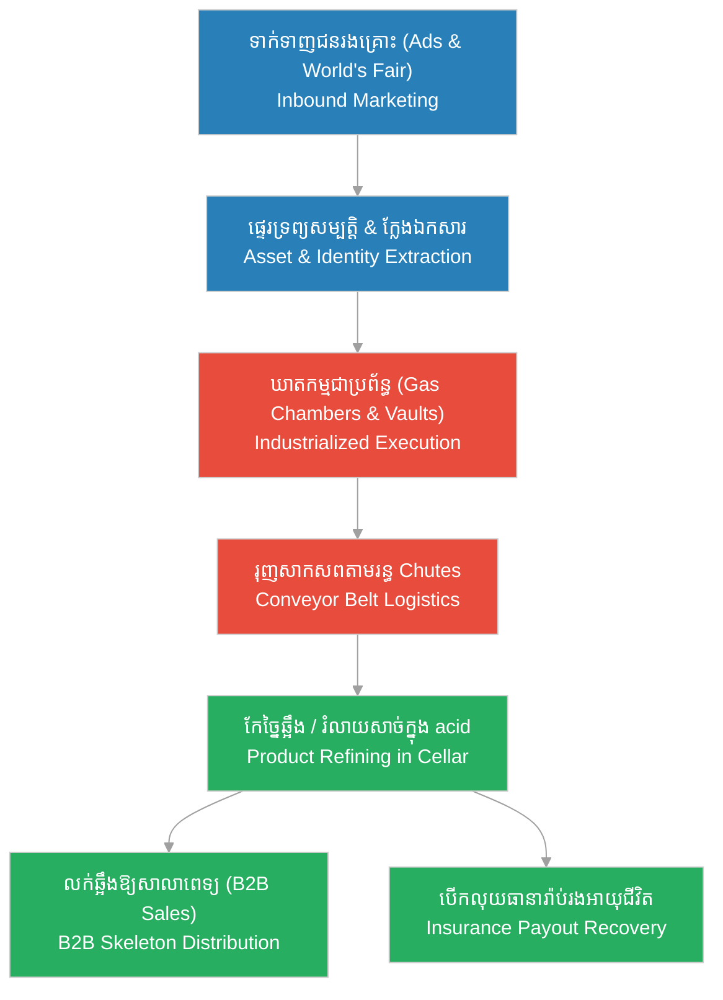

# H.H. Holmes' Crime-as-a-Business Model (យន្តការអាជីវកម្មឧក្រិដ្ឋកម្មរបស់ H.H. Holmes)

**Author:** ichamrong  
**Date:** 2026-06-05  
**Tags:** #hh-holmes #crime-business #gilded-age #chicago #insurance-fraud #sociopath  
**Category:** Biographies  
**Read Time:** ~15 min  

---

## 📌 មាតិកា (Table of Contents)
- [សេចក្តីផ្តើម៖ ឧក្រិដ្ឋកម្មជាប្រព័ន្ធអាជីវកម្ម (Intro: Crime as an Industrial System)](#0)
- [១. សសរស្តម្ភទាំង ៥ នៃអាជីវកម្មឧក្រិដ្ឋកម្មរបស់ Holmes (1. The 5 Pillars of Holmes' Criminal Enterprise)](#1)
- [២. ដើមកំណើតនៃការរៀនសូត្រ៖ និស្សិតពេទ្យ និងទីផ្សារសាកសព (2. Educational Origins: Medical Studies & The Corpse Market)](#2)
- [៣. ដើមកំណើតនៃការរៀនសូត្រ៖ ឱសថការី និងការគ្រប់គ្រងហាងលក់រាយ (3. Business Origins: Pharmacy & Retail Management)](#3)
- [៤. ដើមកំណើតនៃការរៀនសូត្រ៖ យុគសម័យ Gilded Age និងពួកចោរប្លន់មូលធន (4. Environmental Origins: The Gilded Age & Robber Barons)](#4)
- [៥. ដ្យាក្រាមខ្សែសង្វាក់ផលិតកម្មឧក្រិដ្ឋកម្ម (The Criminal Assembly Line Flow)](#5)
- [សេចក្តីសន្និដ្ឋាន (Conclusion)](#6)
- [🔗 ឯកសារទាក់ទង (Related Topics)](#7)
- [ឯកសារយោង (References)](#8)

---

## សេចក្តីផ្តើម៖ ឧក្រិដ្ឋកម្មជាប្រព័ន្ធអាជីវកម្ម (Intro: Crime as an Industrial System)

> **«នៅក្នុងប្រវត្តិសាស្ត្រឧក្រិដ្ឋកម្ម ឃាតករភាគច្រើនសម្លាប់មនុស្សដោយសារតែអារម្មណ៍ឆេវឆាវ កំហឹង ឬតណ្ហា។ ប៉ុន្តែ H.H. Holmes បានផ្លាស់ប្តូរវាទៅជាប្រតិបត្តិការអាជីវកម្មមួយ ដែលមានការគិតគូរពីប្រាក់ចំណេញ ថ្លៃដើម និងខ្សែសង្វាក់ផលិតកម្មច្បាស់លាស់។»**  
> *(“In criminal history, most killers acted on impulse, rage, or passion. However, H.H. Holmes transformed crime into a commercial operation, complete with profit margins, cost analysis, and a structured assembly line.”)*

មុនពេល H.H. Holmes លេចមុខឡើង ករណីឃាតកម្មស៊េរីភាគច្រើន ដូចជាករណី Jack the Ripper នៅឡុងដ៍ គឺកើតឡើងដោយគ្មានការរៀបចំគម្រោងវែងឆ្ងាយ និងពឹងផ្អែកលើឱកាសចៃដន្យ។ ប៉ុន្តែ Holmes បាននាំយកទស្សនវិស័យថ្មីមួយមកកាន់ពិភពឧក្រិដ្ឋកម្ម គឺការធ្វើឱ្យឧក្រិដ្ឋកម្មក្លាយជា «ឧស្សាហកម្ម» (Industrialized Crime)។ គាត់បានប្រើប្រាស់ប្រព័ន្ធគ្រប់គ្រងអាជីវកម្ម ដោយបន្ស៊ីគ្នារវាងចំណេះដឹងបច្ចេកទេស ផែនការភស្តុភារ យុទ្ធសាស្ត្រល្បួងអតិថិជន និងការលុបបំបាត់ភស្តុតាង ដើម្បីទាញយកផលប្រយោជន៍ហិរញ្ញវត្ថុអតិបរមាពីជនរងគ្រោះម្នាក់ៗ។

Before H.H. Holmes, serial murders were largely chaotic and opportunistic events, exemplified by cases like Jack the Ripper. Holmes introduced a chilling new paradigm: industrialized crime. By combining technical knowledge, logistical planning, marketing strategies, and systematic disposal, he operated his crimes with the structured efficiency of a Gilded Age corporation.

---

## ១. សសរស្តម្ភទាំង ៥ នៃអាជីវកម្មឧក្រិដ្ឋកម្មរបស់ Holmes (1. The 5 Pillars of Holmes' Criminal Enterprise)

ដើម្បីកសាងអាជីវកម្មខុសច្បាប់ដ៏ធំធេងនេះ Holmes បានពឹងផ្អែកលើសសរស្តម្ភចំនួន ៥ ដែលដូចគ្នាទៅនឹងការគ្រប់គ្រងសាជីវកម្មសម័យទំនើប៖

Holmes relied on five fundamental corporate pillars to construct his horrific business model:

*   **១. ជំនាញ និងចំណេះដឹង (Skill & Knowledge)៖** គាត់មានសញ្ញាបត្រពេទ្យ ដែលជាចំណេះដឹងបច្ចេកទេសដ៏ខ្ពង់ខ្ពស់ក្នុងការគ្រប់គ្រងសាកសព សារធាតុគីមី និងថ្នាំបំពុល។ លើសពីនេះ គាត់មានជំនាញខាងចិត្តសាស្ត្របញ្ចុះបញ្ចូល និងមន្តស្នេហ៍ល្បួងមនុស្ស។
*   **២. ការរៀបចំគម្រោង និងការសម្ងាត់ (Planning & Operational Security)៖** គាត់បានរចនា «វិមានឃាតកម្ម» ដោយប្រើប្រាស់វិធីសាស្ត្របំបែកប្លង់សាងសង់ (Compartmentalization) ដើម្បីកុំឱ្យជាងសំណង់ណាម្នាក់ដឹងពីប្លង់សរុប។ គាត់រៀបចំផ្លូវវង្វេង បន្ទប់ហ្គាស និងច្រកសម្ងាត់យ៉ាងល្អិតល្អន់។
*   **៣. បណ្តាញមនុស្ស និងដៃគូ (Strategic Network)៖** គាត់មិនបានធ្វើការតែម្នាក់ឯងឡើយ។ គាត់មានដៃគូដូចជា Benjamin Pitezel សម្រាប់ជួយការងាររូបវន្ត និងការបោកប្រាស់ ព្រមទាំងមានទំនាក់ទំនងជាមួយមេធាវីពុករលួយ និងសាលាពេទ្យដែលជាអ្នកទិញផលិតផលឆ្អឹងរបស់គាត់។
*   **៤. ការផ្សព្វផ្សាយ និងការទាក់ទាញ (Target Marketing)៖** គាត់ប្រើការចុះផ្សាយពាណិជ្ជកម្មតាមកាសែត ដើម្បីល្បួងស្ត្រីវ័យក្មេងឱ្យមកធ្វើការ ឬមកស្នាក់នៅក្នុងសណ្ឋាគាររបស់គាត់។ ពិព័រណ៍ពិភពលោកឆ្នាំ ១៨៩៣ គឺជាឱកាសទីផ្សារដ៏ធំដែលនាំមកនូវជនរងគ្រោះរាប់ម៉ឺននាក់មកកាន់មាត់ទ្វាររបស់គាត់។
*   **៥. ការគ្រប់គ្រង និងការប្រតិបត្តិ (Operations & Asset Extraction)៖** ជនរងគ្រោះម្នាក់ៗគឺជា «វត្ថុធាតុដើម»។ គាត់ទាញយកទ្រព្យសម្បត្តិទាំងអស់ពីពួកគេជាមុន (ដីធ្លី លុយកាក់ គ្រឿងអលង្ការ) រួចទើបសម្លាប់ពួកគេដើម្បីយកលុយធានារ៉ាប់រង ឬកែច្នៃសាកសពជាគ្រោងឆ្អឹងសម្រាប់លក់។

---

## ២. ដើមកំណើតនៃការរៀនសូត្រ៖ និស្សិតពេទ្យ និងទីផ្សារសាកសព (2. Educational Origins: Medical Studies & The Corpse Market)

មនុស្សជាច្រើនឆ្ងល់ថា តើ Holmes ទទួលបានគំនិតបំប្លែងមនុស្សស្លាប់ទៅជាលុយដោយរបៀបណា? ចម្លើយគឺស្ថិតនៅក្នុងសម័យកាលដែលគាត់រៀននៅ **សាកលវិទ្យាល័យ Michigan (University of Michigan Medical School)** ចន្លោះឆ្នាំ ១៨៨២ ដល់ ១៨៨៤។

How did Holmes learn to monetize death? The blueprint was formed during his medical training:

*   **តម្រូវការទីផ្សារងងឹត (The Black Market for Cadavers)៖** ក្នុងទសវត្សរ៍ឆ្នាំ ១៨៨០ សាលាពេទ្យទូទាំងសហរដ្ឋអាមេរិកជួបប្រទះការខ្វះខាតសាកសពយ៉ាងខ្លាំងសម្រាប់ការសិក្សាផ្នែកកាយវិភាគវិទ្យា (Anatomy Dissection) ដោយសារច្បាប់តឹងរ៉ឹង។ ស្ថានភាពនេះបានបង្កើតឱ្យមាន «ទីផ្សារងងឹតសាកសព» ដ៏មានតម្លៃ។ ក្រុមលួចសាកសពពីផ្នូរ (Grave Robbers) អាចលក់សាកសពមួយបានតម្លៃខ្ពស់ទៅឱ្យសាលាពេទ្យនានា។ Holmes បានឃើញផ្ទាល់ភ្នែកថា **«រាងកាយរបស់មនុស្សគឺជាទំនិញដែលមានតម្លៃសាច់ប្រាក់ខ្ពស់»**។
*   **ការសាកល្បងធានារ៉ាប់រងដំបូង (First Insurance Experiments)៖** ក្នុងនាមជានិស្សិតមន្ទីរពិសោធន៍កាយវិភាគវិទ្យា Holmes បានចាប់ផ្តើមលួចសាកសពពីសាលាពេទ្យ វាយបំផ្លាញមុខមាត់ដើម្បីកុំឱ្យគេស្គាល់ រួចយកទៅដាក់ធានារ៉ាប់រងក្រោមឈ្មោះក្លែងក្លាយ ដោយអះអាងថាសាច់ញាតិរបស់ខ្លួនបានស្លាប់ដោយចៃដន្យ ដើម្បីបើកយកលុយ។ នេះជាការចាប់ផ្តើមសហគ្រិនភាពឧក្រិដ្ឋកម្មដំបូងបង្អស់របស់គាត់។
*   **Anatomy School Exploitation (English)៖** In the 1880s, strict laws limited the supply of cadavers for anatomy dissection. This created a lucrative underground market where "resurrectionists" (grave robbers) sold bodies to medical schools. Holmes realized early on that human bodies were high-value cash commodities.
*   **Fraud Prototype (English)៖** Utilizing his access to the university anatomy lab, Holmes stole corpses, disfigured them, and presented them to insurance companies as deceased policyholders under fake names. This served as the initial test of his fraudulent business model.

---

## ៣. ដើមកំណើតនៃការរៀនសូត្រ៖ ឱសថការី និងការគ្រប់គ្រងហាងលក់រាយ (3. Business Origins: Pharmacy & Retail Management)

បន្ទាប់ពីបញ្ចប់ការសិក្សា Holmes មិនបានបើកគ្លីនិកព្យាបាលជំងឺដូចគ្រូពេទ្យដទៃឡើយ ប៉ុន្តែគាត់បែរជាចាប់អារម្មណ៍លើការគ្រប់គ្រងអាជីវកម្មលក់រាយ និងឱសថស្ថាន ដែលជាកន្លែងបណ្តុះបណ្តាលឱ្យគាត់ទទួលបានបទពិសោធន៍ជាក់ស្តែងផ្នែករដ្ឋបាល និងយុទ្ធសាស្ត្រគ្រប់គ្រងហិរញ្ញវត្ថុ។

After graduating, Holmes focused on pharmacy and retail management rather than practicing medicine, gaining essential administrative skills:

*   **ការគ្រប់គ្រងឱសថស្ថាន Englewood (The Englewood Pharmacy Front)៖** នៅពេលគាត់មកដល់ក្រុង Chicago ក្នុងឆ្នាំ ១៨៨៦ គាត់បានធ្វើការ និងគ្រប់គ្រងឱសថស្ថានរបស់លោកស្រី Elizabeth Holton។ នៅទីនេះ គាត់បានរៀនអំពីវិធីសាស្ត្រគ្រប់គ្រងស្តុកទំនិញ (Inventory Control) ទំនាក់ទំនងអតិថិជន (Customer Psychology) និងរបៀបចរចាជាមួយអ្នកផ្គត់ផ្គង់ (Supplier Negotiations)។
*   **ការបង្កើតភាពជឿជាក់ខាងហិរញ្ញវត្ថុ (Leveraging Corporate Credibility)៖** Holmes បានប្រើប្រាស់ប្រាក់ចំណេញពីឱសថស្ថាន និងការបង្កើតបណ្តាញឥណទានបោកប្រាស់ ដើម្បីទិញដីធ្លីនៅទល់មុខហាង។ គាត់បានបង្កើតក្រុមហ៊ុនក្លែងក្លាយជាច្រើន ដើម្បីទិញសម្ភារៈសំណង់ និងគ្រឿងដែកធ្ងន់ៗដោយជំពាក់លុយ។ ភាពជោគជ័យនៃហាងលក់រាយខាងមុខ បានផ្តល់ឱ្យគាត់នូវឥទ្ធិពល និងភាពជឿជាក់ក្នុងការខ្ចីបុលពីធនាគារ និងអ្នកវិនិយោគ ដើម្បីយកមកសាងសង់ «វិមានឃាតកម្ម»។
*   **Retail Mastery (English)៖** Running the drugstore in Englewood taught Holmes inventory control, cost management, and customer relations. He analyzed retail demand and built a facade of professional legitimacy.
*   **Financial Leverage (English)៖** Holmes used the drugstore's steady cash flow and credit schemes to acquire the land across the street. He established shell corporations to purchase construction materials on credit, using retail credibility to swindle suppliers and fund the building's hidden features.

---

## ៤. ដើមកំណើតនៃការរៀនសូត្រ៖ យុគសម័យ Gilded Age និងពួកចោរប្លន់មូលធន (4. Environmental Origins: The Gilded Age & Robber Barons)

កត្តាដ៏សំខាន់បំផុតដែលបង្កើតផ្នត់គំនិតឧក្រិដ្ឋកម្មបែបអាជីវកម្មរបស់ Holmes គឺបរិស្ថានសង្គមនៃ **ទីក្រុង Chicago ក្នុងយុគសម័យ Gilded Age (ចុងសតវត្សរ៍ទី ១៩)**។

The most powerful influence on Holmes' operational mindset was the socio-economic landscape of Gilded Age Chicago:

*   **យុគសម័យមូលធននិយមព្រៃផ្សៃ (The Rise of Ruthless Capitalism)៖** សម័យនោះជាសម័យកាលនៃការកើនឡើងនៃពួកមហាសេដ្ឋីផ្តាច់មុខ ឬ «ចោរប្លន់មូលធន» (Robber Barons) ដូចជា Rockefeller និង Carnegie។ ទស្សនៈសង្គមសម័យនោះផ្តោតខ្លាំងលើការស្វែងរកប្រាក់ចំណេញដោយគ្មានដែនកំណត់ ការកាត់បន្ថយថ្លៃដើម និងការចាត់ទុកមនុស្សធ្វើការជា «ធនធាន» ឬ «វត្ថុធាតុដើម» សម្រាប់បម្រើទ្រព្យសម្បត្តិ។ Holmes បានយកផ្នត់គំនិតនេះមកអនុវត្តក្នុងឧក្រិដ្ឋកម្ម៖ គាត់មើលឃើញជនរងគ្រោះជាអតិថិជន និងជាផលិតផលដែលអាចបំប្លែងទៅជាលុយ។
*   **ការសាងសង់ខ្សែសង្វាក់ផលិតកម្ម (The Efficiency Mindset)៖** ក្នុងសម័យបដិវត្តន៍ឧស្សាហកម្ម ការបង្កើនប្រសិទ្ធភាពពេលវេលា និងការបង្កើតខ្សែសង្វាក់ផលិតកម្ម (Assembly Line) កំពុងពេញនិយម។ វិមានឃាតកម្មរបស់ Holmes ត្រូវបានរចនាឡើងតាមគំនិតនេះ៖ វាគឺជា «ខ្សែសង្វាក់នៃការសម្លាប់»។ ជនរងគ្រោះចូលតាមច្រកទ្វារ ➔ ត្រូវបានចរចាផ្ទេរទ្រព្យសម្បត្តិ ➔ ត្រូវបានសម្លាប់ក្នុងបន្ទប់ហ្គាស ➔ ត្រូវបានទម្លាក់តាមរន្ធ Chutes ➔ ត្រូវបានកែច្នៃជាឆ្អឹង ឬរំលាយសាច់ក្នុងបន្ទប់ក្រោមដី។ គ្រប់ជំហានទាំងអស់គឺធ្វើឡើងដើម្បីភាពរហ័ស និងគ្មានការរំខាន។
*   **Robber Baron Philosophy (English)៖** The late 19th century was defined by aggressive monopoly capitalism. Tycoons viewed laborers merely as expendable units of production. Holmes absorbed this industrial philosophy, viewing human lives as raw material to be processed for financial return.
*   **The Assembly Line of Death (English)៖** Mirroring the industrial assembly lines emerging in American factories, Holmes designed the Castle as a logical pipeline: victim acquisition ➔ asset extraction ➔ termination ➔ waste disposal ➔ product sales. It was the ultimate, cold-blooded application of industrial efficiency.

---

## ៥. ដ្យាក្រាមខ្សែសង្វាក់ផលិតកម្មឧក្រិដ្ឋកម្ម (The Criminal Assembly Line Flow)

ដ្យាក្រាមខាងក្រោមបង្ហាញពីរបៀបដែល H.H. Holmes បានចាត់ចែងឧក្រិដ្ឋកម្មរបស់ខ្លួនជាខ្សែសង្វាក់ផលិតកម្មឧស្សាហកម្ម៖

The following diagram maps out how H.H. Holmes structured his crimes as an industrial pipeline:

---

## សេចក្តីសន្និដ្ឋាន (Conclusion)

H.H. Holmes មិនមែនជាឃាតករស៊េរីធម្មតាដែលសម្លាប់មនុស្សដោយសារតែបញ្ហាផ្លូវចិត្តឆេវឆាវនោះទេ។ គាត់គឺជាសហគ្រិនឧក្រិដ្ឋកម្ម (Criminal Entrepreneur) ម្នាក់ដែលបានទាញយកផលប្រយោជន៍ពីសម័យកាលបដិវត្តន៍ឧស្សាហកម្ម និងយុគសម័យ Gilded Age មកបង្កើតជាប្រព័ន្ធអាជីវកម្មសម្លាប់មនុស្ស។ ការរួមបញ្ចូលគ្នារវាងចំណេះដឹងផ្នែកវេជ្ជសាស្ត្រ ជំនាញគ្រប់គ្រងហាងលក់រាយ និងមេរៀនពីទីផ្សារងងឹតសាកសព បានធ្វើឱ្យ «វិមានឃាតកម្ម» ក្លាយជាឧទាហរណ៍ដ៏គួរឱ្យរន្ធត់បំផុតនៃការបំប្លែងឧក្រិដ្ឋកម្មទៅជាឧស្សាហកម្ម។

H.H. Holmes was not a typical impulsive serial killer; he was a cold, calculating criminal entrepreneur. By applying Gilded Age business models, medical marketing opportunities, and industrial assembly-line logic, he turned human bodies into profit. The Murder Castle remains a historical monument to the ultimate degradation of industrial efficiency when weaponized by a sociopath.

---

## 🔗 ឯកសារទាក់ទង (Related Topics)
*   [ជីវប្រវត្តិ H.H. Holmes](01-h-h-holmes-biography.md) — ជីវប្រវត្តិ និងការកសាងវិមានឃាតកម្ម។
*   [ការស៊ើបអង្កេតករណី H.H. Holmes](02-h-h-holmes-investigation.md) — ដំណើរការតាមដាន និងការលាតត្រដាងការពិតដោយលោក Frank Geyer។
*   [វិធីសាស្ត្រស៊ើបអង្កេតរបស់លោក Frank Geyer](04-geyer-investigative-methodology.md) — ការជីកកកាយ និងច្រោះភស្តុតាងបែបវិទ្យាសាស្ត្រ។
*   [ការគ្រប់គ្រងការភ័យខ្លាច និងសុវត្ថិភាពគ្រួសារ](05-managing-fear-and-family-protection.md) — របៀបរក្សាសុវត្ថិភាព OpSec របស់លោក Frank Geyer។

---

## ឯកសារយោង (References)
*   **Harold Schechter** — *Depraved: The Definitive True Story of H.H. Holmes, America's First Serial Killer* (1994)។ សៀវភៅលម្អិតបំផុតអំពីការវិភាគផែនការអាជីវកម្មធានារ៉ាប់រង និងបោកប្រាស់របស់ Holmes។
*   **Erik Larson** — *The Devil in the White City* (2003)។ ការពិពណ៌នាអំពីយុគសម័យ Gilded Age ទីក្រុង Chicago និងការលេចឡើងនៃមូលធននិយមផ្តាច់មុខ។
*   **Michael Newton** — *The Encyclopedia of Serial Killers* (2006) Laws regarding cadaver trades and the black market for anatomical studies in the late 19th century.
