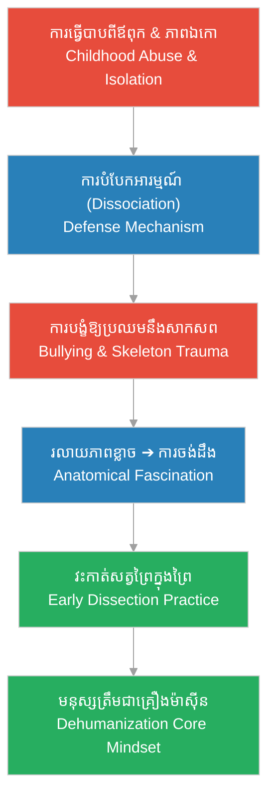

# Episode 1: ស្រមោលកុមារភាព (Shadows of New Hampshire)

**Author:** ichamrong  
**Date:** 2026-06-05  
**Tags:** #hh-holmes #screenplay #episode-1 #gilded-age #childhood-trauma #sociopath  
**Category:** Biographies  
**Read Time:** ~10 min  

---

## 📌 មាតិកា (Table of Contents)
- [សេចក្តីផ្តើម៖ ដើមកំណើតបិសាច (Introduction: The Ascent of Mudgett)](#0)
- [១. ប្លង់ទី ១៖ ផ្ទះឈើត្រជាក់ស្រស្រេប (Scene 1: The Cold Homestead - Gilmanton, NH)](#1)
- [២. ប្លង់ទី ២៖ การប្រឈមមុខនឹងសាកសព (Scene 2: Confronting the Skeleton - School Bullies)](#2)
- [៣. ប្លង់ទី ៣៖ ពីភាពភ័យខ្លាចទៅជាការស្រាវជ្រាវ (Scene 3: From Terror to Anatomy - The Woods)](#3)
- [៤. យន្តការចិត្តសាស្ត្រនៃការវិវឌ្ឍ (Psychological Evolution Loop)](#4)
- [សេចក្តីសន្និដ្ឋាន (Conclusion)](#5)
- [🔗 ឯកសារទាក់ទង (Related Topics)](#6)

---

## សេចក្តីផ្តើម៖ ដើមកំណើតបិសាច (Introduction: The Ascent of Mudgett)

រឿងភាគដំបូងនេះបង្ហាញពីគ្រឹះនៃចិត្តសាស្ត្ររបស់ Herman Mudgett (ក្រោយមកក្លាយជា H.H. Holmes)។ វាបង្ហាញពីរបៀបដែលក្មេងប្រុសម្នាក់ដែលរងការវាយដំ និងភ័យខ្លាចការស្លាប់ បានបំប្លែងខ្លួនទៅជាមនុស្សត្រជាក់សំបកក្រៅ ដែលមើលឃើញការឈឺចាប់ និងសាកសពជាឧបករណ៍ពិសោធន៍។

This premiere episode establishes the psychological foundations of young Herman Mudgett (later H.H. Holmes). It dramatizes how an abused boy, once terrified of death, transformed his trauma into cold dissociation, viewing pain and skeletons merely as scientific apparatus.

---

## ១. ប្លង់ទី ១៖ ផ្ទះឈើត្រជាក់ស្រស្រេប (Scene 1: The Cold Homestead - Gilmanton, NH)

**ទីតាំង៖** ផ្ទះគ្រួសារ Mudgett, ទីក្រុង Gilmanton, រដ្ឋ New Hampshire, ឆ្នាំ ១៨៧០ (វេលាព្រលប់)  
**Location:** The Mudgett Homestead, Gilmanton, New Hampshire, 1870 (Dusk)

**សកម្មភាព៖** កុមារ Herman Mudgett (អាយុ ៩ ឆ្នាំ) កំពុងអង្គុយក្បែរឡភ្លើងដែលជិតរលត់។ ឪពុករបស់គេគឺ Levi Mudgett (បុរសមាឌធំ សំឡេងខ្លាំង និងតឹងរ៉ឹង) ដើរចូលមកដោយកាន់រំពាត់ធំមួយ។ គ្មានពាក្យសម្តីកក់ក្តៅឡើយ មានតែការទាមទារវិន័យដ៏ព្រៃផ្សៃ។  
**Action:** Young Herman Mudgett (9 years old) sits shivering by a dying hearth. His father, Levi Mudgett—a large, stern Puritan—enters holding a leather strap. There are no warm words, only the cold imposition of brutal, religious discipline.

*   **ឡេវី មូដជិត (Levi Mudgett)៖** "Herman! ឯងមិនបានរៀបចំអុសសម្រាប់ថ្ងៃស្អែកទេ! ភាពខ្ជិលច្រអូសគឺជាមាត់ច្រកនៃអារក្ស!"  
    *   *"Herman! You left the woodpile dry for tomorrow! Idleness is the devil's playground!"*
*   **ហឺមែន វ័យក្មេង (Young Herman)៖** "កូន... កូនសុំទោសលោកពុក។ កូនរវល់តែអានសៀវភៅ..."  
    *   *"I... I am sorry, father. I was reading..."*
*   **ឡេវី មូដជិត (Levi Mudgett)៖** "សៀវភៅមិនអាចកក់ក្តៅផ្ទះក្នុងរដូវរងាបានទេ! លុតជង្គង់ចុះ!"  
    *   *"Books do not warm the house in winter! Kneel!"*

**ការពិពណ៌នា៖** Herman លុតជង្គង់ចុះដោយគ្មានស្រក់ទឹកភ្នែកឡើយ។ ភ្នែករបស់គេសម្លឹងមើលទៅកម្ទេចផេះនៅក្នុងឡភ្លើងដោយភាពស្ងៀមស្ងាត់។ នេះជាកន្លែងដែលគេរៀនសូត្រដំបូងបង្អស់អំពី **«ការបំបែកអារម្មណ៍ពីរូបវន្ត» (Emotional Dissociation)** ដើម្បីគេចផុតពីការឈឺចាប់។  
**Description:** Herman kneels without shedding a single tear. His eyes fixate on the cold ashes of the hearth in absolute silence. This is where he first learns emotional dissociation—a mental defense mechanism to survive physical pain.

---

## ២. ប្លង់ទី ២៖ ការប្រឈមមុខនឹងសាកសព (Scene 2: Confronting the Skeleton - School Bullies)

**ទីតាំង៖** គ្លីនិករបស់គ្រូពេទ្យភូមិ, ទីក្រុង Gilmanton (វេលាថ្ងៃត្រង់)  
**Location:** The Village Doctor's Office, Gilmanton (Midday)

**សកម្មភាព៖** ក្មេងទំនើងសាលាពីរនាក់បានចាប់ទាញ Herman ចូលទៅក្នុងបន្ទប់ងងឹតមួយក្នុងគ្លីនិករបស់គ្រូពេទ្យភូមិ។ ពួកគេបង្ខំឱ្យគេប្រឈមមុខនឹងគ្រោងឆ្អឹងមនុស្សពិតដែលព្យួរនៅកាច់ជ្រុងបន្ទប់ ដើម្បីបន្លាចគេ។  
**Action:** Two school bullies drag young Herman into the dark backroom of the local doctor's clinic. They force him face-to-face with a real, articulated human skeleton hanging in the corner to terrify him.

*   **ក្មេងទំនើងទី ១ (Bully 1)៖** "មើលវាទៅ Herman! នេះជាអ្វីដែលកើតឡើងចំពោះមនុស្សកំសាកដូចជាឯង!"  
    *   *"Look at it, Herman! This is what happens to cowards like you!"*
*   **ហឺមែន វ័យក្មេង (Young Herman)៖** (ស្រែកយំ និងភ័យខ្លាចជាខ្លាំង) "ទេ! លែងខ្ញុំ! យកវាចេញទៅ!"  
    *   *(Screaming in terror)* *"No! Let me go! Take it away!"*

**ការផ្លាស់ប្តូរស្មារតី៖** ពួកគេបានចាក់សោទ្វារបន្សល់ទុក Herman តែម្នាក់ឯងជាមួយគ្រោងឆ្អឹងនោះរយៈពេលកន្លះម៉ោង។ នៅក្នុងភាពងងឹត ស្រមោល និងពន្លឺថ្ងៃជះចំឆ្អឹងជំនីរពណ៌ស។ Herman ចាប់ផ្តើមឈប់យំ។ គេដើរចូលទៅជិត ហើយប៉ះឆ្អឹងម្រាមដៃរបស់គ្រោងឆ្អឹងនោះ។ ភាពភ័យខ្លាចបានរលាយបាត់ ជំនួសមកវិញនូវ **«ការចាប់អារម្មណ៍លើកាយវិភាគវិទ្យា» (Anatomical Fascination)**។  
**Mental Shift:** The boys lock the door, leaving Herman alone with the skeleton for half an hour. In the gloom, light catches the bleached ribs. Herman stops crying. He steps closer, reaching out to touch the cold phalanges. His terror dissolves, replaced by a morbid, scientific fascination with anatomy.

---

## ៣. ប្លង់ទី ៣៖ ពីភាពភ័យខ្លាចទៅជាការស្រាវជ្រាវ (Scene 3: From Terror to Anatomy - The Woods)

**ទីតាំង៖** ព្រៃជ្រៅក្រោយភូមិ Gilmanton (វេលារសៀល)  
**Location:** The Deep Woods behind Gilmanton (Afternoon)

**សកម្មភាព៖** ហឺមែន អាយុ ១២ ឆ្នាំ កំពុងអង្គុយម្នាក់ឯងនៅលើដងឈើដួល។ នៅពីមុខគេមានតុឈើច្នៃមួយដែលមានសត្វកណ្តុរ និងសត្វព្រាបងាប់។ គេប្រើឡាម និងកាំបិតតូចៗវះកាត់ពួកវាដោយភាពស្ងប់ស្ងាត់បំផុត។  
**Action:** Herman, now 12, sits alone on a fallen log. Before him is a makeshift wooden bench with dead mice and forest birds. He uses a razor and small scalpel to dissect them with surgical precision and calmness.

*   **ហឺមែន (Herman)៖** (និយាយម្នាក់ឯងតិចៗ) "សាច់ ឆ្អឹង និងសរសៃឈាម... គ្មានព្រលឹងពិតប្រាកដទេ។ មានតែយន្តការម៉ាស៊ីនប៉ុណ្ណោះ។"  
    *   *(Whispering to himself)* *"Flesh, bone, and vessels... there is no soul. Just a machine."*

**ការពិពណ៌នា៖** គេកត់ត្រាការសង្កេតកាយវិភាគវិទ្យាសត្វដាក់ក្នុងសៀវភៅកំណត់ហេតុសម្ងាត់។ នេះជាការចាប់ផ្តើមដំបូងនៃការមើលឃើញរាងកាយមានជីវិតជា «វត្ថុធាតុដើម» សម្រាប់ដំណើរការពិសោធន៍។  
**Description:** He logs animal anatomical structures in a secret journal. This marks the origin of his view of living organisms as "raw materials" to be processed and dissected.

---

## ៤. យន្តការចិត្តសាស្ត្រនៃការវិវឌ្ឍ (Psychological Evolution Loop)

ដ្យាក្រាមខាងក្រោមបង្ហាញពីរបៀបដែលរបួសផ្លូវចិត្តកុមារភាព និងការប្រឈមមុខនឹងសាកសព បានបង្កើតជាផ្នត់គំនិតឃាតករស៊េរីបែបអាជីវកម្ម៖

The following diagram maps how his childhood trauma and confrontation with death catalyzed his path toward becoming a cold, commercial serial killer:

> [!IMPORTANT]
> **🧠 យន្តការចិត្តសាស្ត្រ / Psychological Mechanism - ការបំបែកអារម្មណ៍ (Dissociation):**
> * «នៅពេលដែល Herman វ័យក្មេងលែងឆ្លើយតបនឹងការឈឺចាប់ដោយទឹកភ្នែក វាជាសញ្ញានៃការបិទអារម្មណ៍ទាំងស្រុង ដែលជួយឱ្យគេមិនមានអារម្មណ៍អាណិតអាសូរចំពោះការឈឺចាប់របស់អ្នកដទៃនាពេលអនាគត។» (*"When young Herman ceased responding to pain with tears, it signaled complete emotional dissociation, paving the way for his absolute lack of empathy for others' suffering."*).

---

## សេចក្តីសន្និដ្ឋាន (Conclusion)

> **«កាយវិភាគវិទ្យាមិនមែនជាការសិក្សាអំពីសេចក្តីស្លាប់ឡើយ ប៉ុន្តែវាជាការសិក្សាអំពីរបៀបដែលជីវិតដំណើរការដូចជាគ្រឿងម៉ាស៊ីន» — H.H. Holmes**
> 
> **“Anatomy is not the study of death, but the study of how life operates as a machine.” — H.H. Holmes**

រឿងភាគទី ១ បិទបញ្ចប់ដោយ Herman មើលទៅគំនូរប្លង់កាយវិភាគវិទ្យាសត្វ ដោយភ្នែករបស់គេបង្ហាញពីការសម្រេចចិត្តដ៏ខ្មៅងងឹត៖ គេនឹងរៀនសាលាពេទ្យ ហើយប្រើប្រាស់ចំណេះដឹងទាំងនេះដើម្បីគ្រប់គ្រងសេចក្តីស្លាប់ និងមនុស្សដទៃ។

Episode 1 concludes with Herman gazing at his animal dissection blueprints, his eyes reflecting a chilling resolve: he will enter medical school, weaponizing this physical knowledge to control life, death, and those around him.

---

## 🔗 ឯកសារទាក់ទង (Related Topics)
*   [ជីវប្រវត្តិ H.H. Holmes](../01-h-h-holmes-biography.md) — ស្វែងយល់​លម្អិត​អំពី​ប្រវត្តិ​ផ្ទាល់ខ្លួន និង​វិមាន​ឃាតកម្ម។
*   [គម្រោងរឿងភាគដ្រាម៉ា ៦៣ ភាគ](../08-holmes-drama-episode-guide.md) — គម្រោងសាច់រឿងរឿងភាគ ៦៣ ភាគ។
*   [យន្តការអាជីវកម្មឧក្រិដ្ឋកម្មរបស់ H.H. Holmes](../06-holmes-crime-business-model.md) — វិភាគរបៀបរៀបចំផែនការ និងដំណើរការឧក្រិដ្ឋកម្មជាអាជីវកម្មបែបឧស្សាហកម្ម។
