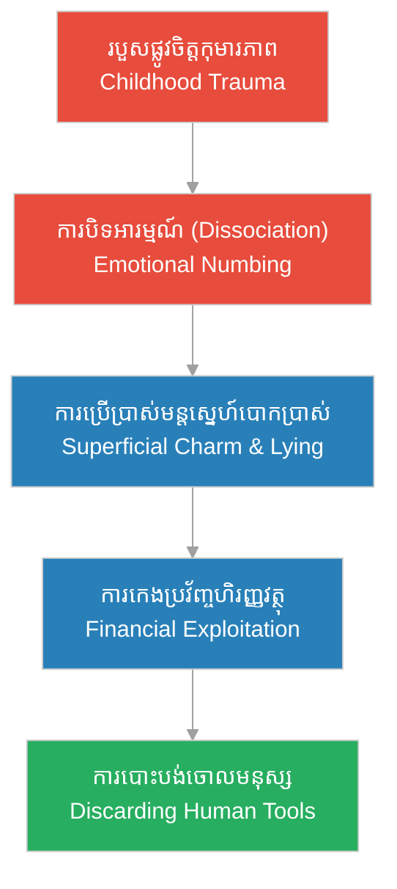

# Episode 2: ការលះបង់របស់ Clara (Clara's Sacrifice)

**Author:** ichamrong  
**Date:** 2026-06-06  
**Tags:** #hh-holmes #screenplay #episode-2 #gilded-age #manipulation #financial-fraud  
**Category:** Biographies  
**Read Time:** ~10 min  

---

## 📌 មាតិកា (Table of Contents)
- [សេចក្តីផ្តើម៖ អាពាហ៍ពិពាហ៍ជាឧបករណ៍ (Introduction: Marriage as a Transaction)](#0)
- [១. ប្លង់ទី ១៖ ស្នេហាក្នុងទីក្រុង Alton (Scene 1: Romance in Alton, NH - 1878)](#1)
- [២. ប្លង់ទី ២៖ ការកេងប្រវ័ញ្ចហិរញ្ញវត្ថុ (Scene 2: Financial Exploitation - Burlington, VT)](#2)
- [៣. ប្លង់ទី ៣៖ ការបោះបង់ចោលដ៏ត្រជាក់ (Scene 3: The Cold Abandonment - 1880)](#3)
- [៤. យន្តការចិត្តសាស្ត្រនៃការវិវឌ្ឍ (Psychological Evolution Loop)](#4)
- [សេចក្តីសន្និដ្ឋាន (Conclusion)](#5)
- [🔗 ឯកសារទាក់ទង (Related Topics)](#6)

---

## សេចក្តីផ្តើម៖ អាពាហ៍ពិពាហ៍ជាឧបករណ៍ (Introduction: Marriage as a Transaction)

រឿងភាគទី ២ នេះ ហ្វឹកហាត់លើការផ្លាស់ប្តូររបស់ Herman Mudgett ពីយន្តការការពារខ្លួនកុមារភាព ទៅជាការប្រើប្រាស់ «មន្តស្នេហ៍ល្បួងបោកប្រាស់» (Superficial Charm)។ វាបង្ហាញពីរបៀបដែល Herman ប្រើប្រាស់អាពាហ៍ពិពាហ៍ជាមួយនាង Clara Lovering ធ្វើជាឧបករណ៍ហិរញ្ញវត្ថុដើម្បីបង់ថ្លៃសិក្សាពេទ្យ មុនពេលបោះបង់នាងចោលដោយគ្មានវិប្បដិសារី។

This second episode focuses on Herman Mudgett's transition from childhood defense mechanisms to the active deployment of superficial charm. It dramatizes how Herman utilizes his marriage to Clara Lovering as a mere financial engine to fund his medical education, discarding her without remorse once her utility is exhausted.

---

## ១. ប្លង់ទី ១៖ ស្នេហាក្នុងទីក្រុង Alton (Scene 1: Romance in Alton, NH - 1878)

**ទីតាំង៖** ផ្ទះគ្រួសារ Lovering, ទីក្រុង Alton, រដ្ឋ New Hampshire, ឆ្នាំ ១៨៧៨ (វេលារសៀល)  
**Location:** The Lovering Homestead, Alton, New Hampshire, 1878 (Afternoon)

**សកម្មភាព៖** Herman Mudgett (អាយុ ១៧ ឆ្នាំ មានរូបរាងសមរម្យ ភ្នែកពណ៌ខៀវមុតស្រួច និងសម្តីផ្អែមល្ហែម) កំពុងអង្គុយនៅក្នុងបន្ទប់ទទួលភ្ញៀវជាមួយ Clara Lovering (អាយុ ១៨ ឆ្នាំ នារីស្លូតត្រង់ កូនស្រីម្ចាស់កសិដ្ឋានមានទ្រព្យ) និងឪពុករបស់នាងគឺលោក John Lovering។ Herman បង្ហាញខ្លួនជាយុវជនមានមហិច្ឆតា និងការអប់រំខ្ពស់។  
**Action:** Herman Mudgett (17 years old, handsome with piercing blue eyes and gentle speech) sits in the parlor with Clara Lovering (18 years old, innocent daughter of a wealthy farmer) and her father, John Lovering. Herman presents himself as a highly motivated, moral, and aspiring scholar.

*   **ហឺមែន (Herman)៖** "លោកពុក Lovering បំណងប្រាថ្នាតែមួយគត់របស់ខ្ញុំ គឺចង់ក្លាយជាគ្រូពេទ្យ ដើម្បីជួយសង្គ្រោះជីវិតមនុស្សលោក។ ប៉ុន្តែការរៀនសូត្រត្រូវការពេលវេលា និងធនធានច្រើន..."  
    *   *"Mr. Lovering, my only dream is to become a doctor and save human lives. But medical school requires years of dedication and substantial resources..."*
*   **ចន ឡូវើរីង (John Lovering)៖** (សម្លឹងមើលដោយការពេញចិត្ត) "Herman ឯងជាយុវជនមានសម្តីច្បាស់លាស់ និងមានសីលធម៌ល្អ។ កូនស្រីខ្ញុំ Clara តែងតែនិយាយសរសើរពីឯងជានិច្ច។"  
    *   *"Herman, you are a well-spoken and moral young man. My daughter Clara speaks highly of you."*
*   **ក្លារ៉ា (Clara)៖** (និយាយដោយក្តីស្រឡាញ់ និងអៀនប្រៀន) "លោកពុក... Herman នឹងក្លាយជាគ្រូពេទ្យដ៏ពូកែម្នាក់។ កូនជឿជាក់លើរូបគាត់។"  
    *   *"Father... Herman will make a wonderful physician. I believe in him."*
*   **ហឺមែន (Herman)៖** (ញញឹមតិច ៗ និងចាប់ដៃ Clara) "ខ្ញុំសន្យាថានឹងមើលថែ Clara ឱ្យអស់ពីជីវិតរបស់ខ្ញុំ។ នាងជាកម្លាំងចិត្តតែមួយគត់របស់ខ្ញុំ។"  
    *   *(Smiling gently, taking Clara's hand)* *"I promise to cherish Clara with all my life. She is my only inspiration."*

**ការពិពណ៌នា៖** ខណៈពេលដែលសើច និងបង្ហាញក្តីស្រឡាញ់ដ៏ស្មោះ ភ្នែករបស់ Herman គឺត្រជាក់ស្ងប់ និងសង្កេតមើលកាបូបលុយដែករបស់លោក John Lovering នៅលើតុ។ សម្រាប់ Herman ពិភពលោកលែងជាកន្លែងគំរាមកំហែងដូចកុមារភាពទៀតហើយ ប៉ុន្តែវាជាកន្លែងដាក់អន្ទាក់ និងប្រមូលផលប្រយោជន៍។  
**Description:** While smiling and performing affection, Herman's eyes remain detached, quietly noting the iron lockbox on John Lovering's desk. For Herman, the world is no longer just a source of childhood pain, but a resource to be harvested through manipulation.

---

## ២. ប្លង់ទី ២៖ ការកេងប្រវ័ញ្ចហិរញ្ញវត្ថុ (Scene 2: Financial Exploitation - Burlington, VT)

**ទីតាំង៖** បន្ទប់ជួលដ៏ចង្អៀត, ក្រុង Burlington, រដ្ឋ Vermont, ឆ្នាំ ១៨៧៩ (វេលាយប់ជ្រៅ)  
**Location:** A Cramped Rented Room, Burlington, Vermont, 1879 (Late Night)

**សកម្មភាព៖** Herman អង្គុយនៅតុអានសៀវភៅកាយវិភាគវិទ្យា។ បន្ទប់ពោរពេញដោយភាពត្រជាក់។ Clara (ឥឡូវជាភរិយារបស់គេ) ដើរចូលមកបន្ទប់ទាំងហត់នឿយ ដោយកាន់កាបូបលុយតូចមួយដែលនាងបានមកពីការធ្វើការងាររោងចក្រ និងការសុំជំនួយពីឪពុកនាង។  
**Action:** Herman sits at his desk studying anatomy blueprints. The room is freezing. Clara (now his wife) enters exhausted, holding a small purse of money she earned from factory work and begging her father.

*   **ក្លារ៉ា (Clara)៖** "Herman នេះជាលុយដែលលោកពុកផ្ញើមកបន្ថែមសម្រាប់ថ្លៃសៀវភៅពេទ្យរបស់បង... ហើយអូនក៏បានថែមម៉ោងការងារដែរ។"  
    *   *"Herman, here is the extra money father sent for your medical textbooks... and I worked extra hours at the mill."*
*   **ហឺមែន (Herman)៖** (ទទួលយកលុយដោយមិនសម្លឹងមើលមុខនាង) "ល្អណាស់ Clara។ ប៉ុន្តែថ្លៃសាលានៅឆ្នាំក្រោយនឹងកើនឡើង។ យើងត្រូវការពន្ធបន្ថែមពីដីធ្លីកសិដ្ឋានរបស់ឪពុកអូន។"  
    *   *(Taking the purse without looking at her)* *"Good, Clara. But next year's tuition will increase. We will need to leverage more from your father's land deeds."*
*   **ក្លារ៉ា (Clara)៖** (និយាយដោយទឹកភ្នែកខ្សោយ) "Herman... យើងលែងមានលុយសេសសល់ទៀតហើយ។ បងលែងនិយាយរកអូន បងមើលឃើញតែឆ្អឹង និងសាកសពសត្វ... តើបងនៅស្រឡាញ់អូនទេ?"  
    *   *(Tearfully)* *"Herman... we have nothing left. You barely speak to me, spending all hours with bones and carcasses... do you still love me?"*
*   **ហឺមែន (Herman)៖** (និយាយដោយសំឡេងស្មើ និងគ្មានអារម្មណ៍) "Clara នេះគឺជាការវិនិយោគ។ កុំយកអារម្មណ៍មកលាយឡំនឹងការងារនាពេលអនាគតរបស់យើង។"  
    *   *(With a flat, emotionless voice)* *"Clara, this is an investment. Do not confuse emotional sentiment with the functional execution of our future."*

**ការពិពណ៌នា៖** Herman ងាកទៅអានសៀវភៅកាយវិភាគវិទ្យាវិញភ្លាម ៗ ដោយមិនចាប់អារម្មណ៍នឹងការយំសោករបស់ភរិយាឡើយ។ គេលែងមានសមត្ថភាពយល់ដឹងពីទុក្ខសោករបស់មនុស្សដទៃទៀតហើយ ព្រោះចិត្តរបស់គេបានចាត់ទុកមនុស្សទាំងអស់ជាគ្រឿងម៉ាស៊ីន និងជាឧបករណ៍បំពេញគោលដៅរបស់ខ្លួន។  
**Description:** Herman turns back to his anatomy sketches instantly, completely detached from his wife's weeping. He has fully compartmentalized his life, viewing human beings only as operational tools to fund his ambitions.

---

## ៣. ប្លង់ទី ៣៖ ការបោះបង់ចោលដ៏ត្រជាក់ (Scene 3: The Cold Abandonment - 1880)

**ទីតាំង៖** ស្ថានីយរថភ្លើងក្រុង Burlington (វេលាព្រលឹមស្រាង ៗ)  
**Location:** Burlington Train Station (Dawn)

**សកម្មភាព៖** Herman កំពុងឈរកាន់វ៉ាលីធំមួយ រៀបចំឡើងរថភ្លើងទៅកាន់រដ្ឋ Michigan ដើម្បីបន្តការសិក្សាពេទ្យ។ Clara ឈរយំឱបកូនប្រុសទើបនឹងកើតរបស់ពួកគេគឺ Robert។  
**Action:** Herman stands holding a leather suitcase, preparing to board a train to Michigan for medical school. Clara stands weeping, clutching their newborn son, Robert.

*   **ក្លារ៉ា (Clara)៖** "Herman! ហេតុអ្វីបងមិនឱ្យអូន និងកូនទៅជាមួយផង? អូនអាចធ្វើការជួយបងបាន!"  
    *   *"Herman! Why won't you let us come with you? I can find work there to support you!"*
*   **ហឺមែន (Herman)៖** "ទីនោះត្រជាក់ និងមិនទាន់មានស្ថិរភាពនៅឡើយទេ។ ចូរនៅទីនេះជាមួយឪពុកម្តាយអូនសិនចុះ នាងជាកន្លែងមានសុវត្ថិភាពបំផុត។"  
    *   *"It is too cold and unstable there. Stay with your parents; it is functionally safer for the child."*
*   **ក្លារ៉ា (Clara)៖** "បងសន្យាថានឹងផ្ញើសំបុត្រមក និងផ្ញើលុយមកវិញមែនទេ?"  
    *   *"You promise you will write to us and send for us soon?"*
*   **ហឺមែន (Herman)៖** (ថើបក្បាល Clara ដោយត្រជាក់ និងគ្មានអារម្មណ៍) "បាទ ខ្ញុំសន្យា។"  
    *   *(Kissing her forehead coldly)* *"Yes, I promise."*

**ការពិពណ៌នា៖** Herman ដើរឡើងរថភ្លើងដោយគ្មានការងាកក្រោយសម្លឹងមើលភរិយា និងកូនឡើយ។ នៅពេលរថភ្លើងចាប់ផ្តើមចេញដំណើរ Herman យកសៀវភៅកត់ត្រាហិរញ្ញវត្ថុរបស់ខ្លួនមកបើកមើល រួចគូសឆូតលើឈ្មោះ «Clara Lovering» ចេញពីបញ្ជីទ្រព្យសកម្ម ព្រោះនាងលែងមានតម្លៃប្រើប្រាស់ហិរញ្ញវត្ថុសម្រាប់គេទៀតហើយ។ ភ្នែករបស់គេសម្លឹងមើលទៅក្រៅបង្អួច ដោយរីករាយនឹងភាពស្ងប់ស្ងាត់ និងសេរីភាពថ្មី។  
**Description:** Herman boards the train without a single backward glance at his family. As the carriage moves, Herman pulls out his financial ledger and draws a clean line through the name "Clara Lovering"—she has been fully depreciated. He looks out the window, finding comfort in the silence and the absolute lack of emotional obligation.

---

## ៤. យន្តការចិត្តសាស្ត្រនៃការវិវឌ្ឍ (Psychological Evolution Loop)

ដ្យាក្រាមខាងក្រោមបង្ហាញពីរបៀបដែល Herman ផ្លាស់ប្តូរយន្តការការពារខ្លួន ទៅជាការប្រើប្រាស់មនុស្សជាឧបករណ៍ហិរញ្ញវត្ថុ៖

The following diagram maps the evolution of Herman's psychological defense mechanisms into calculated, relational predation:

> [!IMPORTANT]
> **🧠 យន្តការចិត្តសាស្ត្រ / Psychological Mechanism - [ការប្រើប្រាស់មន្តស្នេហ៍ល្បួងបោកប្រាស់ (Superficial Charm)](../keyword/emotional-dissociation.md):**
> * «សម្រាប់ Herman មន្តស្នេហ៍មិនមែនកើតចេញពីអារម្មណ៍ស្រឡាញ់ពិតប្រាកដឡើយ ប៉ុន្តែវាជាបច្ចេកទេស ឬរបាំងមុខដែលគេបង្កើតឡើងដើម្បីទាក់ទាញ និងគ្រប់គ្រងអ្នកដទៃឱ្យបម្រើផលប្រយោជន៍របស់គេ។» (*"For Herman, charm is not an emotional reality but an operational tool—a mask crafted to manipulate others into serving his goals."*).
> 
> **🤫 យន្តការចិត្តសាស្ត្រ / Psychological Mechanism - [ការបោះបង់ចោលឧបករណ៍ (Discarding Tools)](../keyword/preserving-the-silence.md):**
> * «នៅពេលដែលជនរងគ្រោះលែងមានប្រយោជន៍ ឬអស់លុយកាក់សម្រាប់កេងប្រវ័ញ្ច Herman នឹងកាត់ផ្តាច់ទំនាក់ទំនងភ្លាម ៗ ដោយគ្មានភាពស្តាយក្រោយ ព្រោះគេមើលឃើញមនុស្សជាឧបករណ៍ប្រើប្រាស់តែប៉ុណ្ណោះ។» (*"Once a target's utility is depleted, Herman discards them with mechanical efficiency, completely insulated from guilt or empathy."*).

---

## សេចក្តីសន្និដ្ឋាន (Conclusion)

> **«មនុស្សទាំងអស់ប្រៀបដូចជាសៀវភៅ ឬគ្រឿងម៉ាស៊ីន... យើងប្រើប្រាស់ពួកវាដើម្បីរៀនសូត្រ និងសម្រេចគោលដៅ រួចបិទវាទុកចោល» — H.H. Holmes**
> 
> **“All people are like books or machines... we use them to learn and achieve our goals, then we shut them away.” — H.H. Holmes**

រឿងភាគទី ២ បិទបញ្ចប់ដោយ Herman អង្គុយលើរថភ្លើង សម្លឹងមើលទៅកាន់ទីក្រុង Ann Arbor ដោយក្តីសង្ឃឹម និងការត្រៀមខ្លួនសម្រាប់ប្រតិបត្តិការថ្មីនៅក្នុងសាលាពេទ្យ។

Episode 2 concludes with Herman sitting on the train, gazing toward Ann Arbor with cold anticipation, ready to launch his next phase of scientific fraud in medical school.

---

## 🔗 ឯកសារទាក់ទង (Related Topics)
*   **[Episode 1: ស្រមោលកុមារភាព (Shadows of New Hampshire)](ep-01-shadows-of-new-hampshire.md)** — ស្គ្រីបភាគទី ១ ដែលជាសាច់រឿងគ្រឹះនៃកុមារភាពរបស់ Young Herman។
*   **[ជីវប្រវត្តិ H.H. Holmes](../01-h-h-holmes-biography.md)** — ស្វែងយល់លម្អិតអំពីប្រវត្តិផ្ទាល់ខ្លួន និងវិមានឃាតកម្ម។
*   **[គម្រោងរឿងភាគដ្រាម៉ា ៦៣ ភាគ](../08-holmes-drama-episode-guide.md)** — គម្រោងសាច់រឿងរឿងភាគ ៦៣ ភាគ។
