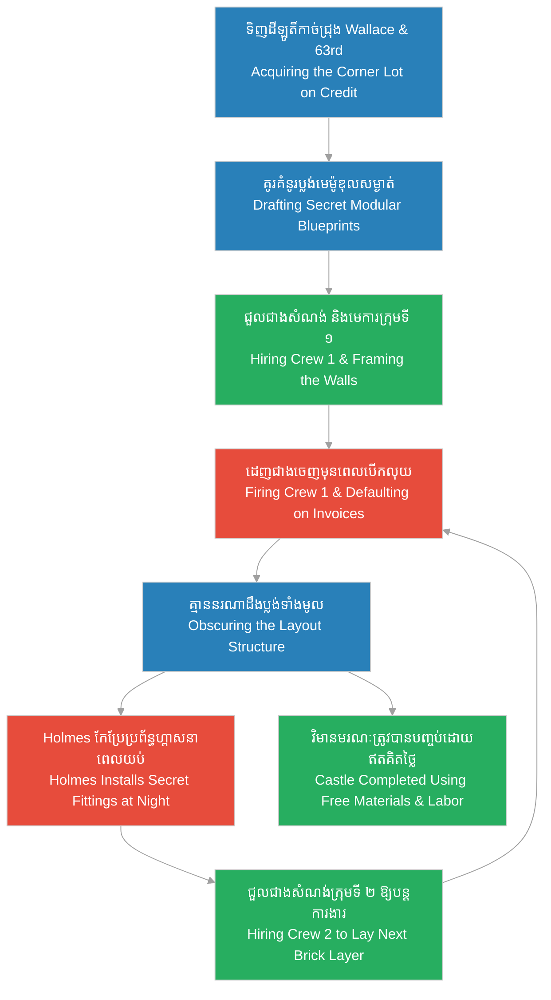

# Episode 7: ប្លង់មេនៃសេចក្តីស្លាប់ (The Secret Blueprint)

**Author:** ichamrong  
**Date:** 2026-06-07  
**Tags:** #hh-holmes #screenplay #episode-7 #gilded-age #chicago #construction-fraud #compartmentalization #manipulation #historical-case-study  
**Category:** Biographies  
**Read Time:** ~15 min  

---

## 📌 មាតិកា (Table of Contents)
- [សេចក្តីផ្តើម៖ ប្លង់មេដែលបំបែកជាផ្នែក (Introduction: The Compartmentalized Design)](#0)
- [១. ប្លង់ទី ១៖ ការគូរគំនូរប្លង់បំបែក (Scene 1: Drafting the Modular Blueprint)](#1)
- [២. ប្លង់ទី ២៖ ការទិញដីឡូតិ៍កាច់ជ្រុង (Scene 2: Purchasing the Corner Lot)](#2)
- [៣. ប្លង់ទី ៣៖ ការបំបែកភាគសំណង់ និងការដេញជាងចេញ (Scene 3: Firing and Rotating the Crews)](#3)
- [៤. ប្លង់ទី ៤៖ ជញ្ជាំងសម្ងាត់ និងការកែប្រែនាពេលយប់ (Scene 4: Secret Partitions and Night Modifications)](#4)
- [៥. យន្តការបោកប្រាស់សំណង់ និងការបំបែកភាគ (Construction Fraud & Compartmentalization Loop)](#5)
- [សេចក្តីសន្និដ្ឋាន (Conclusion)](#6)
- [🔗 ឯកសារទាក់ទង (Related Topics)](#7)

---

## សេចក្តីផ្តើម៖ ប្លង់មេដែលបំបែកជាផ្នែក (Introduction: The Compartmentalized Design)

រឿងភាគទី ៧ នេះ ផ្អែកលើករណីសិក្សាប្រវត្តិសាស្ត្រពិតនៃដំណើរការសាងសង់អគារ «Murder Castle» របស់ H.H. Holmes នៅកាច់ជ្រុងផ្លូវលេខ ៦៣ និង Wallace St ក្នុងតំបន់ Englewood ទីក្រុង Chicago។ Holmes មិនបានប្រើប្រាស់ស្ថាបត្យករអាជីព ឬប្លង់សំណង់តែមួយសម្រាប់ការងារទាំងមូលឡើយ។ ផ្ទុយទៅវិញ គេបានគូរប្លង់អគារជាលក្ខណៈម៉ូឌុល (Modular) និងបំបែកភាគ (Compartmentalization) ដោយខ្លួនឯង។ គេបានជួលមេជាង និងក្រុមជាងសំណង់ជាច្រើនក្រុមឱ្យមកធ្វើការសាងសង់អគារជាផ្នែក ៗ រួចដេញពួកគេចេញមុនពេលបើកលុយប្រចាំខែ ដោយដោះសារថាសំណង់ខុសលក្ខណៈបច្ចេកទេស។ យុទ្ធសាស្ត្រនេះមិនត្រឹមតែជួយឱ្យ Holmes អាចគេចវេសមិនបង់ថ្លៃពលកម្ម និងសម្ភារសំណង់ប៉ុណ្ណោះទេ ប៉ុន្តែថែមទាំងធានាថា គ្មាននរណាម្នាក់ក្រៅពីគេ យល់ដឹងពីប្លង់មេទាំងមូលនៃអគារដែលមានបន្ទប់ និងច្រកផ្លូវសម្ងាត់នោះឡើយ។

This seventh episode is based on the documented historical case study of the construction of H.H. Holmes' "Murder Castle" at the corner of 63rd and Wallace St in Englewood, Chicago. Holmes did not employ a professional architect or use a unified blueprint. Instead, he drafted modular and compartmentalized designs himself. He hired numerous contractors and construction crews, rotating them out and firing them before payment was due by claiming their work was defective. This strategy served a dual purpose: it insulated Holmes from construction costs and labor fees, and ensured that no single individual, besides himself, ever understood the layout of the labyrinthine building with its hidden rooms and secret passages.

---

## ១. ប្លង់ទី ១៖ ការគូរគំនូរប្លង់បំបែក (Scene 1: Drafting the Modular Blueprint)

**ទីតាំង៖** ការិយាល័យខាងក្រោយឱសថស្ថានរបស់ Holmes, Englewood, Chicago, ឆ្នាំ ១៨៨៨ (វេលាយប់ជ្រៅ)  
**Location:** The Back Office of Holmes' Drugstore, Englewood, Chicago, 1888 (Late Night)

**សកម្មភាព៖** Holmes អង្គុយនៅតុសរសេររបស់គេ ក្រោមពន្លឺចង្អៀតនៃចង្កៀងប្រេងកាត។ នៅលើតុមានក្រដាសគំនូរប្លង់ធំ ៗ បន្ទាត់ និងដែកឈូស។ គេកំពុងគូសខ្សែបន្ទាត់ជញ្ជាំង និងច្រកផ្លូវដោយដៃដ៏ស្ងប់ស្ងាត់។ គំនូរប្លង់មិនមានលក្ខណៈដូចប្លង់ស្ថាបត្យកម្មទូទៅឡើយ គឺវាត្រូវបានបែងចែកជាក្រឡា និងផ្នែកដាច់ ៗ ពីគ្នា (Modular Cells)។ ជំនួយការវ័យក្មេងម្នាក់ឈ្មោះ Benjamin Pitezel (បុរសវ័យ ២០ ឆ្នាំ ស្លៀកពាក់អាវធំសាមញ្ញ ទឹកមុខហ្មត់ចត់ និងគោរពកោតសរសើរ Holmes) ដើរចូលមកបន្ទប់ដោយកាន់ថាសកែវកាហ្វេ។  
**Action:** Holmes sits at his desk, illuminated by the tight pool of a kerosene lamp. On the desk are large draft sheets, rulers, and compasses. He draws wall partitions and access corridors with a calm, steady hand. The layout is atypical of standard architecture, composed of disjointed, modular cells. His young assistant, Benjamin Pitezel (in his late 20s, wearing plain attire with a serious, deferential expression), enters carrying a tray with coffee.

<!-- [IMAGE: H.H. Holmes planning the Murder Castle. H.H. Holmes sits in the dim drugstore back office drafting modular blueprints. (Image generation rate-limited, to be added later)] -->

*   **ផាយធាហ្សល (Pitezel)៖** "លោកគ្រូពេទ្យ Holmes នេះជាកាហ្វេរបស់លោក។ ខ្ញុំឃើញលោកគូរប្លង់នេះពេញមួយសប្តាហ៍ហើយ។ តើវាជាប្លង់អគារសណ្ឋាគារសម្រាប់ពិព័រណ៍ពិភពលោកមែនទេ?"  
    *   *"Dr. Holmes, your coffee. I have seen you drafting this project for over a week. Is this the design for the hotel to serve the World's Fair?"*
*   **ហូម (Holmes)៖** (មិនងើបមុខពីប្លង់សរសេរឡើយ ដៃកំពុងវាស់ចម្ងាយ) "ពិតហើយ Pitezel។ អគារពីរជាន់នេះនឹងមានហាងលក់ថ្នាំនៅជាន់ក្រោម និងបន្ទប់ស្នាក់នៅជាច្រើននៅជាន់ទីពីរ។ ប៉ុន្តែដើម្បីសន្សំសំចៃថ្លៃសំណង់ និងការពារការចម្លងម៉ូដ ខ្ញុំត្រូវរចនាវាជាផ្នែក ៗ ដាច់ដោយឡែក។ គ្មាននរណាម្នាក់អាចយល់ប្លង់ទាំងមូលក្រៅពីយើងឡើយ។"  
    *   *(Without looking up, adjusting his ruler)* *"Yes, Pitezel. This two-story structure will house our drugstore on the ground floor and numerous lodging suites on the second. However, to control costs and prevent design theft, I am designing it in compartmentalized, isolated modules. No outsider must comprehend the complete layout."*
*   **ផាយធាហ្សល (Pitezel)៖** (សម្លឹងមើលប្លង់ដែលច្របូកច្របល់) "ប៉ុន្តែ... ជញ្ជាំងកន្លែងនេះមើលទៅហាក់បីដូចជាគ្មានច្រកចេញចូលទាល់តែសោះ។ តើនេះជាបន្ទប់ផ្ទុកទំនិញ ឬជាកន្លែងដាក់ឯកសារ?"  
    *   *(Looking at the confusing grid)* *"But... these partition walls here seem to lead nowhere. Is this a utility room or an archive vault?"*
*   **ហូម (Holmes)៖** (ងើបមុខមកសម្លឹងមើល Pitezel ដោយកែវភ្នែកត្រជាក់ស្រេប) "វាគ្រាន់តែជាកន្លែងសន្តិសុខ និងទុកដាក់សម្ភារៈពិសេសប៉ុណ្ណោះ Pitezel។ នៅក្នុងអាជីវកម្ម ការលាក់ការសម្ងាត់ និងការគ្រប់គ្រងព័ត៌មាន គឺជាគន្លឹះនៃភាពជោគជ័យ។ ឯងគ្រាន់តែរៀបចំឯកសារបញ្ជាទិញឥដ្ឋ និងដែកពីក្រុមហ៊ុនផ្គត់ផ្គង់តាមបញ្ជីនេះទៅបានហើយ។"  
    *   *(Raising his head, locking his cold gaze onto Pitezel)* *"It is merely a secure storage space for specialized goods, Pitezel. In enterprise, information control is the key to leverage. You only need to prepare the purchase orders for brick and iron from the suppliers on this list."*

**ការពិពណ៌នា៖** Pitezel ងក់ក្បាលដោយការគោរព និងដើរចេញទៅវិញ។ Holmes ញញឹមយ៉ាងស្ងប់ស្ងាត់ រួចយកប៊ិចពណ៌ក្រហមមកវាស់វែង និងគូសចំណាំទីតាំងបំពង់ហ្គាស និងប្រព័ន្ធបង្ហូរខ្យល់សម្ងាត់នៅក្នុងបន្ទប់កណ្តាល។ គេដឹងថា គំនូរប្លង់ដែលច្របូកច្របល់នេះ នឹងមិនត្រូវឆ្លងកាត់ការចុះបញ្ជីជាសាធារណៈឡើយ ព្រោះច្បាប់សំណង់សម័យ Gilded Age នៅ Chicago មិនទាន់មានការរឹតបន្តឹង និងការត្រួតពិនិត្យគំនូរប្លង់ជាផ្លូវការនៅឡើយទេ។  
**Description:** Pitezel nods respectfully and withdraws. Holmes smiles coldly, using a red pencil to map gas lines and secret ventilation routes in the central rooms. He knows these confusing diagrams will never pass through a public registry, as Gilded Age Chicago building regulations do not require official filing or layout inspections.

---

## ២. ប្លង់ទី ២៖ ការទិញដីឡូតិ៍កាច់ជ្រុង (Scene 2: Purchasing the Corner Lot)

**ទីតាំង៖** ការិយាល័យរបស់ភ្នាក់ងារលក់ដីធ្លី, ក្រុង Chicago, ឆ្នាំ ១៨៨៧ (វេលារសៀល)  
**Location:** The Office of a Real Estate Broker, Chicago, 1887 (Afternoon)

**សកម្មភាព៖** Holmes អង្គុយទល់មុខភ្នាក់ងារលក់ដីធ្លីម្នាក់ឈ្មោះ លោក អាល់ឌ្រីច (Mr. Aldrich)។ នៅលើតុមានឯកសារចុះបញ្ជីកម្មសិទ្ធិដីឡូតិ៍ទទេមួយកន្លែង ដែលស្ថិតនៅកាច់ជ្រុងផ្លូវលេខ ៦៣ និង Wallace St។ Holmes ប្រើប្រាស់ឈ្មោះអត្តសញ្ញាណបោកប្រាស់របស់ខ្លួន និងបង្ហាញទឹកមុខគួរឱ្យទុកចិត្តបំផុត។ គេហុចកញ្ចប់ប្រាក់កក់ដំបូងចំនួនតិចតួច ព្រមទាំងលិខិតធានាឥណទានពីក្រុមហ៊ុនខ្យល់របស់គេ។  
**Action:** Holmes sits opposite a real estate broker, Mr. Aldrich. On the desk lies the title registration for the vacant corner lot at 63rd and Wallace St. Holmes, operating under a dummy alias, projects an aura of extreme wealth and respectability. He presents a minimal cash deposit alongside credit reference letters from his shell companies.

<!-- [IMAGE: H.H. Holmes negotiating with a real estate broker. He presents credentials under a dummy name. (Image generation rate-limited, to be added later)] -->

*   **លោក អាល់ឌ្រីច (Mr. Aldrich)៖** "លោក Mudgett... ឬក៏ Holmes... ឯកសារធានាឥណទានរបស់ក្រុមហ៊ុនលោកពិតជាមានរបៀបរៀបរយណាស់។ ដីឡូតិ៍កាច់ជ្រុងនេះមានតម្លៃខ្ពស់ ដោយសារវាស្ថិតនៅចំកណ្តាលតំបន់ពាណិជ្ជកម្ម Englewood ដែលកំពុងអភិវឌ្ឍ។ តើលោកគ្រោងនឹងសាងសង់អ្វីនៅលើដីនេះ?"  
    *   *"Mr. Mudgett... or Holmes... your corporate credit references are immaculate. This corner lot is highly valuable, positioned in the center of Englewood's developing commercial zone. What do you intend to construct on this site?"*
*   **ហូម (Holmes)៖** "ខ្ញុំគ្រោងនឹងកសាងអាគារពាណិជ្ជកម្មទំនើបមួយ ដែលមានហាងលក់ថ្នាំធំជាងគេក្នុង Englewood និងបន្ទប់ការិយាល័យជួល។ វានឹងក្លាយជាមជ្ឈមណ្ឌលពាណិជ្ជកម្មដ៏មមាញឹក។ នេះជាប្រាក់កក់ដំបូង ចំណែកសមតុល្យដែលនៅសេសសល់ ខ្ញុំនឹងទូទាត់ប្រចាំខែតាមរយៈធនាគារកណ្តាល Chicago។"  
    *   *"I plan to build a modern commercial structure featuring the largest pharmacy in Englewood and rental office suites. It will serve as a commercial hub. Here is the initial deposit; the remaining balance will be serviced in monthly transfers through the Chicago Central Bank."*
*   **លោក អាល់ឌ្រីច (Mr. Aldrich)៖** (ចុះហត្ថលេខាលើលិខិតផ្ទេរកម្មសិទ្ធិ និងហុចឱ្យ Holmes) "កិច្ចសន្យាត្រូវបានយល់ព្រម។ ខ្ញុំសង្ឃឹមថាសំណង់នេះនឹងរួចរាល់ទាន់ពេលពិព័រណ៍ពិភពលោកចាប់ផ្តើម។"  
    *   *(Signing the transfer deed and handing it to Holmes)* *"The transaction is approved, Dr. Holmes. I look forward to seeing the project completed in time for the Columbian Exposition."*
*   **ហូម (Holmes)៖** (ទទួលយកក្រដាសចុះហត្ថលេខា រួចញញឹមយ៉ាងស្ងប់ស្ងាត់) "វាជារឿងពិតប្រាកដណាស់ លោក Aldrich។ អាគារនេះនឹងលេចរូបរាងឡើងលឿនជាងអ្វីដែលលោកគិតទៅទៀត។"  
    *   *(Taking the signed deed, smiling calmly)* *"Undoubtedly, Mr. Aldrich. This building will rise faster than you anticipate."*

**ការពិពណ៌នា៖** Holmes ចាកចេញពីការិយាល័យដោយកាន់លិខិតផ្ទេរកម្មសិទ្ធិ។ គេមិនមានបំណងបង់លុយសមតុល្យដែលនៅសេសសល់ឡើយ។ គេដឹងថា ឥណទានដែលបោកបានពីដីឡូតិ៍នេះ នឹងត្រូវបានប្រើប្រាស់ដើម្បីទិញដែក និងឥដ្ឋជំពាក់លុយពីក្រុមហ៊ុនផ្សេង ៗ។ គេចាប់ផ្តើមសាងសង់អាណាចក្រសំណង់របស់ខ្លួន ដោយប្រើប្រាស់ទ្រព្យសម្បត្តិរបស់អ្នកដទៃទាំងស្រុង។  
**Description:** Holmes departs with the title deed. He has no intention of paying the remaining balances. He knows the credit leveraged from this land will secure brick and iron orders from other firms on credit. He initiates his construction empire using other people's capital.

---

## ៣. ប្លង់ទី ៣៖ ការបំបែកភាគសំណង់ និងការដេញជាងចេញ (Scene 3: Firing and Rotating the Crews)

**ទីតាំង៖** ការដ្ឋានសំណង់អគារ Castle, ផ្លូវ 63rd និង Wallace St, ឆ្នាំ ១៨៨៨ (វេលាថ្ងៃត្រង់)  
**Location:** The Castle Construction Site, 63rd and Wallace St, 1888 (Midday)

**សកម្មភាព៖** ជញ្ជាំងឥដ្ឋនៃជាន់ទីពីរត្រូវបានសាងសង់បានពាក់កណ្តាល។ កម្មករ និងជាងសំណង់ជាច្រើននាក់កំពុងមមាញឹកនឹងការងាររៀបឥដ្ឋ និងលើកធ្នឹមឈើ។ Holmes (ស្លៀកពាក់អាវធំស្អាតបាត ពាក់ស្រោមដៃពណ៌ស) ដើរពិនិត្យការដ្ឋានសំណង់ជាមួយលោក ថូម៉ាស (Mr. Thomas) ដែលជាមេការសំណង់ និងតំណាងក្រុមហ៊ុនម៉ៅការ។ Holmes ឈប់ត្រង់ជញ្ជាំងថ្មីមួយ រួចយកម្រាមដៃស្រោមដៃពណ៌សទៅជូតតាមចន្លោះឥដ្ឋ រួចបង្ហាញស្នាមប្រឡាក់ភក់ និងឥដ្ឋមិនស្មើគ្នា។ គេបង្ហាញទឹកមុខខឹងសម្បារជាខ្លាំង និងនិយាយសំឡេងខ្លាំង ៗ ដើម្បីឱ្យកម្មករទាំងអស់ឮ។  
**Action:** The brick walls of the second floor are half-built. Laborers and bricklayers are busy aligning bricks and hoisting heavy wooden beams. Holmes (dressed in a clean coat, wearing white gloves) walks the construction site with Mr. Thomas, the head contractor. Holmes stops at a newly laid wall section, runs his white-gloved finger along the brick joints, showing soil stains and uneven mortar. He projects cold anger, speaking loudly to ensure all workers hear.

<!-- [IMAGE: H.H. Holmes firing a construction crew. He inspects the brickwork and gestures angrily while the workers stand frustrated. (Image generation rate-limited, to be added later)] -->

*   **ហូម (Holmes)៖** "លោក Thomas! មើលជញ្ជាំងកាច់ជ្រុងនេះចុះ! ឥដ្ឋរៀបមិនស្មើគ្នា និងគ្មានលំនឹងទាល់តែសោះ! នេះជាការងារអន់ថយ និងគ្រោះថ្នាក់បំផុតសម្រាប់សំណង់របស់ខ្ញុំ!"  
    *   *"Mr. Thomas! Look at this corner wall! The alignment is completely off, and the mortar is structurally unsound! This is substandard work and a severe safety hazard to my project!"*
*   **លោក ថូម៉ាស (Mr. Thomas)៖** (ភ្ញាក់ផ្អើល និងព្យាយាមដោះសារ) "ប៉ុន្តែលោកគ្រូពេទ្យ Holmes នេះជាការរៀបចំតាមស្តង់ដារសំណង់ទូទៅ។ ជញ្ជាំងនេះរឹងមាំល្អណាស់ កម្មកររបស់ខ្ញុំបានធ្វើការយ៉ាងហ្មត់ចត់..."  
    *   *(Surprised, attempting to explain)* *"But Dr. Holmes, this mortar is mixed to standard construction specifications. This wall is perfectly solid; my men have worked diligently..."*
*   **ហូម (Holmes)៖** (និយាយកាត់ភ្លាម ៗ ដោយគ្មានការអត់ឱន) "គ្រប់គ្រាន់ហើយ! ខ្ញុំមិនអាចបង់លុយប្រាំបីរយដុល្លារសម្រាប់កិច្ចសន្យាខូចខាតបែបនេះឡើយ។ លោក និងកម្មករទាំងអស់ត្រូវចាកចេញពីការដ្ឋានរបស់ខ្ញុំភ្លាម! ខ្ញុំនឹងជួលក្រុមហ៊ុនថ្មីមកសាងសង់ឡើងវិញ។"  
    *   *(Cutting him off without mercy)* *"Enough! I will not disburse eight hundred dollars for such defective, dangerous work. You and your crew must leave my property immediately! I will hire a new firm to rebuild this section."*
*   **លោក ថូម៉ាស (Mr. Thomas)៖** (ខឹងសម្បារជាខ្លាំង និងចង្អុលមុខ Holmes) "នេះជាការលួចបន្លំ! ឯងគ្រាន់តែចង់ដេញយើងចេញដើម្បីកុំឱ្យបង់លុយប៉ុណ្ណោះ! យើងនឹងប្តឹងឯងទៅតុលាការ!"  
    *   *(Furious, gesturing at Holmes)* *"This is a swindle! You are firing us just to evade payment! We will sue your company in civil court!"*

**ការពិពណ៌នា៖** Holmes សម្លឹងមើល Thomas ដោយភាពព្រងើយកន្តើយ រួចហៅសន្តិសុខឱ្យដេញពួកគេចេញ។ គេដឹងថា ដំណើរការប្តឹងផ្តល់ក្នុងតុលាការនឹងត្រូវចំណាយពេលរាប់ខែ ហើយកិច្ចសន្យាសាងសង់ត្រូវបានចុះក្រោមឈ្មោះក្រុមហ៊ុនខ្យល់ដែលគ្មានប្រាក់នៅក្នុងគណនីស្រាប់។ នៅសប្តាហ៍បន្ទាប់ Holmes ជួលក្រុមជាងថ្មីមួយក្រុមទៀតឱ្យមកបន្តសំណង់ពីកន្លែងចាស់។ វិធីសាស្ត្រ **«ការបំបែកភាគសំណង់» ([Compartmentalization](../keyword/compartmentalization-mechanic.md))** នេះ ធ្វើឱ្យគ្មានជាងសំណង់ណាម្នាក់ដឹងថា ជញ្ជាំង និងបន្ទប់ដែលពួកគេសាងសង់ត្រូវបានភ្ជាប់ទៅកាន់កន្លែងណាខ្លះឡើយ។  
**Description:** Holmes stares at Thomas with flat indifference, gesturing for security to escort them out. He knows civil litigation will take months, and the construction contract was signed under a shell company with zero bank balance. The following week, Holmes hires a new crew to continue the construction. This functional [compartmentalization](../keyword/compartmentalization-mechanic.md) ensures no single contractor ever knows how the specific walls and rooms they built connect to the rest of the layout.

---

## ៤. ប្លង់ទី ៤៖ ជញ្ជាំងសម្ងាត់ និងការកែប្រែនាពេលយប់ (Scene 4: Secret Partitions and Night Modifications)

**ទីតាំង៖** ជាន់ទីពីរនៃអគារ Castle ដែលកំពុងសាងសង់, Englewood, ឆ្នាំ ១៨៨៨ (វេលាយប់ធ្យូង)  
**Location:** The skeletal second floor of the Castle under construction, Englewood, 1888 (Late Night)

**សកម្មភាព៖** ពន្លឺព្រះខែជះកាត់រន្ធដំបូលដែលមិនទាន់ប្រក់ក្បឿង។ កម្រាលឈើ និងធ្នឹមដែកធំ ៗ បង្កើតជាស្រមោលវែង ៗ គួរឱ្យខ្លាច។ Holmes ឈរតែម្នាក់ឯងនៅក្នុងបន្ទប់កណ្តាល កាន់ចង្កៀងប្រេងកាត និងប្រអប់ឧបករណ៍ដែក។ គេកំពុងដំឡើងវ៉ាល់ហ្គាស និងប្រព័ន្ធបំពង់ដែកខ្មៅងងឹតទៅក្នុងជញ្ជាំងដែលទើបតែរៀបចំរួច។ គេធ្វើការយ៉ាងស្ងៀមស្ងាត់ គ្មានសំឡេងរំខានឡើយ ភ្នែកពណ៌ខៀវរបស់គេពោរពេញដោយការផ្ដោតអារម្មណ៍ខ្ពស់។  
**Action:** Moonlight filters through the unfinished roof rafters. Raw wooden floorboards and heavy steel beams cast long, skeletal shadows. Holmes stands alone in the central room, holding a lantern and a metal toolbox. He installs brass gas valves and black iron piping configurations inside a newly bricked partition wall. He works in absolute silence, his blue eyes sharp with focus.

<!-- [IMAGE: H.H. Holmes working inside the skeletal frame of the Castle at night. He installs pipes and partition walls under lantern light. (Image generation rate-limited, to be added later)] -->

*   **ហូម (Holmes)៖** (និយាយខ្សឹបម្នាក់ឯង ពេលកំពុងបង្វិលវ៉ាល់ដែកបញ្ចូលគ្នាយ៉ាងណែន) "ជញ្ជាំងដែលជាងសំណង់សាងសង់ខុសជួរ និងច្រកផ្លូវដែលបត់បែនគ្មានរបៀបរៀបរយ... ពួកវាបានក្លាយជាប្លង់មេដ៏ល្អឥតខ្ចោះ។ គ្មានអ្នកណាអាចចងចាំ ឬគូរវាឡើងវិញបានឡើយ។ ភាពច្របូកច្របល់របស់ពួកគេ គឺជាលំដាប់លំដោយរបស់ខ្ញុំ។"  
    *   *(Whispering to himself as he tightens the iron fittings)* *"The walls they misaligned, the corridors that curve without order... they have created the perfect layout. None of them can recall or map this space. Their chaos is my absolute order."*

**ការពិពណ៌នា៖** Holmes បិទបន្ទះក្តារឈើបិទបាំងបំពង់ហ្គាសនៅក្នុងជញ្ជាំង រួចជូតសម្អាតស្នាមធូលីដោយកន្សែងដៃពណ៌ស។ គេដឹងថា នៅពេលដែលកម្មករក្រុមថ្មីមកដល់នៅថ្ងៃស្អែក ពួកគេគ្រាន់តែឃើញជញ្ជាំងធម្មតា និងបន្តការងាររៀបឥដ្ឋបិទជិតពីលើប៉ុណ្ណោះ។ គេបានបង្កើតម៉ាស៊ីនមួយដែលបង្កប់នៅក្នុងសំណង់ស៊ីវិលធម្មតា ដោយប្រើប្រាស់ចន្លោះប្រហោងនៃសំណង់ និងពលកម្មឥតគិតថ្លៃរបស់អ្នកដទៃទាំងស្រុង។  
**Description:** Holmes closes a wooden access panel, concealing the gas lines within the partition wall, and wipes his hands with a clean white handkerchief. He knows when the new crew arrives tomorrow, they will only see a standard wall and continue laying bricks over it. He has engineered a hidden mechanism inside a standard civil building, leveraging structural loopholes and free labor.

---

## ៥. យន្តការបោកប្រាស់សំណង់ និងការបំបែកភាគ (Construction Fraud & Compartmentalization Loop)

ដ្យាក្រាមខាងក្រោមបង្ហាញពីរង្វង់យន្តការដែល H.H. Holmes ប្រើប្រាស់ដើម្បីសាងសង់អគារ Castle ដោយមិនចំណាយលុយ និងរក្សាការសម្ងាត់ប្លង់សំណង់៖

The following diagram maps the strategic loop Holmes engineered to construct the Castle without payment while keeping the layout secret:

> [!IMPORTANT]
> **🧠 យន្តការចិត្តសាស្ត្រ / Psychological Mechanism - [លំហូរនៃធនធាន និងការរៀបចំយន្តការ (Flow of Resources and Mechanics)](../keyword/flow-of-resources-and-mechanics.md):**
> * «នៅក្នុងប្លង់ទី ៣ Holmes ចាត់ទុកមេការ Thomas និងកម្មករទាំងអស់ ត្រឹមតែជាធនធានបណ្តោះអាសន្ន ដែលត្រូវស្រូបយកពលកម្ម រួចកាត់ចោលពីបញ្ជីទូទាត់ប្រាក់។ គេមិនបារម្ភពីរឿងអយុត្តិធម៌ ឬបណ្តឹងរបស់ពួកគេឡើយ ព្រោះប្រព័ន្ធគណនេយ្យរបស់គេត្រូវបានរៀបចំឡើងដើម្បីលេបយកផលចំណេញហិរញ្ញវត្ថុដោយឥតគិតថ្លៃ។» (*"In Scene 3, Holmes treats foreman Thomas and his workers merely as transient resources, extracting their labor and discarding them from the payment ledger. He is indifferent to payment ethics or their civil suits, his system engineered to swallow free capital."*).
> 
> **🤫 យន្តការចិត្តសាស្ត្រ / Psychological Mechanism - [បញ្ជីវាស់វែងវិន័យ (Discipline Ledger)](../keyword/discipline-ledger.md):**
> * «នៅក្នុងប្លង់ទី ៤ Holmes អនុវត្តវិន័យខ្ពស់ក្នុងការដំឡើងប្រព័ន្ធហ្គាសពុល និងការកែប្រែជញ្ជាំងនាពេលយប់។ គេគ្រប់គ្រងរាល់ការផ្លាស់ប្តូរ និងរៀបចំឱ្យមានរបៀបរៀបរយឡើងវិញ បន្ទាប់ពីកម្មករចាកចេញ ដើម្បីកុំឱ្យបន្សល់ទុកតម្រុយ ឬកំហុសឆ្គងណាមួយប៉ះពាល់ដល់យន្តការសម្ងាត់របស់អគារ។» (*"In Scene 4, Holmes applies strict discipline in setting up the gas configurations and wall partitions at night. He regulates and restores order to the construction site after the crews depart, leaving no clues or structural errors that could expose the building's hidden design."*).

---

## សេចក្តីសន្និដ្ឋាន (Conclusion)

> **«នៅក្នុងសំណង់ស៊ីវិល ភាពច្របូកច្របល់របស់ជាងសំណង់ គឺជាខែលការពារដ៏ល្អបំផុតសម្រាប់ស្ថាបត្យករដែលលាក់បំណងឧក្រិដ្ឋកម្ម» — H.H. Holmes**
> 
> **“In civic architecture, the structural confusion of the builders is the ultimate shield for an architect concealing criminal intent.” — H.H. Holmes**

រឿងភាគទី ៧ បិទបញ្ចប់ដោយទិដ្ឋភាពជញ្ជាំងជាន់ទីពីរនៃវិមាន Castle ត្រូវបានសាងសង់រួចរាល់ជាស្ថាពរ។ Holmes ឈរនៅលើ veranda សម្លឹងមើលទៅផ្លូវ Wallace St នាពេលយប់ងងឹត។ គេដឹងថា ជំហានបន្ទាប់គឺការស្វែងរកដៃគូយូរអង្វែងម្នាក់ ដែលនឹងជួយគេគ្រប់គ្រង និងស្វែងរកផលប្រយោជន៍ពីម៉ាស៊ីនដ៏ធំនេះ ដែលនឹងបង្ហាញខ្លួននៅក្នុងភាគទី ៨ និងទី ៩។

Episode 7 concludes with the second-floor brickwork of the Castle completed. Holmes stands on the veranda, looking down Wallace St at night. He knows the next phase requires securing a long-term partner to assist in operating and extracting profit from this grand machinery, leading into the events of Episodes 8 and 9.

---

## 🔗 ឯកសារទាក់ទង (Related Topics)
*   **[Episode 6: ជីវិតស្ទួននៅ Wilmette (The Double Life)](ep-06-the-double-life.md)** — ស្គ្រីបភាគទី ៦ ដែល Holmes រៀបការជាមួយ Myrta Belknap និងកសាងផ្ទះនៅ Wilmette។
*   **[Episode 8: ជាងសំណង់គ្មានឈ្មោះ (Rotated Labor)](ep-08-rotated-labor.md)** — ស្គ្រីបភាគទី ៨ ដែល Holmes គ្រប់គ្រងគម្រោងសំណង់ជាន់ទីពីរ និងការដំឡើងប្រព័ន្ធបំពង់ហ្គាសធំ ៗ។
*   **[លំហូរនៃធនធាន និងការរៀបចំយន្តការ (Flow of Resources and Mechanics)](../keyword/flow-of-resources-and-mechanics.md)** — វិធីសាស្ត្រចាត់ទុកធនធានមនុស្ស និងពលកម្មជាទ្រព្យសកម្មរូបវន្ត។
*   **[បញ្ជីវាស់វែងវិន័យ (Discipline Ledger)](../keyword/discipline-ledger.md)** — វិធីសាស្ត្រតាមដាន និងគ្រប់គ្រងចិត្តសាស្ត្ររបស់ Holmes។
*   **[ជីវប្រវត្តិ H.H. Holmes](../01-h-h-holmes-biography.md)** — ជីវប្រវត្តិនៃការវិវឌ្ឍជីវិត និងវិមានឃាតកម្មរបស់ Holmes។
*   **[គម្រោងរឿងភាគដ្រាម៉ា ៦៣ ភាគ](../08-holmes-drama-episode-guide.md)** — ផែនការ និងការសង្ខេបរឿងភាគទូរទស្សន៍ទាំង ៦៣ ភាគ។
