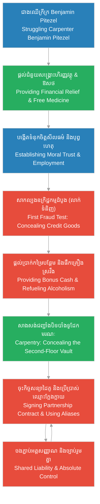

# Episode 9: ដៃគូក្នុងស្រមោល (Meeting Pitezel)

**Author:** ichamrong  
**Date:** 2026-06-07  
**Tags:** #hh-holmes #screenplay #episode-9 #gilded-age #chicago #manipulation #partnership-in-crime #alcoholism #carpentry-fraud #historical-case-study  
**Category:** Biographies  
**Read Time:** ~15 min  

---

## 📌 មាតិកា (Table of Contents)
- [សេចក្តីផ្តើម៖ ការជ្រើសរើសឧបករណ៍មនុស្ស (Introduction: Recruiting the Human Instrument)](#0)
- [១. ជាងឈើដែលជួបការលំបាក (Scene 1: The Struggling Carpenter)](#1)
- [២. ការសាកល្បងភាពស្មោះត្រង់ (Scene 2: Testing Pitezel's Loyalty)](#2)
- [៣. ការបិទបាំងទូដែកសុវត្ថិភាព (Scene 3: Disguising the Steel Vault)](#3)
- [៤. សន្ធិសញ្ញាក្នុងស្រមោល (Scene 4: The Covenant of Shadows)](#4)
- [៥. យន្តការចិត្តសាស្ត្រនៃការអូសទាញដៃគូ (The Psychological Recruitment Loop)](#5)
- [សេចក្តីសន្និដ្ឋាន (Conclusion)](#6)
- [🔗 ឯកសារទាក់ទង (Related Topics)](#7)

---

## សេចក្តីផ្តើម៖ ការជ្រើសរើសឧបករណ៍មនុស្ស (Introduction: Recruiting the Human Instrument)

រឿងភាគទី ៩ នេះ ផ្អែកលើករណីសិក្សាប្រវត្តិសាស្ត្រពិតនៃទំនាក់ទំនងរវាង H.H. Holmes និង **Benjamin Pitezel** ដែលជាដៃគូសហការ និងជាជនរងគ្រោះដ៏សំខាន់បំផុតរបស់គេ។ នៅក្នុងឆ្នាំ ១៨៨៩ Holmes បានជួប និងជួល Pitezel ដែលជាជាងឈើក្រីក្រ ម្នាក់ និងជាឪពុកដែលមានកូនប្រាំនាក់ ព្រមទាំងមានប្រវត្តិធ្លាប់រងការញាំញីដោយជំងឺញៀនស្រា និងបំណុលហិរញ្ញវត្ថុ។ Holmes បានមើលឃើញយ៉ាងច្បាស់ពី «ភាពងាយរងគ្រោះ» និងជំនាញបច្ចេកទេសរបស់ Pitezel ហើយបានប្រើប្រាស់ប្រាក់កាក់ ជំនួយសង្គ្រោះ និងគ្រឿងស្រវឹង ដើម្បីអូសទាញ Pitezel ឱ្យក្លាយជាដៃស្តាំរបស់ខ្លួនក្នុងការសម្រេចគម្រោងសំណង់ និងការអនុវត្តផែនការបោកប្រាស់ធានារ៉ាប់រង។

This ninth episode is based on the documented historical case study of the relationship between H.H. Holmes and **Benjamin Pitezel**, his primary accomplice and ultimate victim. In 1889, Holmes met and employed Pitezel, a struggling carpenter and father of five, who was burdened by debt and chronic alcoholism. Holmes recognized Pitezel's technical skills and vulnerability, systematically deploying cash, paternalistic rescue, and alcohol to bind Pitezel to him as his trusted right-hand man for construction projects and interstate insurance fraud schemes.

---

## ១. ជាងឈើដែលជួបការលំបាក (Scene 1: The Struggling Carpenter)

**ទីតាំង៖** ឱសថស្ថានរបស់ Holmes, តំបន់ Englewood, Chicago, ឆ្នាំ ១៨៨៩ (វេលារសៀល)  
**Location:** Holmes' Drugstore, Englewood, Chicago, 1889 (Afternoon)

**សកម្មភាព៖** Benjamin Pitezel (អាយុ ២៨ ឆ្នាំ ស្លៀកពាក់ខោអាវជាងឈើចាស់ ៗ ស្មាទម្រេត សក់ក្បាលរញ៉េរញ៉ៃ និងមានក្អកញឹកញាប់) ដើរចូលមកហាងថ្នាំដោយក្តីស្ទាក់ស្ទើរ។ ដៃរបស់គាត់គ្រើម និងប្រឡាក់ដោយធូលីឈើ។ Holmes ឈរនៅពីក្រោយបញ្ជរឱសថស្ថាន សម្លឹងមើលទៅ Pitezel ដោយការវាយតម្លៃយ៉ាងរហ័ស។ គេមើលឃើញភាពទន់ខ្សោយ បំណុល និងភាពអស់សង្ឃឹមនៅក្នុងកែវភ្នែករបស់បុរសម្នាក់នេះភ្លាម។ Pitezel លូកហោប៉ៅរកលុយមកបង់ថ្លៃថ្នាំក្អក ប៉ុន្តែជួបតែភាពទទេស្អាត។  
**Action:** Benjamin Pitezel (28 years old, wearing worn carpenter's work clothes, with slouched shoulders, disheveled hair, and a persistent cough) enters the drugstore hesitantly. His hands are calloused and stained with sawdust. Holmes stands behind the counter, executing a rapid assessment. He immediately identifies the vulnerability, debt, and desperation in Pitezel's eyes. Pitezel fumbles through his pockets for money to pay for cough syrup, only to find them empty.

<!-- [IMAGE: Benjamin Pitezel entering the drugstore looking tired. H.H. Holmes behind the counter, handing him medicine. (Image generation rate-limited, to be added later)] -->

*   **ផាយធាហ្សល (Pitezel)៖** "ជំរាប... ជម្រាបសួរលោកគ្រូពេទ្យ។ ខ្ញុំចង់បានថ្នាំក្អកខ្លះសម្រាប់ជំងឺសួតរបស់ខ្ញុំ។ ប៉ុន្តែ... ខ្ញុំមិនទាន់រកការងារធ្វើបានទេក្នុងសប្តាហ៍នេះ។ តើខ្ញុំអាចជំពាក់លុយលោកសិនបានទេ? ខ្ញុំមានប្រពន្ធ និងកូនប្រាំនាក់ត្រូវមើលថែ..."  
    *   *"Good... Good afternoon, Doctor. I require some cough syrup for my chest. However... I have found no steady construction work this week. Could I settle the bill later? I have a wife and five children to support..."*
*   **ហូម (Holmes)៖** (និយាយដោយទឹកមុខទន់ភ្លន់ និងហុចដបថ្នាំផ្សំពិសេសឱ្យគាត់ដោយគ្មានស្ទាក់ស្ទើរ) "មិនអីទេ លោក Pitezel។ សុខភាពរបស់លោកគឺជារឿងសំខាន់បំផុត។ ថ្នាំនេះខ្ញុំជូនលោកដោយមិនគិតថ្លៃឡើយ។ ខ្ញុំឃើញដៃរបស់លោកមានស្នាមក្រិនឈើ តើលោកជាជាងឈើមែនទេ?"  
    *   *(Speaking with simulated gentleness, handing him a customized bottle without hesitation)* *"Do not worry, Mr. Pitezel. Your health is the priority. I present this syrup to you free of charge. I notice the callouses on your hands; are you a carpenter by trade?"*
*   **ផាយធាហ្សល (Pitezel)៖** (ទទួលដបថ្នាំទាំងភ្ញាក់ផ្អើល និងដឹងគុណខ្លាំង) "អូ! បាទ លោកគ្រូពេទ្យ។ ខ្ញុំធ្លាប់ធ្វើការងារសាងសង់ផ្ទះ និងគ្រឿងសង្ហារិមជាច្រើនឆ្នាំ។ ប៉ុន្តែឥឡូវនេះការដ្ឋានភាគច្រើនជួលតែជាងសំណង់បណ្តោះអាសន្នប៉ុណ្ណោះ។ ខ្ញុំត្រូវការការងារខ្លាំងណាស់។"  
    *   *(Taking the bottle, surprised and deeply grateful)* *"Oh! Yes, Doctor. I have worked on framing and custom cabinetry for years. But most contractors only hire temporary labor now. I am in desperate need of employment."*
*   **ហូម (Holmes)៖** (ញញឹមយ៉ាងកក់ក្តៅ និងចង្អុលទៅដីឡូតិ៍សាងសង់អគារទល់មុខហាង) "លោកមកចំពេលល្អណាស់។ ខ្ញុំកំពុងសាងសង់អគារថ្មីមួយនៅទល់មុខនេះ និងត្រូវការជាងឈើដែលមានជំនាញខ្ពស់ និងអាចទុកចិត្តបានដូចជាលោក។ ខ្ញុំនឹងផ្តល់ការងារឱ្យលោកភ្លាម និងផ្តល់ប្រាក់កម្រៃប្រចាំសប្តាហ៍ទៀងទាត់។"  
    *   *(Smiling warmly, pointing to the construction site across the street)* *"You have arrived at the perfect moment. I am constructing a commercial building across the street and require a highly skilled, reliable carpenter like yourself. I can offer you immediate employment with steady weekly wages."*

**ការពិពណ៌នា៖** Pitezel អរគុណ Holmes សឹងតែលុតជង្គង់។ គាត់មើលឃើញ Holmes ដូចជាព្រះសង្គ្រោះដែលមកជួយស្រោចស្រង់ជីវិតគ្រួសារគាត់។ ប៉ុន្តែ Holmes គ្រាន់តែឃើញ Pitezel ត្រឹមតែជា «ឧបករណ៍មនុស្ស» ដ៏ល្អឥតខ្ចោះម្នាក់ ដែលគេអាចបញ្ជា និងប្រើប្រាស់បានគ្រប់ពេល ព្រោះតែភាពទន់ខ្សោយហិរញ្ញវត្ថុ និងជំងឺញៀនស្រារបស់គាត់។  
**Description:** Pitezel thanks Holmes profusely, near tears. He views Holmes as a benevolent savior rescuing his family from starvation. However, Holmes only evaluates Pitezel as a perfect "human instrument" to be directed and leveraged, utilizing his financial desperation and chronic alcoholism.

---

## ២. ការសាកល្បងភាពស្មោះត្រង់ (Scene 2: Testing Pitezel's Loyalty)

**ទីតាំង៖** ផ្នែកខាងក្រោយនៃអគារ Castle ដែលកំពុងសាងសង់, Englewood, ឆ្នាំ ១៨៨៩  
**Location:** The Back Section of the Castle under construction, Englewood, 1889

**សកម្មភាព៖** បន្ទប់ងងឹតមួយដែលពោរពេញដោយគំនរគ្រឿងសង្ហារិមឈើប្រណីត កម្រាលព្រំមានតម្លៃ និងអំពូលបំភ្លឺដែលបញ្ជាទិញជំពាក់លុយគេ។ Holmes និង Pitezel ឈរជាមួយគ្នានៅមុខទ្វារសម្ងាត់មួយ។ Holmes យកដុំលុយក្រដាសហាសិបដុល្លារចេញពីហោប៉ៅ រួចហុចទៅឱ្យ Pitezel ដោយសម្លឹងមើលភ្នែករបស់គាត់ចំដើម្បីសង្កេតប្រតិកម្ម។  
**Action:** A dim storeroom is piled with expensive mahogany furniture, rolled velvet carpets, and lighting fixtures acquired on credit. Holmes and Pitezel stand near a hidden partition door. Holmes pulls a roll of fifty-dollar bills from his vest, presenting it to Pitezel while locking eyes to gauge his reaction.

<!-- [IMAGE: H.H. Holmes handing a stack of cash to Benjamin Pitezel. Pitezel is hesitant, looking at the money in his calloused hand. (Image generation rate-limited, to be added later)] -->

*   **ហូម (Holmes)៖** "Pitezel ថ្ងៃស្អែក ភ្នាក់ងារទារបំណុលរបស់ក្រុមហ៊ុនគ្រឿងសង្ហារិមនឹងមកឆែកឆេរអគារនេះ ដោយសារមានការយឺតយ៉ាវរដ្ឋបាលលើគណនីរបស់ខ្ញុំ។ ខ្ញុំចង់ឱ្យលោកជួយរើគ្រឿងសង្ហារិមទាំងអស់នេះទៅលាក់នៅក្នុងបន្ទប់សម្ងាត់ខាងក្រោយជញ្ជាំងពីរជាន់ ដែលលោកបានសាងសង់រួច។"  
    *   *"Pitezel, tomorrow a collection agent from the furniture firm will inspect this building due to an administrative delay on my accounts. I need you to relocate these pieces into the double-walled secret room you framed yesterday."*
*   **ផាយធាហ្សល (Pitezel)៖** (ស្ទាក់ស្ទើរ និងមើលទៅលុយក្នុងដៃ) "ប៉ុន្តែ... លោក Holmes ការរើទំនិញលាក់បាំងបែបនេះ គឺខុសច្បាប់ពាណិជ្ជកម្ម។ ខ្ញុំមិនចង់មានបញ្ហាជាមួយ sheriff ឡើយ..."  
    *   *(Hesitant, staring at the cash)* *"But... Mr. Holmes, concealing inventory like this is a violation of commercial regulations. I do not wish to run afoul of the sheriff..."*
*   **ហូម (Holmes)៖** (និយាយសំឡេងទន់ស្រទន់ និងសង្កត់ធ្ងន់) "គ្មាន sheriff ណាមកខ្វល់ពីរឿងក្រដាសស្នាមរបស់ពួកសេដ្ឋីផ្តាច់មុខនៅ Chicago ឡើយ Pitezel។ លុយមួយរយដុល្លារនេះជាប្រាក់បន្ថែមលើប្រាក់ខែរបស់លោក។ វាគ្រប់គ្រាន់សម្រាប់ទិញសម្លៀកបំពាក់ថ្មីឱ្យកូនស្រី Alice របស់លោក និងទិញអាហារសម្រាប់គ្រួសារលោកពេញមួយខែ។ យើងគ្រាន់តែការពារផលប្រយោជន៍របស់យើងប៉ុណ្ណោះ។"  
    *   *(Speaking in a low, persuasive murmur)* *"No sheriff concerns himself with the administrative paper disputes of Chicago's monopolies, Pitezel. This one hundred dollars is a bonus on top of your wages. It is enough to purchase new clothes for your daughter Alice and food for your kitchen for a month. We are merely protecting our own interests."*
*   **ផាយធាហ្សល (Pitezel)៖** (លេបទឹកមាត់ រួចទទួលយកលុយនោះយ៉ាងណែនក្នុងដៃ) "យល់ព្រម លោក Holmes។ ខ្ញុំនឹងរៀបចំឡានដឹកទំនិញ និងរើវាលាក់ទុកឱ្យជិតបំផុតនាពេលយប់នេះ។"  
    *   *(Swallowing, taking the roll tightly in his calloused palm)* *"Very well, Mr. Holmes. I will align the transfer wagons and conceal the inventory tonight."*

**ការពិពណ៌នា៖** Pitezel ចាប់ផ្តើមលើកកៅអីឈើប្រណីតដោយគ្មានការសួរនាំទៀតឡើយ។ គេបានឆ្លងកាត់ការសាកល្បងភាពស្មោះត្រង់ជាលើកដំបូង។ Holmes ឈរសម្លឹងមើលពីក្រោយដោយកែវភ្នែកគ្មានអារម្មណ៍។ គេដឹងថា ជំហានបន្ទាប់គឺការទាញ Pitezel ឱ្យចូលកាន់តែជ្រៅទៅក្នុងរង្វង់ឧក្រិដ្ឋកម្ម ដែលធ្វើឱ្យ Pitezel មិនអាចដកខ្លួនចេញបានឡើយ ដោយសារតែចំណងហិរញ្ញវត្ថុ និងកំហុសច្បាប់រួមគ្នា។  
**Description:** Pitezel begins lifting the mahogany chairs without further inquiry. He has crossed the initial threshold of complicity. Holmes watches from behind, his expression flat and unreadable. He knows the next phase is to draw Pitezel deeper into a shared web of liability, rendering him incapable of escape.

---

## ៣. ការបិទបាំងទូដែកសុវត្ថិភាព (Scene 3: Disguising the Steel Vault)

**ទីតាំង៖** ជាន់ទីពីរនៃអគារ Castle, ឆ្នាំ ១៨៨៩-១៨៩០ (វេលាថ្ងៃត្រង់)  
**Location:** The Second Floor of the Castle, 1889-1890 (Midday)

**សកម្មភាព៖** Pitezel កំពុងវាស់ និងបាញ់ខ្ទាស់បន្ទះក្តារបន្ទះឈើធំ ៗ ដើម្បីសាងសង់ជញ្ជាំងឈើក្លែងក្លាយបិទបាំងទ្វារដែកសុវត្ថិភាពដ៏ធំធ្ងន់ (Walk-in Vault)។ Holmes ឈរក្បែរនោះ សម្លឹងមើលទៅទ្វារដែកដែលគ្មានប្រព័ន្ធខ្យល់ ឬរន្ធបង្ហូរខ្យល់ចេញចូលឡើយ។ Pitezel ឈប់គោះញញួរ រួចចង្អុលបង្ហាញពីភាពមិនប្រក្រតីខ្លះ។  
**Action:** Pitezel measures and hammers heavy pine panels to construct a false wooden partition wall, completely concealing the massive steel walk-in safe. Holmes stands nearby. Pitezel stops hammering, pointing out a structural anomaly in the safe design.

<!-- [IMAGE: Benjamin Pitezel hammering wooden boards to disguise the steel vault. H.H. Holmes stands nearby watching. (Image generation rate-limited, to be added later)] -->

*   **ផាយធាហ្សល (Pitezel)៖** "លោក Holmes ទូដែកនេះមានទំហំធំខ្លាំងណាស់ ប៉ុន្តែហេតុអ្វីបានជាទ្វាររបស់វាគ្មានប្រព័ន្ធសោសុវត្ថិភាពពីខាងក្នុង និងគ្មានរន្ធខ្យល់ចេញចូលសោះបែបនេះ? ប្រសិនបើមាននរណាម្នាក់ជាប់គាំងនៅខាងក្នុង ពួកគេនឹងថប់ដង្ហើមស្លាប់ក្នុងរយៈពេលមិនដល់មួយម៉ោងឡើយ។"  
    *   *"Mr. Holmes, this safe is built like a vault, but why does the steel door lack an internal release latch or a single ventilation shaft? If a clerk were to get locked inside, they would suffocate within an hour."*
*   **ហូម (Holmes)៖** (និយាយដោយស្នាមញញឹមគួរឱ្យទុកចិត្ត និងសំឡេងស្រទន់) "វាជាទូដែកសម្រាប់ទុកដាក់សម្ភារៈគីមីគ្លីនិក និងសន្លឹកកញ្ចក់រូបថតពិសេស Pitezel។ សារធាតុទាំងនោះត្រូវការបរិយាកាសងងឹត និងគ្មានខ្យល់ចេញចូលទាំងស្រុង ដើម្បីការពារការខូចគុណភាព។ ខ្ញុំគ្រោងនឹងប្រើប្រាស់វាជាបន្ទប់ពិសោធន៍ងងឹត (Darkroom) ផ្ទាល់ខ្លួនរបស់ខ្ញុំ។ ជញ្ជាំងឈើដែលលោកកំពុងសាងសង់នេះ នឹងជួយការពារកុំឱ្យមានពន្លឺជះចូល។"  
    *   *(Smiling reassuringly, in a level tone)* *"It is a vault designed to store chemical formulas and photosensitive plates, Pitezel. Those materials require an absolute dark and airtight environment to prevent degradation. I intend to use it as my private laboratory darkroom. The wood siding you are framing will prevent any light leak from entering."*
*   **ផាយធាហ្សល (Pitezel)៖** (ងក់ក្បាល ទោះបីជាមានការសង្ស័យតិចតួច ប៉ុន្តែចង់បញ្ចប់ការងារដើម្បីបើកលុយ) "បាទ លោកគ្រូពេទ្យ។ ការពន្យល់របស់លោកពិតជាមានហេតុផល។ ខ្ញុំនឹងដំឡើងជញ្ជាំងឈើឱ្យជិត និងធ្វើឱ្យទ្វារដែកនេះមើលទៅដូចជាទ្វារទូខោអាវធម្មតា។"  
    *   *(Nodding, his skepticism quieted by the need to secure his pay)* *"Yes, Doctor. Your explanation is logical. I will seal the woodwork and format the exterior so the steel frame looks like a standard closet door."*

**ការពិពណ៌នា៖** Pitezel បន្តលើកញញួរគោះក្តារឈើយ៉ាងមមាញឹក។ Holmes សម្លឹងមើលទៅទ្វារដែកនោះដោយភាពស្ងប់ស្ងាត់។ គេមិនបារម្ភពីរឿង Pitezel សង្ស័យឡើយ ព្រោះ Pitezel ត្រូវបានដកហូតសមត្ថភាពគិតគូរវែងឆ្ងាយដោយសារតម្រូវការលុយកាក់ និងភាពទន់ខ្សោយផ្ទាល់ខ្លួន។ Pitezel កំពុងសាងសង់បន្ទប់ឃុំឃាំងជនរងគ្រោះដោយដៃរបស់ខ្លួនឯង ក្រោមការបញ្ជារបស់ Holmes។  
**Description:** Pitezel resumes hammering the pine panels. Holmes watches the steel door in silence. He remains unconcerned with Pitezel's curiosity, knowing the carpenter's critical thinking is thoroughly dulled by financial dependency. Pitezel is framing a secure death chamber with his own hands under Holmes' direction.

---

## ៤. សន្ធិសញ្ញាក្នុងស្រមោល (Scene 4: The Covenant of Shadows)

**ទីតាំង៖** ការិយាល័យផ្ទាល់ខ្លួនរបស់ Holmes នៅក្នុងឱសថស្ថាន, ឆ្នាំ ១៨៩០ (វេលាយប់យប់ជ្រៅ)  
**Location:** Holmes' Private Office inside the Drugstore, 1890 (Late Night)

**សកម្មភាព៖** បន្ទប់ការិយាល័យមានសណ្តាប់ធ្នាប់ និងស្ងប់ស្ងាត់។ Holmes ចាក់ស្រាវីស្គីប្រណីតមួយកែវពេញ រួចហុចទៅឱ្យ Pitezel ដែលអង្គុយទល់មុខតុ។ ភ្នែករបស់ Pitezel ឡើងក្រហមបន្តិច និងមានការញ័រម្រាមដៃដោយសារការចង់សេពគ្រឿងស្រវឹង។ គាត់ទទួលយកកែវស្រាផឹកភ្លាម ៗ យ៉ាងសប្បាយចិត្ត។ Holmes សម្លឹងមើលគាត់ដោយទឹកមុខស្និទ្ធស្នាល ប៉ុន្តែជាទឹកមុខដែលរៀបចំទុកជាមុន។  
**Action:** The office is quiet and organized. Holmes pours a generous glass of premium whiskey and slides it across the desk to Pitezel. Pitezel's eyes are bloodshot, his fingers twitching slightly from alcohol withdrawal. He takes the glass and drinks it eagerly. Holmes watches him with a warm, calculated mask.

<!-- [IMAGE: H.H. Holmes pouring whiskey for Benjamin Pitezel in a dimly lit office. They toast and shake hands. (Image generation rate-limited, to be added later)] -->

*   **ហូម (Holmes)៖** "ផឹកឱ្យស្រួលចិត្តចុះ Pitezel។ លោកបានធ្វើការងារយ៉ាងល្អឥតខ្ចោះសម្រាប់អគារ Castle របស់យើង។ លោកមិនមែនត្រឹមតែជាជាងឈើធម្មតាម្នាក់ឡើយ... លោកជាដៃគូជំនួញរបស់ខ្ញុំ។ ខ្ញុំមានផែនការធំ ៗ សម្រាប់យើងទាំងពីរ នៅក្នុងទីក្រុង Chicago នេះ។"  
    *   *"Drink, Pitezel. You have executed exceptional work for our Castle. You are no longer a mere carpenter to me... you are my partner. I have grand blueprints for both of us in Chicago."*
*   **ផាយធាហ្សល (Pitezel)៖** (ដកដង្ហើមធំដោយភាពធូរស្រាល ម្រាមដៃលែងញ័រ) "លោក Holmes លោកជាមនុស្សតែម្នាក់គត់ដែលឱ្យតម្លៃលើរូបខ្ញុំ និងជួយគ្រួសារខ្ញុំមិនឱ្យធ្លាក់ក្នុងភាពក្រីក្រ។ ខ្ញុំនឹងធ្វើគ្រប់យ៉ាងដែលលោកត្រូវការ ដើម្បីរក្សាការងារនេះ។"  
    *   *(Sighing in relief as the tremors subside)* *"Mr. Holmes, you are the only man who has valued my skill and kept my family from the poorhouse. I will execute whatever you require to preserve this arrangement."*
*   **ហូម (Holmes)៖** (ហុចកិច្ចសន្យាថ្មី និងចាក់ស្រាឱ្យគាត់មួយកែវទៀត) "យើងនឹងបង្កើតក្រុមហ៊ុនពាណិជ្ជកម្មថ្មីមួយទៀត។ លោកនឹងដើរតួជាតំណាងចែកចាយ និងចុះហត្ថលេខាទិញទំនិញជំពាក់ឥណទានក្រោមឈ្មោះផ្សេង ៗ។ យើងនឹងបង្វែរលុយ និងធានារ៉ាប់រងអាយុជីវិតមកចែកគ្នា។ នេះជាកិច្ចសន្យាដៃគូរបស់យើង។ ផឹកដើម្បីភាពជោគជ័យរបស់យើងចុះ!"  
    *   *(Handing him a new contract and refilling his glass)* *"We will establish a new commercial firm. You will act as our representative, signing credit orders under various aliases. We will route capital and life insurance payouts to secure our future. This is our partnership agreement. Let us toast to our success!"*
*   **ផាយធាហ្សល (Pitezel)៖** (លើកកែវស្រាឡើង រួចជល់កែវជាមួយ Holmes) "ដើម្បីលោកគ្រូពេទ្យ Holmes និងអនាគតរបស់យើង!"  
    *   *(Raising his glass, clinking it against Holmes' glass)* *"To Dr. Holmes, and to our future!"*

**ការពិពណ៌នា៖** Pitezel ផឹកស្រាកែវទីពីរទាំងសប្បាយចិត្ត និងចុះហត្ថលេខាលើកិច្ចសន្យាដៃគូដោយគ្មានស្ទាក់ស្ទើរ។ Holmes សម្លឹងមើលទៅស្រមោលរបស់ Pitezel ដែលជះកាត់ជញ្ជាំងបន្ទប់ការិយាល័យ។ គេដឹងថា គេបានចងភ្ជាប់ Pitezel ជាប់នឹងខ្លួនទាំងស្រុងហើយ។ គ្រឿងស្រវឹង បំណុល និងកិច្ចសន្យានេះ គឺជាខ្សែចំណងដែលនឹងទាញ Pitezel ឱ្យធ្វើតាមគ្រប់បញ្ជារបស់គេ រហូតដល់ថ្ងៃចុងក្រោយនៃជីវិតរបស់គាត់។  
**Description:** Pitezel drinks the second glass with delight, signing the partnership papers. Holmes looks at Pitezel's shadow cast on the office wall. He knows he has bound Pitezel to him completely. The alcohol, the debt, and the contracts are the invisible chains that will hold Pitezel to his commands until the final hour of his life.

---

## ៥. យន្តការចិត្តសាស្ត្រនៃការអូសទាញដៃគូ (The Psychological Recruitment Loop)

ដ្យាក្រាមខាងក្រោមបង្ហាញពីរបៀបដែល H.H. Holmes គ្រប់គ្រង និងអូសទាញ Benjamin Pitezel ឱ្យក្លាយជាដៃគូឧក្រិដ្ឋកម្មរបស់ខ្លួន៖

The following diagram maps the psychological loop Holmes engineered to recruit and control Benjamin Pitezel:

> [!IMPORTANT]
> **🧠 យន្តការចិត្តសាស្ត្រ / Psychological Mechanism - [លំហូរនៃធនធាន និងការរៀបចំយន្តការ (Flow of Resources and Mechanics)](../keyword/flow-of-resources-and-mechanics.md):**
> * «នៅក្នុងប្លង់ទី ៣ Holmes ប្រើប្រាស់ Pitezel ជាឧបករណ៍ពលកម្មដើម្បីបិទបាំងប្រព័ន្ធមរណៈរបស់គេ។ គេមិនបារម្ភពីរឿង Pitezel ដឹងការពិតឡើយ ព្រោះគេគ្រប់គ្រងលំហូរព័ត៌មានដោយផ្តល់ការពន្យល់បែបវិទ្យាសាស្ត្រក្លែងក្លាយ (បន្ទប់ងងឹតថតរូប) ដែលសមស្របនឹងតម្រូវការយល់ដឹងរបស់ Pitezel។» (*"In Scene 3, Holmes deploys Pitezel as a physical labor instrument to mask his death mechanisms. He is unconcerned with Pitezel discovering the truth, regulating information flow with pseudo-scientific explanations (a darkroom) tailored to soothe Pitezel's curiosity."*).
> 
> **🤫 យន្តការចិត្តសាស្ត្រ / Psychological Mechanism - [បញ្ជីវាស់វែងវិន័យ (Discipline Ledger)](../keyword/discipline-ledger.md):**
> * «នៅក្នុងប្លង់ទី ៤ Holmes អនុវត្តវិន័យដ៏ហ្មត់ចត់ក្នុងការគ្រប់គ្រងការញៀនស្រារបស់ Pitezel។ គេចាក់ស្រាឱ្យ Pitezel ក្នុងបរិមាណដែលគ្រប់គ្រាន់ដើម្បីលុបបំបាត់ការញ័រដៃ និងបង្អាក់សមត្ថភាពគិតពិចារណា ប៉ុន្តែមិនឱ្យស្រវឹងជោកជាំរហូតដល់មិនអាចបំពេញការងារបានឡើយ។ គេគ្រប់គ្រង Pitezel ជាប្រព័ន្ធរដ្ឋបាលរៀបរយមួយ។» (*"In Scene 4, Holmes applies strict discipline in managing Pitezel's alcoholism. He dispenses whiskey in amounts calibrated to suppress withdrawal tremors and inhibit critical thinking, without causing incapacitating intoxication. He manages Pitezel as a structured administrative asset."*).

---

## សេចក្តីសន្និដ្ឋាន (Conclusion)

> **«នៅក្នុងអាណាចក្រពាណិជ្ជកម្ម ដៃគូដ៏ល្អបំផុតគឺមិនមែនជាមនុស្សដែលមានជំនាញពូកែបំផុតនោះឡើយ... គឺពួកសេពគ្រឿងស្រវឹងដែលមានបំណុលជុំខ្លួន និងមានកូនប្រាំនាក់ត្រូវចិញ្ចឹម ព្រោះពួកគេនឹងធ្វើគ្រប់យ៉ាងដើម្បីរក្សាលំហូរឥណទាន» — H.H. Holmes**
> 
> **“In commercial enterprise, the finest partner is not the most skilled... it is the indebted alcoholic with five children to support, for they will execute any command to preserve the flow of credit.” — H.H. Holmes**

រឿងភាគទី ៩ បិទបញ្ចប់ដោយ Holmes និង Pitezel ដើរចេញពីឱសថស្ថានក្នុងវេលាយប់ងងឹត សំដៅទៅកាន់អគារ Castle។ ពួកគេចាប់ដៃគ្នា និងចាក់សោរទ្វារមុខអគាររួមគ្នា ត្រៀមខ្លួនសម្រាប់ភាគទី ១០ ដែលនឹងបង្ហាញពីការបញ្ចប់សំណង់ជាន់ទីពីរ និងការរៀបចំប្រព័ន្ធហ្គាសពុលជាស្ថាពរ។

Episode 9 concludes with Holmes and Pitezel leaving the drugstore under the cover of night, heading toward the Castle. They shake hands and lock the main entrance together, setting the stage for Episode 10, which will cover the completion of the second floor and the final installation of the gas configurations.

---

## 🔗 ឯកសារទាក់ទង (Related Topics)
*   **[Episode 8: ជាងសំណង់គ្មានឈ្មោះ (Rotated Labor)](ep-08-rotated-labor.md)** — ស្គ្រីបភាគទី ៨ ដែល Holmes ប្រើប្រាស់ឥណទានបោកប្រាស់ដែកថែប Aetna និងទូដែកសុវត្ថិភាព។
*   **[Episode 10: ជញ្ជាំងនិងអន្ទាក់ (The Castle Completed)](ep-10-the-castle-completed.md)** — ស្គ្រីបភាគទី ១០ ដែលបង្ហាញពីការបញ្ចប់សំណង់ជាន់ទីពីរ និងការរៀបចំប្រព័ន្ធហ្គាសពុលជាស្ថាពរ។
*   **[លំហូរនៃធនធាន និងការរៀបចំយន្តការ (Flow of Resources and Mechanics)](../keyword/flow-of-resources-and-mechanics.md)** — វិធីសាស្ត្រចិត្តសាស្ត្រដែលចាត់ទុកជីវិតជាទ្រព្យសកម្មរូបវន្ត។
*   **[បញ្ជីវាស់វែងវិន័យ (Discipline Ledger)](../keyword/discipline-ledger.md)** — វិធីសាស្ត្រតាមដាន និងគ្រប់គ្រងចិត្តសាស្ត្ររបស់ Holmes។
*   **[ជីវប្រវត្តិ H.H. Holmes](../01-h-h-holmes-biography.md)** — ជីវប្រវត្តិនៃការវិវឌ្ឍជីវិត និងវិមានឃាតកម្មរបស់ Holmes។
*   **[គម្រោងរឿងភាគដ្រាម៉ា ៦៣ ភាគ](../08-holmes-drama-episode-guide.md)** — ផែនការ និងការសង្ខេបរឿងភាគទូរទស្សន៍ទាំង ៦៣ ភាគ។
