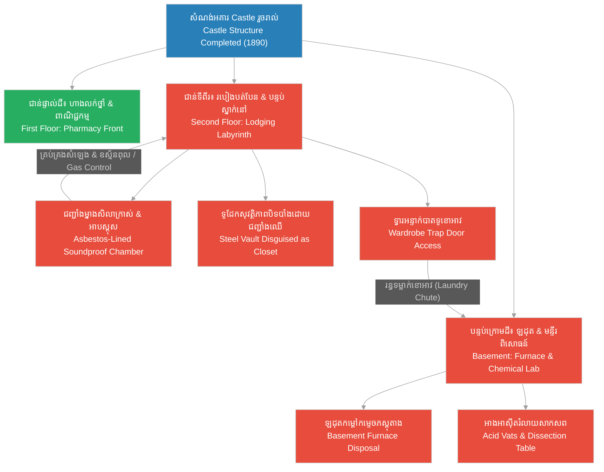

# Episode 10: ជញ្ជាំងនិងអន្ទាក់ (The Castle Completed)

**Author:** ichamrong  
**Date:** 2026-06-07  
**Tags:** #hh-holmes #screenplay #episode-10 #gilded-age #chicago #construction-completion #labyrinth-design #laundry-chute #asbestos-lined #historical-case-study  
**Category:** Biographies  
**Read Time:** ~15 min  

---

## 📌 មាតិកា (Table of Contents)
- [សេចក្តីផ្តើម៖ សោភ័ណភាពនៃភាពមិនប្រក្រតី (Introduction: The Aesthetics of Irregularity)](#0)
- [១. វាំងននបាំងផ្លូវវង្វេង (Scene 1: The Labyrinth of Partition Walls)](#1)
- [២. ទ្វារអន្ទាក់ និងរន្ធទម្លាក់ខោអាវ (Scene 2: The Trap Door and Laundry Chute)](#2)
- [៣. ម្នាងសិលាកាត់សំឡេង និងអាបស្តុស (Scene 3: Asbestos and Soundproof Plaster)](#3)
- [៤. ទ្វារបិទជិតនៅ Englewood (Scene 4: The Closed Doors of Englewood)](#4)
- [៥. យន្តការរចនាសម្ព័ន្ធវិមាន (The Castle Structural Matrix)](#5)
- [សេចក្តីសន្និដ្ឋាន (Conclusion)](#6)
- [🔗 ឯកសារទាក់ទង (Related Topics)](#7)

---

## សេចក្តីផ្តើម៖ សោភ័ណភាពនៃភាពមិនប្រក្រតី (Introduction: The Aesthetics of Irregularity)

រឿងភាគទី ១០ នេះ ផ្អែកលើករណីសិក្សាប្រវត្តិសាស្ត្រពិតនៃការបញ្ចប់សំណង់អគារ «Castle» របស់ H.H. Holmes ក្នុងឆ្នាំ ១៨៩០។ ផ្ទុយទៅនឹងរឿងព្រេងឃាតកម្មដែលត្រូវបានបំផ្លើសដោយសារព័ត៌មានបែបអាស្រូវក្នុងឆ្នាំ ១៨៩៥ គំនូរប្លង់ជាន់ទីពីរដែលបត់បែន និងច្របូកច្របល់មិនមែនជាការរចនាឡើងដំបូងឡើយ។ វាគឺជាលទ្ធផលនៃការសាងសង់ដ៏ថោក ៗ គ្មានរបៀបរៀបរយ និងការស៊ើបប្តឹងជំពាក់លុយពីជាងសំណង់ ដែលបង្ខំឱ្យ Holmes ត្រូវប្តូរប្លង់ជញ្ជាំងជាម៉ូឌុល (Modular Partitions) ញឹកញាប់។ ភាគនេះបង្ហាញពីរបៀបដែល Holmes ណែនាំរន្ធទម្លាក់ខោអាវ (Laundry Chute) និងបន្ទប់បិទជិតដោយជាតិអាបស្តុស (Asbestos-Lined Room) ទៅកាន់ Benjamin Pitezel ដោយប្រើប្រាស់ការពន្យល់បែបពាណិជ្ជកម្ម និងសុវត្ថិភាពគ្លីនិកដ៏សមស្រប។

This tenth episode is based on the documented historical case study of the structural completion of H.H. Holmes' "Castle" in 1890. Correcting the sensationalized myths popularized by yellow journalism in 1895, the second floor's labyrinthine, irregular layout was not a grand mastermind blueprint from day one. Instead, it was the structural consequence of cheap, chaotic building methods and frequent crew rotations to evade creditors, forcing Holmes to modify the modular partition walls. The episode dramatizes how Holmes presented the laundry chute and the asbestos-lined chamber to Benjamin Pitezel, utilizing plausible retail and clinical safety justifications.

---

## ១. វាំងននបាំងផ្លូវវង្វេង (Scene 1: The Labyrinth of Partition Walls)

**ទីតាំង៖** របៀងច្រកផ្លូវជាន់ទីពីរនៃអគារ Castle, ឆ្នាំ ១៨៩០ (វេលារសៀល)  
**Location:** The Second-Floor Corridors of the Castle, 1890 (Afternoon)

**សកម្មភាព៖** របៀងច្រកផ្លូវជាន់ទីពីរមានសភាពងងឹត និងបត់បែនគ្មានសណ្តាប់ធ្នាប់។ ជញ្ជាំងឈើ និងឥដ្ឋដែលទើបតែលាបម្នាងសិលារួច បង្កើតជាបន្ទប់តូច ៗ និងរបៀងដែលមិនមានបង្អួចចេញចូលឡើយ។ Holmes ដើរដឹកនាំមុខ Pitezel ដែលកំពុងស្ពាយកាបូបឧបករណ៍ជាងឈើ និងវាស់ស្ទង់ទ្វារ។ ពួកគេឈប់នៅមុខទ្វាររបៀងមួយ ដែលបើកទៅជួបតែជញ្ជាំងឥដ្ឋបិទជិត។ Pitezel ងឿងឆ្ងល់ និងលើកទម្លាក់ក្តារវាស់ស្ទង់ចុះ។  
**Action:** The second-floor corridors are dim, narrow, and structurally irregular. Newly plastered partition walls and timber frames create small, windowless rooms and dead-end hallways. Holmes walks ahead of Pitezel, who carries a leather tool bag and a spirit level. They stop before a doorway that opens directly to a solid brick wall. Pitezel looks confused, lowering his measuring level.

<!-- [IMAGE: H.H. Holmes and Benjamin Pitezel walking the confusing second-floor corridors. Pitezel holds a level tool, adjusting a door frame. (Image generation rate-limited, to be added later)] -->

*   **ផាយធាហ្សល (Pitezel)៖** "លោក Holmes ប្លង់របៀងកន្លែងនេះខុសគ្នាឆ្ងាយណាស់ពីប្លង់ដើម។ ទ្វាររបៀងនេះបើកទៅជួបជញ្ជាំងឥដ្ឋបិទជិតទាល់តែសោះ។ តើនេះជាកំហុសរបស់ជាងរៀបឥដ្ឋក្រុមមុន ឬជាបំណងរបស់លោក?"  
    *   *"Mr. Holmes, the corridor layout here is completely different from our initial framing. This door opens directly into a solid brick wall. Was this an error by the previous masonry crew, or did you intend it?"*
*   **ហូម (Holmes)៖** "វាជាវិធីសាស្ត្រដោះស្រាយបញ្ហាដ៏ល្អបំផុត Pitezel។ ដោយសារយើងត្រូវរុះរើ និងប្តូរក្រុមជាងសំណង់ញឹកញាប់ដើម្បីការពារការសម្ងាត់ ជញ្ជាំងខ្លះត្រូវបានរៀបខុសជួរ។ ខ្ញុំគ្រាន់តែរៀបចំទ្វារនេះជាទូខោអាវបិទជិត ដើម្បីសន្សំសំចៃទំហំបន្ទប់។ នៅក្នុងក្រុង Chicago ដែលមានដីធ្លីតម្លៃថ្លៃ ការបត់បែនតាមរចនាសម្ព័ន្ធ គឺជាច្បាប់មាស។"  
    *   *"It is a structural adjustment, Pitezel. Because we had to rotate masonry crews to insulate ourselves from liability, some walls were misaligned. I simply converted this doorway into a false closet to maximize room space. In a high-rent city like Chicago, spatial flexibility is the golden rule."*
*   **ផាយធាហ្សល (Pitezel)៖** (សម្លឹងមើលរបៀងបត់បែនដែលគ្មានពន្លឺព្រះអាទិត្យ) "ប៉ុន្តែបន្ទប់មួយចំនួនគ្មានបង្អួចទាល់តែសោះ។ វានឹងមានសភាពហប់ និងងងឹតខ្លាំងណាស់ សម្រាប់អ្នកជួលស្នាក់នៅ។"  
    *   *(Looking at the windowless, dim corridor)* *"But several of these inner suites have no window frames at all. It will be dark and poorly ventilated for prospective tenants."*
*   **ហូម (Holmes)៖** (និយាយដោយទំនុកចិត្ត និងទន់ភ្លន់) "បន្ទប់ទាំងនោះត្រូវបានរចនាសម្រាប់ភ្ញៀវដែលចង់បានភាពស្ងប់ស្ងាត់ និងឯកជនភាពទាំងស្រុងពីសំឡេងរំខានរបស់រថភ្លើងតាមផ្លូវ Wallace St។ យើងនឹងបំពាក់ចង្កៀងហ្គាសទំនើបបំផុត ដើម្បីផ្តល់ពន្លឺពណ៌មាសដ៏កក់ក្តៅជានិច្ច។"  
    *   *(Speaking smoothly with reassurance)* *"Those interior rooms are designed for tenants who demand absolute quiet and insulation from the train traffic on Wallace St. We will install the latest gas lamps to provide a steady, warm golden light."*

**ការពិពណ៌នា៖** Pitezel យល់ស្រប និងបន្តវាស់ស្ទង់ទ្វារបន្ទាប់។ គេមិនដឹងឡើយថា ការរចនាអគារដ៏ច្របូកច្របល់នេះ មិនត្រឹមតែជួយលាក់បាំងសកម្មភាពរបស់ Holmes ប៉ុណ្ណោះទេ ប៉ុន្តែវាក៏ជាការបង្កើតម៉ាស៊ីនមួយដែលនឹងឃុំខ្លួនជនរងគ្រោះនៅក្នុងពិភពលោកបិទជិត គ្មានពន្លឺ គ្មានខ្យល់ និងគ្មានច្រកចេញចូលដោយខ្លួនឯងឡើយ។  
**Description:** Pitezel nods, moving to measure the next frame. He remains oblivious that this irregular layout not only insulates Holmes from legal scrutiny, but constructs a physical matrix designed to confine victims within a windowless, silent loop with no escape routes.

---

## ២. ទ្វារអន្ទាក់ និងរន្ធទម្លាក់ខោអាវ (Scene 2: The Trap Door and Laundry Chute)

**ទីតាំង៖** បន្ទប់គេងកណ្តាលជាន់ទីពីរ នៃអគារ Castle, ឆ្នាំ ១៨៩០  
**Location:** The Central Bedroom Suite, Second Floor of the Castle, 1890

**សកម្មភាព៖** Pitezel កំពុងដំឡើងទូខោអាវឈើធំមួយនៅក្នុងបន្ទប់គេង។ Holmes បើកទ្វារបាតទូខោអាវ ដែលមានទ្វារអន្ទាក់ឈើ (Trap Door) បើកទៅជួបរន្ធទម្លាក់ចុះក្រោមជាលក្ខណៈបញ្ឈរ (Vertical Chute)។ គេយកចង្កៀងប្រេងកាតជះបំភ្លឺមើលទៅក្នុងរន្ធដ៏ជ្រៅ ដែលរត់ចុះទៅកាន់បន្ទប់ក្រោមដី។ Pitezel ឈប់គោះញញួរ រួចសម្លឹងមើលទៅរន្ធនោះទាំងងឿងឆ្ងល់។  
**Action:** Pitezel frames a large built-in wardrobe. Holmes opens the bottom panel of the closet, revealing a heavy trap door that hinges open to a vertical wooden chute. He shines his lantern down the deep shaft, which runs directly to the cellar floor. Pitezel stops hammering, looking down the dark opening with a questioning gaze.

<!-- [IMAGE: H.H. Holmes showing Benjamin Pitezel the trap door inside the closet. Pitezel looks down the dark vertical chute. (Image generation rate-limited, to be added later)] -->

*   **ផាយធាហ្សល (Pitezel)៖** "លោក Holmes ខ្ញុំបានធ្វើរន្ធឈើនេះតាមដែលលោកប្រាប់។ ប៉ុន្តែហេតុអ្វីបានជាយើងត្រូវធ្វើទ្វារអន្ទាក់លាក់នៅក្នុងបាតទូខោអាវបែបនេះ? វាមិនស្រួលសម្រាប់ប្រើប្រាស់ជាទូទៅឡើយ។"  
    *   *"Mr. Holmes, I constructed this wooden shaft as specified. But why must we hide a trap door inside the wardrobe floor? It seems highly impractical for standard room use."*
*   **ហូម (Holmes)៖** (និយាយពន្យល់ដោយភាពរៀបរយ និងចង្អុលទៅរន្ធខាងក្រោម) "វាជារន្ធទម្លាក់ខោអាវកខ្វក់ (Laundry Chute) ដ៏ទំនើប Pitezel។ ភ្ញៀវស្នាក់នៅ ឬលេខារបស់ខ្ញុំ អាចបោះសម្លៀកបំពាក់កខ្វក់ និងសម្រាមចុះទៅក្រោមបន្ទប់បោកអ៊ុតផ្ទាល់ ក្នុងបន្ទប់ក្រោមដីភ្លាម ៗ។ វានឹងជួយកាត់បន្ថយការធ្វើដំណើរតាមជណ្តើរចង្អៀត និងការពារក្លិនមិនល្អនៅក្នុងរបៀងអគារ។"  
    *   *(Explaining methodically, pointing down the shaft)* *"It is a modern gravity laundry chute, Pitezel. Lodgers or my clerks can discard soiled linens and refuse directly to the basement laundry facility. It eliminates the need to carry heavy laundry baskets down these steep stairwells and prevents odors in the hallways."*
*   **ផាយធាហ្សល (Pitezel)៖** "ចុះសោខ្ទាស់ពីខាងលើនេះ? ហេតុអ្វីបានជាត្រូវការគន្លឹះចាក់សោរឹងមាំបែបនេះ?"  
    *   *"And the latch lock on top? Why does a laundry hatch require such a heavy lock configuration?"*
*   **ហូម (Holmes)៖** "ដើម្បីសុវត្ថិភាពក្មេង ៗ របស់អតិថិជន កុំឱ្យពួកគេលេង និងធ្លាក់ចូលទៅក្នុងរន្ធនេះដោយចៃដន្យ Pitezel។ វិន័យ និងសុវត្ថិភាព គឺជាគោលការណ៍ចម្បងនៃសំណង់របស់ខ្ញុំ។"  
    *   *"For client safety, to prevent children from opening it and falling down the shaft, Pitezel. Structural safety is always my primary operational principle."*

**ការពិពណ៌នា៖** Pitezel ងក់ក្បាលដោយការយល់ស្រប។ គាត់ដំឡើងគន្លឹះគប់សោពីខាងក្រៅយ៉ាងណែន។ គាត់មិនដែលគិតដល់លទ្ធភាពដ៏ឃោរឃៅដែលថា រន្ធទម្លាក់ខោអាវនេះ នឹងត្រូវ Holmes ប្រើប្រាស់ដើម្បីទម្លាក់សាកសពជនរងគ្រោះពីជាន់ទីពីរ ចុះទៅកាន់បន្ទប់ឡដុតក្នុងបន្ទប់ក្រោមដីដោយផ្ទាល់ គ្មានសំឡេង គ្មានអ្នកឃើញ និងគ្មានបន្សល់ទុកតម្រុយឡើយ។  
**Description:** Pitezel nods in approval, bolting the lock securely from the outside. He never considers the grim reality that this gravity chute will be utilized by Holmes to drop the heavy bodies of his victims directly from the second floor to the cellar furnace, silently and without leaving a single trace.

---

## ៣. ម្នាងសិលាកាត់សំឡេង និងអាបស្តុស (Scene 3: Asbestos and Soundproof Plaster)

**ទីតាំង៖** បន្ទប់បិទជិតជាប់នឹងទូដែកជាន់ទីពីរ, ឆ្នាំ ១៨៩០  
**Location:** The Sealed Vault Chamber next to the safe, Second Floor, 1890

**សកម្មភាព៖** បន្ទប់តូចចង្អៀតមួយដែលគ្មានបង្អួច ឬរន្ធខ្យល់ចេញចូលឡើយ។ Pitezel កំពុងពាក់ម៉ាស់ក្រណាត់សាមញ្ញ លាយម្នាងសិលាពណ៌ស និងបិទបន្ទះសរសៃអាបស្តុស (Asbestos Sheets) ទៅនឹងជញ្ជាំងឥដ្ឋ។ ធូលីសស្កុសហុយពេញបន្ទប់។ Holmes ឈរនៅមាត់ទ្វារដែក សម្លឹងមើលទៅជញ្ជាំងដែលកំពុងរៀបចំរួច ដោយភាពពេញចិត្ត។ គេយកម្រាមដៃទៅប៉ះម្នាងសិលាដ៏ក្រាស់ ដែលមានកម្រាស់ពីរជាន់។  
**Action:** A cramped, windowless inner room. Pitezel wears a simple cloth mask, mixing white plaster and nailing gray asbestos sheets directly to the brick walls. Fine white dust fills the air. Holmes stands at the iron-plated doorway, inspecting the progress with satisfaction. He touches the double-thick soundproof plaster.

<!-- [IMAGE: Benjamin Pitezel applying plaster to the asbestos-lined vault room. Holmes stands nearby instructing him. (Image generation rate-limited, to be added later)] -->

*   **ផាយធាហ្សល (Pitezel)៖** (និយាយទាំងក្អកតិច ៗ និងចង្អុលជញ្ជាំង) "លោក Holmes ជញ្ជាំងបន្ទប់នេះក្រាស់ណាស់។ យើងបានបិទបន្ទះអាបស្តុសពីរជាន់ និងបូកម្នាងសិលាកាត់សំឡេងយ៉ាងក្រាស់ពីលើ។ សូម្បីតែសំឡេងញញួរគោះ ក៏មិនឮចេញទៅរបៀងក្រៅដែរ។ តើលោកពិតជាចង់ផ្ទុកគីមីគ្រោះថ្នាក់ខ្លាំងនៅក្នុងបន្ទប់នេះមែនទេ?"  
    *   *(Coughing slightly, gesturing to the plaster)* *"Mr. Holmes, these partitions are remarkably thick. We have installed double-layer asbestos and finished with a heavy layer of sound-deadening plaster. Even my hammering is silent to the corridor. Do you truly require this level of insulation for chemical storage?"*
*   **ហូម (Holmes)៖** "ពិតប្រាកដណាស់ Pitezel។ Formaldehyde, Ether និង Chloroform ដែលយើងប្រើប្រាស់ក្នុងឱសថស្ថាន គឺជាសារធាតុឆាប់ឆេះ និងបញ្ចេញក្លិនពុលខ្លាំង។ បន្ទះអាបស្តុសនឹងការពារពីគ្រោះអគ្គិភ័យ ឯជញ្ជាំងម្នាងសិលាដ៏ក្រាស់ នឹងការពារកុំឱ្យមានការលេចធ្លាយឧស្ម័នពុលទៅកាន់បន្ទប់ស្នាក់នៅរបស់ភ្ញៀវជិតខាង។ វាជាស្តង់ដារមន្ទីរពិសោធន៍ទំនើបបំផុត។"  
    *   *"Absolutely, Pitezel. The formaldehyde, ether, and chloroform we stock are volatile, highly flammable, and emit toxic fumes. Asbestos sheets prevent fire hazards, while the double-plaster prevents gas leaks from disturbing guest quarters. It matches standard medical laboratory safety design."*
*   **ផាយធាហ្សល (Pitezel)៖** "យល់ហើយ លោកគ្រូពេទ្យ។ លោកពិតជាគិតគូរពីសុវត្ថិភាពបានល្អល្អះណាស់។ ខ្ញុំនឹងបិទបន្ទះក្តារឈើបិទជិតពីលើម្នាងសិលានេះឱ្យរួចរាល់នៅល្ងាចនេះ។"  
    *   *"I see, Doctor. Your precautions are thorough. I will finish the wood siding over this plaster layer by this evening."*

**ការពិពណ៌នា៖** Holmes ងក់ក្បាលយ៉ាងស្ងប់ស្ងាត់ រួចដើរចេញទៅវិញ។ គេដឹងថា ជញ្ជាំងអាបស្តុស និងម្នាងសិលាដ៏ក្រាស់នេះ មិនមែនដើម្បីការពារភ្លើង ឬក្លិនគីមីឡើយ។ វាត្រូវបានបង្កើតឡើងដើម្បីកាត់ផ្តាច់រាល់សំឡេងសម្រែកសុំជំនួយរបស់ជនរងគ្រោះ ដែលនឹងត្រូវគេបង្ហូរហ្គាសពុលចូលមកសម្លាប់។ ភាពស្ងប់ស្ងាត់ទាំងស្រុងនៅក្នុងបន្ទប់នេះ នឹងក្លាយជាលក្ខណៈពិសេសដ៏ល្អឥតខ្ចោះនៃម៉ាស៊ីនសម្លាប់មនុស្សរបស់គេ។  
**Description:** Holmes nods and departs. He knows this double-thick asbestos wall is not designed to contain chemical fires or store pharmacy stock. It is engineered to swallow every scream of his victims once the gas valves are turned. The absolute silence inside this room will serve as the perfect operational feature of his machine.

---

## ៤. ទ្វារបិទជិតនៅ Englewood (Scene 4: The Closed Doors of Englewood)

**ទីតាំង៖** ខាងក្រៅអគារ Castle និងខាងក្នុងឱសថស្ថាន, Englewood, ឆ្នាំ ១៨៩០ (វេលាព្រលប់)  
**Location:** Outside the Castle and inside the Drugstore, Englewood, 1890 (Dusk)

**សកម្មភាព៖** រន្ទាសំណង់ឈើត្រូវបានរុះរើចេញអស់ហើយ។ អគារ Castle បីជាន់ដ៏ធំធ្លី (មានប៉មមូលខ្ពស់ពណ៌ខ្មៅ  veranda ទូលាយ និងបង្អួចកញ្ចក់ធំ ៗ នៅជាន់ផ្ទាល់ដី) ឈរយ៉ាងអង់អាចនៅកាច់ជ្រុងផ្លូវលេខ ៦៣ និង Wallace St។ មេឃពណ៌ប្រផេះស្រអាប់នៃទីក្រុងឧស្សាហកម្ម Chicago ជះកាត់ពីក្រោយបង្កើតជាស្រមោលដ៏ធំមកលើដងផ្លូវ។ អ្នកស្រុក Englewood ដើរកាត់ និងសម្លឹងមើលអគារនេះដោយភាពចម្លែកក្នុងចិត្ត។ នៅក្នុងឱសថស្ថាន H.H. Holmes ឈរនៅពីក្រោយបញ្ជរកញ្ចក់ សម្លឹងមើលទៅក្រៅបង្អួចដោយទឹកមុខស្ងប់ស្ងាត់ ដៃកាន់កូនសោរដែកសុវត្ថិភាព។ Pitezel កំពុងរៀបចំដបថ្នាំនៅលើធ្នើដោយភាពស្អាតបាត។  
**Action:** The heavy construction scaffolding is completely dismantled. The three-story Castle (featuring a dark brick facade, circular turrets, and wide veranda plates) stands completed at the corner of 63rd and Wallace St. The gray Gilded Age Chicago sky frames the structure, casting a long shadow across the dirt street. Local residents walk past, looking up at the irregular architecture with curious eyes. Inside the drugstore, Holmes stands behind the glass counter, looking out the window with a flat, calm expression, holding his pocket vault keys. Pitezel tidies the shelves behind him.

<!-- [IMAGE: Exterior shot of the completed Castle in Englewood. Local residents walk past looking at the turreted building. (Image generation rate-limited, to be added later)] -->

*   **ផាយធាហ្សល (Pitezel)៖** "អគារសំណង់ត្រូវបានបញ្ចប់រួចរាល់ហើយ លោក Holmes។ ហាងថ្នាំរបស់យើងបានបើកដំណើរការ ចំណែកបន្ទប់ជាន់លើក៏បានរៀបចំរួចរាល់ដែរ។ លោកបានសម្រេចការងារដ៏ធំធេងណាស់។"  
    *   *"The structural work is complete, Mr. Holmes. The drugstore is operational, and the upper suites are prepared. You have achieved an extraordinary development here."*
*   **ហូម (Holmes)៖** (និយាយដោយមិនងាកក្រោយ ភ្នែកសម្លឹងមើលដងផ្លូវងងឹត) "នេះគ្រាន់តែជាការចាប់ផ្តើមប៉ុណ្ណោះ Pitezel។ អគារនេះមិនមែនគ្រាន់តែជាកន្លែងលក់ថ្នាំ ឬបន្ទប់ជួលឡើយ។ វាគឺជាម៉ាស៊ីនមួយដែលដំណើរការដោយគ្មានសំឡេង គ្មានការរំខាន និងគ្រប់គ្រងរាល់លំហូរធនធាន និងជីវិត។ ឥឡូវនេះ ទ្វារត្រូវបានបិទជិត ហើយយើងត្រៀមខ្លួនរួចជាស្រេចដើម្បីទទួលភ្ញៀវដំបូងរបស់យើង។"  
    *   *(Speaking without turning, his eyes fixed on the darkening street)* *"This is merely the initialization, Pitezel. This building is not a mere pharmacy or lodging house. It is a machine that operates silently, regulating the flow of resources and life. The doors are locked, and we stand ready to receive our first guests."*

**ការពិពណ៌នា៖** Holmes ញញឹមយ៉ាងស្រទន់ និងបង្វិលកូនសោរដែកនៅក្នុងដៃ។ គេបានកសាងវិស័យសំណង់ដ៏ស្មុគស្មាញនេះដោយជោគជ័យ ដោយប្រើប្រាស់ឥណទានបោកប្រាស់ ជាងសំណង់ដែលដេញចេញជាបន្តបន្ទាប់ និងពលកម្មឥតគិតថ្លៃរបស់ Pitezel។ អគារ Castle ត្រូវបានបញ្ចប់ជាស្ថាពរ ហើយត្រៀមខ្លួនរួចជាស្រេចដើម្បីក្លាយជាវិមានស្រមោលដ៏ធំបំផុតក្នុងប្រវត្តិសាស្ត្រក្រុង Chicago។  
**Description:** Holmes performs a quiet smile, turning the vault keys in his hand. He has successfully constructed his structural machine, utilizing leveraged credit lines, rotated construction crews, and Pitezel's compliant labor. The Castle stands complete, ready to operate as the ultimate shadow monument in Chicago's history.

---

## ៥. យន្តការរចនាសម្ព័ន្ធវិមាន (The Castle Structural Matrix)

ដ្យាក្រាមខាងក្រោមបង្ហាញពីរបៀបដែល H.H. Holmes បំប្លែងរចនាសម្ព័ន្ធអគារស៊ីវិលធម្មតា ឱ្យទៅជាប្រព័ន្ធគ្រប់គ្រង និងបំផ្លាញភស្តុតាងសម្ងាត់៖

The following diagram maps the structural matrix Holmes engineered, integrating standard commercial utility with his secret compartments:

> [!IMPORTANT]
> **🧠 យន្តការចិត្តសាស្ត្រ / Psychological Mechanism - [លំហូរនៃធនធាន និងការរៀបចំយន្តការ (Flow of Resources and Mechanics)](../keyword/flow-of-resources-and-mechanics.md):**
> * «នៅក្នុងប្លង់ទី ២ Holmes បំប្លែងមុខងារ «រន្ធទម្លាក់ខោអាវ» ឱ្យទៅជាឧបករណ៍ផ្ទេរសាកសពដោយផ្ទាល់។ គេមិនយល់ឃើញថាវាជារឿងគួរឱ្យខ្លាចឡើយ ព្រោះចិត្តរបស់គេចាត់ទុករាងកាយមនុស្សជាវត្ថុធាតុដើមរូបវន្ត ដែលត្រូវបញ្ជូនទៅកាន់ឡដុតក្រោមដីតាមយន្តការរូបវិទ្យា។» (*"In Scene 2, Holmes converts the function of a laundry chute into a physical body transfer tool. He does not view this with horror, his mind evaluating human corpses merely as physical material to be routed to the basement furnace via gravitational mechanics."*).
> 
> **🤫 យន្តការចិត្តសាស្ត្រ / Psychological Mechanism - [បញ្ជីវាស់វែងវិន័យ (Discipline Ledger)](../keyword/discipline-ledger.md):**
> * «នៅក្នុងប្លង់ទី ៣ Holmes អនុវត្តវិន័យយ៉ាងតឹងរ៉ឹងក្នុងការរចនាជញ្ជាំងអាបស្តុសកាត់សំឡេង។ គេមិនបណ្តោយឱ្យមនោសញ្ចេតនា ឬសំឡេងសម្រែករបស់ជនរងគ្រោះមកបង្កការភ័យខ្លាចដល់អ្នកដទៃ ឬរំខានដល់ប្រតិបត្តិការឡើយ គេគ្រប់គ្រងរាល់សកម្មភាពកម្ទេចសំឡេងជាបញ្ហាបច្ចេកទេស និងសុវត្ថិភាពរដ្ឋបាលសុទ្ធសាធ។» (*"In Scene 3, Holmes applies strict discipline in designing the soundproof asbestos chambers. He refuses to allow empathy or victim screams to alert neighbors or disrupt operations, managing sound suppression purely as a technical and safety issue."*).

---

## សេចក្តីសន្និដ្ឋាន (Conclusion)

> **«នៅក្នុងម៉ាស៊ីនពាណិជ្ជកម្មដ៏ល្អឥតខ្ចោះ គ្រប់ផ្នែកទាំងអស់ត្រូវតែបំពេញមុខងារពីរ៖ មួយសម្រាប់បង្ហាញដល់សាធារណជន និងមួយទៀតសម្រាប់បម្រើដល់លទ្ធផលចុងក្រោយនៃប្រតិបត្តិការ» — H.H. Holmes**
> 
> **“In a perfect commercial machine, every component must serve a dual function: one to present to the public, and another to secure the operation's ultimate output.” — H.H. Holmes**

រឿងភាគទី ១០ បិទបញ្ចប់ដោយទិដ្ឋភាព Holmes ចាក់សោរទ្វាររបៀងជាន់ទីពីរ និងចងកូនសោរដែកសុវត្ថិភាពនៅចង្កេះ។ គេដើរចុះមកជាន់ក្រោមវិញ បើកទ្វារឱសថស្ថានទទួលស្វាគមន៍អតិថិជនដំបូងគេ ត្រៀមខ្លួនសម្រាប់ភាគទី ១១ ដែលនឹងបង្ហាញពីអាពាហ៍ពិពាហ៍ក្លែងក្លាយ និងការបោកប្រាស់យកទ្រព្យសម្បត្តិស្ត្រីអ្នកមានជាបន្តបន្ទាប់។

Episode 10 concludes with Holmes locking the second-floor partition door, securing his keys. He descends the stairs, opening the drugstore entrance to welcome their first customer, setting the stage for Episode 11, which will cover matrimonial fraud and the systematic extraction of assets from wealthy heiresses.

---

## 🔗 ឯកសារទាក់ទង (Related Topics)
*   **[Episode 9: ដៃគូក្នុងស្រមោល (Meeting Pitezel)](ep-09-meeting-pitezel.md)** — ស្គ្រីបភាគទី ៩ ដែល Holmes ជួប និងជួល Benjamin Pitezel ឱ្យធ្វើជាដៃស្តាំរបស់ខ្លួន។
*   **[Episode 11: អាពាហ៍ពិពាហ៍ក្លែងក្លាយ (Wives and Aliases)](ep-11-wives-and-aliases.md)** — ស្គ្រីបភាគទី ១១ ដែល Holmes រៀបការជាមួយនារីអ្នកមានជាច្រើននាក់ក្រោមឈ្មោះក្លែងក្លាយ។
*   **[លំហូរនៃធនធាន និងការរៀបចំយន្តការ (Flow of Resources and Mechanics)](../keyword/flow-of-resources-and-mechanics.md)** — វិធីសាស្ត្រចិត្តសាស្ត្រដែលចាត់ទុកជីវិតជាទ្រព្យសកម្មរូបវន្ត។
*   **[បញ្ជីវាស់វែងវិន័យ (Discipline Ledger)](../keyword/discipline-ledger.md)** — វិធីសាស្ត្រតាមដាន និងគ្រប់គ្រងចិត្តសាស្ត្ររបស់ Holmes។
*   **[ជីវប្រវត្តិ H.H. Holmes](../01-h-h-holmes-biography.md)** — ជីវប្រវត្តិនៃការវិវឌ្ឍជីវិត និងវិមានឃាតកម្មរបស់ Holmes។
*   **[គម្រោងរឿងភាគដ្រាម៉ា ៦៣ ភាគ](../08-holmes-drama-episode-guide.md)** — ផែនការ និងការសង្ខេបរឿងភាគទូរទស្សន៍ទាំង ៦៣ ភាគ។
