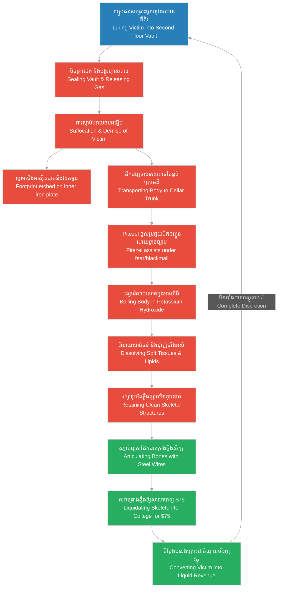

# Episode 14: ស្នាមជើងនៅលើទ្វារដែក (The Footprint in the Vault)

**Author:** ichamrong  
**Date:** 2026-06-07  
**Tags:** #hh-holmes #screenplay #episode-14 #gilded-age #chicago #emeline-cigrand #steel-vault #footprint #medical-school #historical-case-study  
**Category:** Biographies  
**Read Time:** ~15 min  

---

## 📌 មាតិកា (Table of Contents)
- [សេចក្តីផ្តើម៖ សក្ខីកម្មនៅលើទ្វារដែក (Introduction: Testimony on the Iron Door)](#0)
- [១. អន្ទាក់ដែកបិទជិត (Scene 1: The Trap Closes)](#1)
- [២. នាទីចុងក្រោយ និងស្នាមជើងអាស៊ីត (Scene 2: The Final Struggle & Footprint)](#2)
- [៣. ការរំលាយសាច់ និងការរក្សាឆ្អឹង (Scene 3: Boiling the Evidence)](#3)
- [៤. ការលក់គ្រោងឆ្អឹងទៅសាលាពេទ្យ (Scene 4: The Specimen Sale)](#4)
- [៥. យន្តការកម្ទេច និងការបំប្លែងរូបរាងជនរងគ្រោះជាចំណូល (Victim Liquidation & Specimen Supply Loops)](#5)
- [សេចក្តីសន្និដ្ឋាន (Conclusion)](#6)
- [🔗 ឯកសារទាក់ទង (Related Topics)](#7)

---

## សេចក្តីផ្តើម៖ សក្ខីកម្មនៅលើទ្វារដែក (Introduction: Testimony on the Iron Door)

រឿងភាគទី ១៤ នេះ ផ្អែកលើករណីសិក្សាប្រវត្តិសាស្ត្រពិតនៃការស៊ើបអង្កេតរបស់ប៉ូលីសក្រុង Chicago ក្នុងឆ្នាំ ១៨៩៥។ ពេលឆែកឆេរវិមាន Castle ពួកគេបានរកឃើញស្នាមជើង ឬស្នាមដៃស្រអាប់របស់ស្ត្រីម្នាក់នៅផ្នែកខាងក្នុងនៃទ្វារដែកសុវត្ថិភាពដ៏ធំធ្ងន់ (Walk-in Vault) ជាន់ទីពីរ។ ស្នាមជើងនោះត្រូវបានឆេះស្រអាប់ជាប់នឹងដែក ដោយសារតែប្រតិកម្មគីមី ឬផ្សែងអាស៊ីតអំឡុងពេលដែលកញ្ញា **Emeline Cigrand** ព្យាយាមធាក់ទ្វារដើម្បីដកដង្ហើម។ ភាគនេះបង្ហាញពីទិដ្ឋភាពឃោរឃៅនៃការសម្លាប់ Emeline ដោយការបង្ហូរហ្គាសពុល ការដឹកជញ្ជូនសាកសពទៅបន្ទប់ក្រោមដីដើម្បីស្ងោររំលាយសាច់ និងការលក់គ្រោងឆ្អឹងរបស់នាងទៅឱ្យ **សាលាពេទ្យ Hahnemann Medical College** ក្នុងតម្លៃ ៧៥ ដុល្លារ ដោយមានការចូលរួមជួយយ៉ាងស្ងៀមស្ងាត់ពី Benjamin Pitezel ក្រោមឥទ្ធិពលនៃភាពភ័យខ្លាច និងការគំរាមកំហែង។

This fourteenth episode is based on the documented historical evidence uncovered by the Chicago Police in 1895. During their inspection of the Castle's second-floor walk-in vault, investigators found a faint, chemical-etched print of a woman's foot on the inside of the heavy iron door. The print was permanently etched into the metal due to chemical reactions and soot from the gas while **Emeline Cigrand** desperately kicked the door in her final moments. This episode details the grim reality of her execution via gas suffocation, the transfer of her body to the basement cellar to strip the flesh, and the sale of her skeleton to the **Hahnemann Medical College** for $75, showing Benjamin Pitezel's forced complicity under the weight of fear and blackmail.

---

## ១. អន្ទាក់ដែកបិទជិត (Scene 1: The Trap Closes)

**ទីតាំង៖** ជាន់ទីពីរនៃអគារ Castle, ខែធ្នូ ឆ្នាំ ១៨៩២ (វេលារសៀល)  
**Location:** The Second Floor of the Castle, December 1892 (Afternoon)

**សកម្មភាព៖** Holmes (ពាក់អាវធំផ្លូវការ បង្ហាញទឹកមុខស្ងប់ស្ងាត់) ឈរក្បែរទ្វារឈើដែលបិទបាំងទ្វារដែកសុវត្ថិភាព (Walk-in Vault)។ Emeline (កាន់ឯកសារ និងសំបុត្រមួយចំនួន) ដើរចូលមកជិត។ Holmes ហុចសោឱ្យនាង និងចង្អុលបង្ហាញទៅក្នុងទូដែកងងឹតនោះ។  
**Action:** Holmes (wearing his formal coat, presenting a calm expression) stands near the wooden door concealing the heavy walk-in vault. Emeline (carrying papers and correspondence) approaches. Holmes hands her a key, pointing inside the dark steel enclosure.

<!-- [IMAGE: H.H. Holmes luring Emeline Cigrand into the second-floor steel vault, pointing to files inside. Dim corridor. (Image generation rate-limited, to be added later)] -->

*   **ហូម (Holmes)៖** "Emeline... ខ្ញុំត្រូវការឯកសារកិច្ចសន្យាចាស់ ៗ របស់ក្រុមហ៊ុន Warner Glass Bending ដែលរក្សាទុកនៅលើធ្នើរខាងក្រោមបំផុតក្នុងទូដែកនេះ។ នាងជួយចូលទៅយកវាឱ្យខ្ញុំបន្តិចបានទេ? ខ្ញុំមានការងារប្រញាប់ត្រូវផ្ទៀងផ្ទាត់។"  
    *   *"Emeline... I require the historical contract files of the Warner Glass Bending Co., which are archived on the lowest shelf inside the vault. Could you step inside and retrieve them for me? I have an urgent matter to verify."*
*   **អិមមីលីន (Emeline)៖** (ញញឹមដោយភាពកក់ក្តៅ និងរាក់ទាក់) "ចាស លោក Howard។ ខ្ញុំនឹងរកវាឱ្យលោកភ្លាម។ នៅក្នុងទូដែកនេះហាក់ដូចជាខ្សត់ពន្លឺបន្តិចហើយ។"  
    *   *(Smiling warmly and helpfully)* *"Certainly, Mr. Howard. I will secure them for you immediately. It is rather dark inside the vault today."*
*   **ហូម (Holmes)៖** "មិនអីទេ ខ្ញុំនឹងកាន់ចង្កៀងបំភ្លឺពីក្រោយនាង។ សូមចូលទៅចុះ។"  
    *   *"Do not worry, I will hold the lantern to assist your search. Please, step inside."*

**ការពិពណ៌នា៖** Emeline ដើរចូលទៅក្នុងបន្ទប់ដែកដ៏តូច និង windowless នោះ។ ភ្លាមនោះ Holmes ងាកមកក្រោយយ៉ាងលឿន ចាប់ទ្វារដែកដ៏ធ្ងន់នោះរុញបិទភ្លាម ៗ ឮសូរផាច់! គេបង្វិលសោកង់ដែកខាងក្រៅយ៉ាងណែន ឮសូរក្រាក ៗ។ ពន្លឺនៅក្នុងទូដែកត្រូវបានកាត់ផ្តាច់ទាំងស្រុង បន្សល់ទុកតែភាពងងឹតសូន្យសុង។  
**Description:** Emeline steps into the cramped, windowless steel chamber. Instantly, Holmes pivots, slamming the heavy iron door shut with a resounding bang! He rapidly spins the external brass locking wheel with sharp clicks. The light inside the vault is completely severed, plunging her into absolute darkness.

---

## ២. នាទីចុងក្រោយ និងស្នាមជើងអាស៊ីត (Scene 2: The Final Struggle & Footprint)

**ទីតាំង៖** ផ្នែកខាងក្នុង និងខាងក្រៅនៃទ្វារដែកសុវត្ថិភាព, នាទីបន្ទាប់  
**Location:** The Inside and Outside of the Steel Vault, Moments Later

**សកម្មភាព៖** អេក្រង់ត្រូវបានបែងចែកជាពីរ (Split Screen)៖ ខាងឆ្វេង បង្ហាញពី Emeline នៅក្នុងទូដែកងងឹត កំពុងភ័យស្លន់ស្លោ ស្រែកហៅ និងយកដៃវាយទ្វារដែកខ្លាំង ៗ។ ខាងស្តាំ បង្ហាញ Holmes ឈរយ៉ាងស្ងប់ស្ងាត់នៅខាងក្រៅទ្វារដែក យកម្រាមដៃវាស់លើនាឡិកាហោប៉ៅរបស់គេ។ គេលូកដៃទៅបង្វិលវ៉ាល់លង្ហិនដែលភ្ជាប់នឹងទុយោហ្គាសពុលនៅលើជញ្ជាំងយឺត ៗ។  
**Action:** A split-screen display: on the left, Emeline inside the pitch-black vault panics, screaming and pounding against the iron plate with force. On the right, Holmes stands in perfect composure outside the door, checking his pocket watch. He reaches out, slowly rotating a brass valve connected to the toxic gas line on the wall.

<!-- [IMAGE: Split screen: Emeline inside the dark vault gasping for air, Holmes outside adjusting a brass gas valve. (Image generation rate-limited, to be added later)] -->

*   **អិមមីលីន (Emeline)៖** (សម្លេងស្រែកហៅរបស់នាងឮតិច ៗ និងស្អក ៗ តាមចន្លោះទ្វារ) "Herman! Herman! បើកទ្វារឱ្យខ្ញុំផង! ទីនេះងងឹត និងថប់ដង្ហើមណាស់! នេះមិនមែនជាការលេងសើចទេ Herman! សូមជួយខ្ញុំផង!"  
    *   *(Her muffled, raspy screams filtering through the seams)* *"Herman! Herman! Open the door! It is freezing and I cannot breathe! This is no jest, Herman! Please, let me out!"*
*   **សម្លេងគីមី (Sound Effect)៖** (សម្លេងហ្គាសហូរចេញពីបំពង់លាន់ឮសូរខ្សក ៗ ក្នុងបន្ទប់ដែក) *[A quiet, persistent hissing sound as gas enters the sealed chamber.]*
*   **អិមមីលីន (Emeline)៖** (ក្អកខ្លាំង ៗ និងដកដង្ហើមញាប់ញ័រ) "អូ... មានក្លិនអ្វីប្លែកខ្លាំងណាស់... ភ្នែកខ្ញុំ... ភ្នែកខ្ញុំផ្សារណាស់... Herman... ហេតុអ្វីបានជាបងធ្វើបែបនេះដាក់ខ្ញុំ? ជួយខ្ញុំផង... ពុក... ម៉ែ..."  
    *   *(Coughing violently, gasping)* *"Oh... there is a strange odor... my eyes... they are burning... Herman... why do you do this to me? Help me... Mother... Father..."*

**ការពិពណ៌នា៖** នៅក្នុងភាពងងឹត និងការឈឺចាប់ខ្លាំង Emeline ដួលទៅលើដី នាងប្រឹងធាក់ជើងរបស់នាងទៅនឹងទ្វារដែកដើម្បីរកច្រកចេញ។ ជើងរបស់នាងដែលប្រឡាក់ដោយសារធាតុគីមី ឬផ្សែងហ្គាសដែល Holmes បង្ហូរចូល បានបន្សល់ទុកនូវស្នាមជើងស្រអាប់មួយជាប់នឹងដែកទ្វារផ្នែកខាងក្នុង។ នៅខាងក្រៅ Holmes ឈរស្ដាប់សម្លេងកោស និងធាក់ទ្វារដែលខ្សោយទៅ ៗ រហូតដល់ស្ងាត់សូន្យសុង។ គេដកដង្ហើមធំស្ងប់ស្ងាត់ រួចដើរចេញទៅការិយាល័យរបស់គេវិញដោយគ្មានអារម្មណ៍តក់ស្លុតឡើយ។  
**Description:** In the darkness and agony, Emeline collapses, desperately kicking her feet against the iron door to find a way out. Her foot, coated in chemical residue from the floor and the venting gas, leaves a faint, permanent print etched onto the inner steel plate. Outside, Holmes listens to the scratching and kicking grow faint, then cease entirely. He breathes quietly, returning to his desk with complete emotional detachment.

---

## ៣. ការរំលាយសាច់ និងការរក្សាឆ្អឹង (Scene 3: Boiling the Evidence)

**ទីតាំង៖** បន្ទប់ពិសោធន៍សម្ងាត់ក្នុងបន្ទប់ក្រោមដី, ពីរថ្ងៃក្រោយមក (វេលាយប់ជ្រៅ)  
**Location:** The Secret Laboratory in the Basement Cellar, Two Days Later (Late Night)

**សកម្មភាព៖** ឡដុតដែកកំពុងឆេះក្រហមងំ។ អាងទឹកស្ងោរខ្នាតធំមួយកំពុងពុះកញ្ជ្រោល និងជះចំហាយទឹកគីមីអាប់អួពេញបន្ទប់ក្រោមដី។ Holmes (ពាក់អាវអៀមស្បែកពណ៌ខ្មៅ និងពាក់វ៉ែនតាសុវត្ថិភាព) កំពុងប្រើដំបងឈើវែងកូរនៅក្នុងអាងស្ងោរនោះ។ Pitezel (ដើរចុះជណ្តើរមក កាន់ដបស្រា និងមានទឹកមុខស្លេកស្លាំង ញ័រជើង) សម្លឹងមើលទៅអាងស្ងោរនោះដោយក្តីព្រឺក្បាល និងភ័យខ្លាចជាខ្លាំង។  
**Action:** The iron furnace radiates a red glow. A large boiling vat bubbles, filling the cellar with chemical steam. Holmes (wearing a black leather apron and safety goggles) uses a long wooden rod to stir the contents of the vat. Pitezel (descending the stairs carrying a flask, looking pale and trembling) stares at the vat with horror.

<!-- [IMAGE: H.H. Holmes in a leather apron stirring a steaming vat in the basement. Pitezel stands on the stairs, looking terrified. (Image generation rate-limited, to be added later)] -->

*   **ផាយធាហ្សល (Pitezel)៖** "លោក Howard... តើ... តើកញ្ញា Cigrand ពិតជាស្ថិតនៅក្នុងនោះមែនទេ? ព្រះអើយ... ក្លិននេះវាសាហាវខ្លាំងណាស់។ ខ្ញុំមិនអាចបំភ្លេចទឹកមុខរបស់នាងពេលមកសម្ភាសន៍ដំបូងឡើយ។"  
    *   *(Stammering, horrified)* *"Mr. Howard... is... is Miss Cigrand truly in that vat? My God... the odor is intolerable. I cannot erase the memory of her face when she first arrived for the interview."*
*   **ហូម (Holmes)៖** (និយាយដោយទឹកមុខស្ងប់ស្ងាត់ មិនបញ្ចេញអារម្មណ៍ ដៃនៅតែបន្តកូរ) "ផាយធាហ្សល... នៅក្នុងវិទ្យាសាស្ត្រ គ្មានអ្វីដែលហៅថា Emeline Cigrand ទៀតឡើយ។ ទីនេះមានតែវត្ថុធាតុដើមសរីរាង្គដែលកំពុងត្រូវបានបំបែកធាតុគីមីប៉ុណ្ណោះ។ ប៉ូតាស្យូមអ៊ីដ្រូស៊ីត (Potassium Hydroxide) នឹងរំលាយសាច់ និងខ្លាញ់ទាំងអស់ក្នុងរយៈពេលតែប៉ុន្មានម៉ោង ដោយមិនធ្វើឱ្យខូចខាតដល់គ្រោងឆ្អឹងឡើយ។ ឆ្អឹងរបស់នាងមានទម្រង់ស្អាតល្អណាស់ ដែលស័ក្តិសមបំផុតសម្រាប់ធ្វើជាឧបករណ៍សិក្សាវេជ្ជសាស្ត្រ។"  
    *   *(Stirring the vat with neutral calm, not looking up)* *"Pitezel... in science, there is no longer an entity named Emeline Cigrand. There is only organic material undergoing chemical decomposition. The potassium hydroxide dissolves the soft tissue and lipids within hours, leaving the skeletal structure undamaged. Her bones are perfectly shaped, ideal for clinical study specimens."*
*   **ផាយធាហ្សល (Pitezel)៖** (ផឹកស្រាមួយក្អឹកធំ និយាយសំឡេងខ្សឹប) "ចុះបើសិនជាប៉ូលីសមកសួរនាំ? ឬគ្រួសារនាងនៅ Indiana មកតាមរកនាង?"  
    *   *(Whispering after a drink)* *"What if the authorities inquire? Or her family from Indiana comes searching for her?"*
*   **ហូម (Holmes)៖** "សំបុត្រដែលនាងសរសេរផ្ញើទៅឪពុកម្តាយនាង បានប្រាប់ច្បាស់ហើយថា នាងបានចាកចេញទៅរៀបការ និងធ្វើដំណើរទៅអឺរ៉ុប។ គ្មាននរណាម្នាក់នឹងមកសង្ស័យហាងថ្នាំនេះឡើយ។ ភារកិច្ចរបស់អ្នក គឺជួយខ្ញុំរៀបចំប្រអប់ក្បាល និងឆ្អឹងទាំងនេះឱ្យមានរបៀប ដើម្បីងាយស្រួលដឹកជញ្ជូន។"  
    *   *"The letter she executed and mailed to her parents confirms she departed to marry and travel to Europe. No investigator will look toward this drugstore. Your duty is to help me pack the cranium and bones cleanly for transport."*

**ការពិពណ៌នា៖** Pitezel ងក់ក្បាលយឺត ៗ ដោយភាពភ័យខ្លាច និងមិនអាចប្រកែកបាន ព្រោះគាត់បានដឹង និងចូលរួមលាក់បាំងសកម្មភាពនេះរួចទៅហើយ។ Holmes ប្រើដង្កៀបដែកស្រង់ឆ្អឹងដៃដែលត្រូវបានសម្អាតសាច់អស់យ៉ាងស្អាតចេញពីអាងគីមី មកដាក់លើថាសដែកយ៉ាងត្រជាក់ស្រេង។  
**Description:** Pitezel nods slowly, paralyzed by fear and complicity. Holmes uses iron tongs to lift a clean arm bone from the chemical bath, placing it onto a steel tray with absolute composure.

---

## ៤. ការលក់គ្រោងឆ្អឹងទៅសាលាពេទ្យ (Scene 4: The Specimen Sale)

**ទីតាំង៖** ការិយាល័យរបស់សាលាពេទ្យ Hahnemann Medical College ក្រុង Chicago, ពីរពីរដងសប្តាហ៍ក្រោយមក  
**Location:** The Office of Hahnemann Medical College in Chicago, Two Weeks Later

**សកម្មភាព៖** បន្ទប់ការិយាល័យវេជ្ជសាស្ត្រមានសៀវភៅក្រាស់ ៗ និងដបគីមីរក្សាទុកសរីរាង្គតម្រៀបគ្នា។ សាស្ត្រាចារ្យពេទ្យម្នាក់ឈ្មោះ លោកស្រី វេជ្ជបណ្ឌិត អាល់ឡែន (Dr. Allen) កំពុងពិនិត្យមើលគ្រោងឆ្អឹងស្ត្រីមួយដែលត្រូវបានដំឡើង និងតភ្ជាប់គ្នាដោយលួសដែកយ៉ាងមានរបៀបរៀបរយព្យួរនៅលើបង្គោលដែក។ Holmes (ស្លៀកពាក់អាវធំប្រណីត ពាក់មួក bowler កាន់កាបូបស្បែកផ្លូវការ) ឈរក្បែរនោះដោយស្នាមញញឹមគួរឱ្យទុកចិត្ត។  
**Action:** A medical office is filled with leather-bound books and anatomical specimens in jars. A professor of anatomy, Dr. Allen, inspects an articulated female skeleton suspended from a metal stand. Holmes (dressed in a refined coat, holding his leather satchel) stands nearby, presenting his professional smile.

<!-- [IMAGE: H.H. Holmes selling an articulated female skeleton to a medical professor in a laboratory. The professor inspects the skull. (Image generation rate-limited, to be added later)] -->

*   **វេជ្ជបណ្ឌិត អាល់ឡែន (Dr. Allen)៖** (វាស់ និងពិនិត្យឆ្អឹងក្បាល និងឆ្អឹងជំនីរដោយក្តីពេញចិត្ត) "លោកគ្រូពេទ្យ Mudgett... គ្រោងឆ្អឹងនេះត្រូវបានសម្អាត និងតភ្ជាប់លួសដែកបានល្អណាស់។ ឆ្អឹងនីមួយ ៗ ស្អាតល្អ និងគ្មានការខូចខាតឡើយ។ នេះជាសម្ភារៈសិក្សាដ៏ល្អឥតខ្ចោះសម្រាប់ថ្នាក់វះកាត់សាកសពរបស់ខ្ញុំ។ នេះជាប្រាក់ ៧៥ ដុល្លារ ដូចដែលយើងបានព្រមព្រៀង។"  
    *   *(Inspecting the skull and ribs with satisfaction)* *"Dr. Mudgett... this skeleton is beautifully cleaned and articulated. The bones are pristine and free of structural damage. It is an exemplary specimen for my anatomy classroom. Here is the seventy-five dollars as agreed."*
*   **ហូម (Holmes)៖** (ទទួលយកក្រដាសប្រាក់ ៧៥ ដុល្លារមកកាប់ក្នុងដៃ និងញញឹមយ៉ាងសមរម្យ) "អរគុណ វេជ្ជបណ្ឌិត Allen។ ទំនាក់ទំនងរបស់ខ្ញុំជាមួយបន្ទប់វះកាត់សាកសពនៅភាគខាងកើត ជួយឱ្យខ្ញុំអាចស្វែងរក «វត្ថុធាតុសិក្សា» ដែលមានគុណភាពខ្ពស់បែបនេះបាន។ ខ្ញុំរីករាយនឹងជួយសម្រួលដល់ការសិក្សាវិទ្យាសាស្ត្ររបស់សាលាពេទ្យជានិច្ច។"  
    *   *(Taking the seventy-five dollars, smiling politely)* *"Thank you, Dr. Allen. My administrative connections with eastern dissecting rooms allow me to secure study specimens of this high caliber. I am always pleased to facilitate the progress of medical science."*
*   **វេជ្ជបណ្ឌិត អាល់ឡែន (Dr. Allen)៖** "ប្រសិនបើលោកមាន «វត្ថុធាតុសិក្សា» បែបនេះទៀត សូមយកមកឱ្យខ្ញុំភ្លាម ខ្ញុំនឹងទិញទាំងអស់។ ទីផ្សារសាលាពេទ្យក្រុង Chicago តែងតែខ្វះខាតរបស់ទាំងនេះជានិច្ច។"  
    *   *"If you secure more specimens of this quality, bring them to me immediately; I will acquire them. Chicago's medical colleges suffer a chronic shortage."*
*   **ហូម (Holmes)៖** "ពិតប្រាកដណាស់ វេជ្ជបណ្ឌិត Allen។ ខ្ញុំនឹងទាក់ទងមកលោកមុនគេជានិច្ច។"  
    *   *"Undoubtedly, Dr. Allen. I will give your department priority access."*

**ការពិពណ៌នា៖** Holmes ដាក់លុយចូលក្នុងកាបូបស្បែក និងចាកចេញទៅវិញដោយសេចក្តីស្ងប់ស្ងាត់។ សម្រាប់គេ ជីវិតរបស់ Emeline Cigrand បានបញ្ចប់ដោយជោគជ័យ៖ ពីដំបូងជាលេខាធ្វើការងារការិយាល័យ ក្រោយមកជាប្រភពធនធានបិទបាំង ហើយចុងក្រោយជាគ្រោងឆ្អឹងដែលបំប្លែងជាប្រាក់ ៧៥ ដុល្លារស្របច្បាប់។ គ្មានដានភស្តុតាង គ្មានបំណុល គ្មានឧបសគ្គផ្លូវច្បាប់។  
**Description:** Holmes stores the currency in his bag and departs quietly. To him, the lifecycle of Emeline Cigrand has reached a successful, profitable completion: first as office labor, next as security cover, and finally as an anatomical specimen liquidated for seventy-five dollars. No clues, no liabilities, no friction.

---

## ៥. យន្តការកម្ទេច និងការបំប្លែងរូបរាងជនរងគ្រោះជាចំណូល (Victim Liquidation & Specimen Supply Loops)

ដ្យាក្រាមខាងក្រោមបង្ហាញពីរង្វង់យន្តការដែល H.H. Holmes ប្រើប្រាស់ដើម្បីសម្លាប់ កម្ទេចសាកសព និងបំប្លែងជនរងគ្រោះឱ្យទៅជាគ្រោងឆ្អឹងលក់យកចំណូលហិរញ្ញវត្ថុ៖

The following diagram maps the strategic loop Holmes engineered to execute, process, and liquidate his victims into financial assets:

> [!IMPORTANT]
> **🧠 យន្តការចិត្តសាស្ត្រ / Psychological Mechanism - [លំហូរនៃធនធាន និងការរៀបចំយន្តការ (Flow of Resources and Mechanics)](../keyword/flow-of-resources-and-mechanics.md):**
> * «នៅក្នុងប្លង់ទី ២ និងទី ៣ Holmes ចាត់ទុករាងកាយរបស់ Emeline Cigrand ត្រឹមតែជា «វត្ថុធាតុគីមី» ដែលត្រូវកែច្នៃប៉ុណ្ណោះ។ គេសម្លាប់នាងដោយគ្មានការស្អប់ខ្ពើម ឬក្តីខឹងសម្បារឡើយ គឺធ្វើឡើងតាមលំដាប់លំដោយបច្ចេកវិទ្យាដ៏ត្រជាក់ ដើម្បីទាញយកឆ្អឹងមកលក់ជាប្រាក់ចំណូល ៧៥ ដុល្លារ។ សម្រាប់គេ ធនធានមនុស្សទាំងអស់ត្រូវតែបំប្លែងជាតម្លៃរូបវន្ត។» (*"In Scenes 2 and 3, Holmes treats Emeline Cigrand's physical body strictly as 'chemical inputs' to be processed. He executes her without hatred or passion, proceeding via cold technical order to harvest her skeleton for seventy-five dollars of revenue. For him, all human assets must be converted into physical value."*).
> 
> **🤫 យន្តការចិត្តសាស្ត្រ / Psychological Mechanism - [បញ្ជីវាស់វែងវិន័យ (Discipline Ledger)](../keyword/discipline-ledger.md):**
> * «នៅក្នុងប្លង់ទី ៤ Holmes បង្ហាញពីវិន័យហិរញ្ញវត្ថុ និងរដ្ឋបាលដ៏ហ្មត់ចត់។ គេប្រើប្រាស់ឈ្មោះអត្តសញ្ញាណបោកប្រាស់ដើម្បីលក់គ្រោងឆ្អឹងទៅឱ្យសាលាពេទ្យ Hahnemann College ដោយរក្សាទំនាក់ទំនងនេះឱ្យនៅស្អាតស្អំផ្លូវច្បាប់ និងប្រើប្រាស់លិខិតបង្វែរដានរបស់ Emeline ដើម្បីការពារខ្លួនពីការស៊ើបអង្កេតរបស់ប៉ូលីស។» (*"In Scene 4, Holmes exercises exact financial and administrative discipline. He employs his alias to sell the skeleton to Hahnemann College, maintaining this channel as legally clean while deploying Emeline's deflection letter to insulate himself from investigation."*).

---

## សេចក្តីសន្និដ្ឋាន (Conclusion)

> **«នៅក្នុងទីផ្សារសេរី សូម្បីតែសាកសពក៏មានតម្លៃហិរញ្ញវត្ថុច្បាស់លាស់ដែរ... អ្វីដែលសំខាន់ គឺរបៀបដែលយើងសម្អាត និងរៀបចំវាឱ្យសមស្របទៅនឹងតម្រូវការរបស់អតិថិជន» — H.H. Holmes**
> 
> **“In a free market, even a corpse holds defined financial value... what matters is how cleanly we process and package it to align with the customer's specifications.” — H.H. Holmes**

រឿងភាគទី ១៤ បិទបញ្ចប់ដោយទិដ្ឋភាព Holmes រាប់ក្រដាសប្រាក់ ៧៥ ដុល្លារនៅក្នុងការិយាល័យរបស់គេ ខណៈដែល Pitezel កំពុងដុតខោអាវ និងឯកសារផ្ទាល់ខ្លួនរបស់ Emeline នៅក្នុងឡដុតជាន់ក្រោមដី។ ផ្សែងខ្មៅហុយចេញតាមបំពង់ផ្សែង រលាយបាត់ទៅក្នុងអាកាសធាតុដ៏ត្រជាក់នៃក្រុង Chicago។ នេះជាការបញ្ចប់រឿងរ៉ាវរបស់ Emeline Cigrand យ៉ាងជោគជ័យ និងជាការត្រៀមឆាកសម្រាប់ភាគទី ១៥ និងទី ១៦ ដែលនឹងបង្ហាញពីការមកដល់ និងករណីបាត់ខ្លួនរបស់កញ្ញា Emily van Tassel។

Episode 14 concludes with Holmes counting the seventy-five dollars in his office while Pitezel burns Emeline's clothing and personal items in the basement furnace. The dark smoke vents from the chimney, dissolving into Chicago's winter air. This completes the tragic cycle of Emeline Cigrand, setting the stage for Episodes 15 and 16, which will document the arrival and disappearance of Miss Emily van Tassel.

---

## 🔗 ឯកសារទាក់ទង (Related Topics)
*   **[Episode 13: ជំនួយការសម្ងាត់ (Emeline's Arrival)](ep-13-emelines-arrival.md)** — ស្គ្រីបភាគទី ១៣ ដែលបង្ហាញពីការជ្រើសរើស និងការលួងលោម Emeline Cigrand។
*   **[Episode 15: យុវតីនៅហាងលក់ថ្នាំ (Emily's Promise)](ep-15-emilys-promise.md)** — ស្គ្រីបភាគទី ១៥ ដែលបង្ហាញពីការមកដល់របស់ Emily van Tassel ក្នុងអគារ Castle។
*   **[លំហូរនៃធនធាន និងការរៀបចំយន្តការ (Flow of Resources and Mechanics)](../keyword/flow-of-resources-and-mechanics.md)** — វិធីសាស្ត្រចិត្តសាស្ត្រដែលចាត់ទុកជីវិតជាទ្រព្យសកម្មរូបវន្ត។
*   **[បញ្ជីវាស់វែងវិន័យ (Discipline Ledger)](../keyword/discipline-ledger.md)** — វិធីសាស្ត្រតាមដាន និងគ្រប់គ្រងចិត្តសាស្ត្ររបស់ Holmes។
*   **[ជីវប្រវត្តិ H.H. Holmes](../01-h-h-holmes-biography.md)** — ជីវប្រវត្តិនៃការវិវឌ្ឍជីវិត និងវិមានឃាតកម្មរបស់ Holmes។
*   **[គម្រោងរឿងភាគដ្រាម៉ា ៦៣ ភាគ](../08-holmes-drama-episode-guide.md)** — ផែនការ និងការសង្ខេបរឿងភាគទូរទស្សន៍ទាំង ៦៣ ភាគ។
