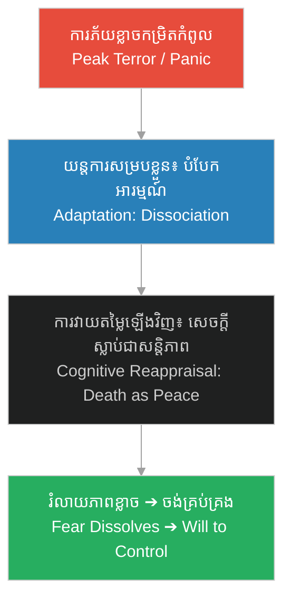

# ការផ្លាស់ប្តូរស្មារតី (Mental Shift)៖ Psychology of Herman Mudgett

**Author:** ichamrong  
**Date:** 2026-06-06  
**Tags:** #psychology #mental-shift #trauma #holmes-analysis #coping-mechanism  
**Category:** Keywords  
**Read Time:** ~4 min  

---

## 📌 មាតិកា (Table of Contents)
- [១. តើអ្វីជាការផ្លាស់ប្តូរស្មារតី? (What is a Mental Shift?)](#1)
- [២. ដំណើរការនៃការផ្លាស់ប្តូរស្មារតីរបស់ Herman (The Process of Herman's Mental Shift)](#2)
- [៣. ករណីសិក្សា៖ ការប្រឈមនឹងគ្រោងឆ្អឹង (Case Study: Confronting the Skeleton)](#3)
- [៤. ផលវិបាករយៈពេលវែង៖ ការរៀបចំខ្សែខួរក្បាលឡើងវិញ (Long-term Impact: Cognitive Rewiring)](#4)
- [ឯកសារយោង (References)](#5)

---

## ១. តើអ្វីជាការផ្លាស់ប្តូរស្មារតី? (What is a Mental Shift?)

**ការផ្លាស់ប្តូរស្មារតី (Mental Shift)** គឺជាការផ្លាស់ប្តូរយ៉ាងរហ័ស និងស៊ីជម្រៅនៃស្ថានភាពផ្លូវចិត្ត ការយល់ឃើញ ឬប្រតិកម្មអារម្មណ៍របស់បុគ្គលម្នាក់ នៅពេលដែលពួកគេជួបប្រទះនឹងភាពតានតឹងខ្លាំង ឬការគំរាមកំហែង។ នៅក្នុងចិត្តសាស្ត្រ វាតំណាងឱ្យយន្តការការពារខ្លួន ដែលខួរក្បាលផ្លាស់ប្តូររបៀបវាយតម្លៃស្ថានភាព ដើម្បីជួយឱ្យបុគ្គលនោះរស់រាន ឬសម្របខ្លួនទៅនឹងបរិយាកាសដ៏អាក្រក់។

A **Mental Shift** is a rapid and profound transition in an individual's cognitive appraisal, emotional response, or defense state when subjected to extreme stress or threat. In psychology, it represents a coping mechanism where the brain rewires its evaluation of a situation to help the individual survive or adapt to a hostile environment.

---

## ២. ដំណើរការនៃការផ្លាស់ប្តូរស្មារតីរបស់ Herman (The Process of Herman's Mental Shift)

ដំណើរការនៃការផ្លាស់ប្តូរស្មារតីរបស់ Herman Mudgett កើតឡើងតាមរយៈដំណាក់កាលដូចខាងក្រោម៖

---

## ៣. ករណីសិក្សា៖ ការប្រឈមនឹងគ្រោងឆ្អឹង (Case Study: Confronting the Skeleton)

នៅក្នុង [រឿងភាគទី ១ (Scene 2)](../episodes/ep-01-shadows-of-new-hampshire.md) ការផ្លាស់ប្តូរស្មារតីរបស់ Herman Mudgett បានកើតឡើងយ៉ាងច្បាស់៖

*   **ដំណាក់កាលភ័យខ្លាចខ្លាំង៖** ក្មេងទំនើងសាលាបានអូស Herman ចូលទៅក្នុងបន្ទប់ងងឹតមួយ ដើម្បីបង្ខំឱ្យគេប្រឈមមុខនឹងគ្រោងឆ្អឹង។ ពេលនោះ គេស្រែកយំ និងភ័យខ្លាចជាខ្លាំង ព្រោះសេចក្តីស្លាប់ និងគ្រោងឆ្អឹងតំណាងឱ្យភាពរន្ធត់សម្រាប់គេ។
*   **ដំណាក់កាលផ្លាស់ប្តូរ (The Shift)៖** នៅពេលដែលគេត្រូវបានឃុំខ្លួនក្នុងបន្ទប់ងងឹតម្នាក់ឯង សម្រែករបស់គេត្រូវបានស្ងាត់ច្រងំ។ ចិត្តរបស់គេបានឈានដល់ចំណុចបំបែក (Breaking Point)។ គេឈប់ស្រែក ហើយចាប់ផ្តើមសម្លឹងមើលគ្រោងឆ្អឹងដោយស្ងប់ស្ងាត់។
*   **ដំណាក់កាលសម្រេចចិត្ត៖** គេបានយល់ឃើញថា គ្រោងឆ្អឹង និងសេចក្តីស្លាប់ គឺស្ងៀមស្ងាត់ ត្រជាក់ និងគ្មានការឈឺចាប់។ សេចក្តីស្លាប់មិនអាចធ្វើបាបគេដូចឪពុកគេឡើយ។ ភាពភ័យខ្លាចបានរលាយបាត់ទាំងស្រុង ជំនួសមកវិញនូវការចង់ដឹងចង់ឃើញ និងចង់គ្រប់គ្រងវា។

In [Episode 1 (Scene 2)](../episodes/ep-01-shadows-of-new-hampshire.md), Herman Mudgett's mental shift is dramatized at a critical juncture:
*   **Acute Panic State:** School bullies drag Herman into a dark clinic room, forcing him to face a hanging skeleton. He screams and begs for release, overwhelmed by the terror of death.
*   **The Transition (The Shift):** Locked in the darkness alone, his screams fail to bring help. His fear reaches a breaking point, prompting a sudden psychological defense response. He stops screaming and gazes at the skeleton.
*   **New Cognitive State:** He realizes that the skeleton is peaceful, cold, and incapable of feeling pain. Death cannot inflict suffering like his father does. His terror dissolves, replaced by anatomical curiosity and a desire to master it.

---

## ៤. ផលវិបាករយៈពេលវែង៖ ការរៀបចំខ្សែខួរក្បាលឡើងវិញ (Long-term Impact: Cognitive Rewiring)

ការផ្លាស់ប្តូរស្មារតីនេះបានផ្លាស់ប្តូរជោគវាសនារបស់ Herman ទាំងស្រុង៖

1.  **ការលុបបំបាត់ភាពភ័យខ្លាចចំពោះសេចក្តីស្លាប់៖** គេឈប់ខ្លាចខ្មោច គ្រោងឆ្អឹង ឬសាកសព។ ផ្ទុយទៅវិញ គេមើលឃើញវាជាវត្ថុស្ងប់ស្ងាត់ និងសរីរាង្គដែលគ្មានអារម្មណ៍។
2.  **ការរៀបចំផែនការគ្រប់គ្រង៖** យន្តការការពារខ្លួននេះបានរុញច្រានគេឱ្យចង់រុះរើ និងសិក្សាកាយវិភាគវិទ្យា ដើម្បីកុំឱ្យខ្លួនឯងក្លាយជាជនរងគ្រោះនៃការឈឺចាប់ម្តងទៀត។ វាក៏ជាស្ពាននាំឱ្យគេក្លាយជា H.H. Holmes ដែលអាចសម្លាប់មនុស្សដោយគ្មានញញើតដៃ ឬមានវិប្បដិសារី។

This mental shift fundamentally altered Herman's life path:
1.  **Eradication of Thanatophobia (Fear of Death):** Skeletons and cadavers ceased to be objects of fear. Instead, he viewed them as peaceful, inanimate structures.
2.  **Rewired Will to Power:** To prevent himself from being a victim ever again, he sought to control life and death. This cognitive transformation laid the mental groundwork for H.H. Holmes—a serial offender capable of processing human bodies without guilt or emotional friction.

---

## ឯកសារយោង (References)

*   **Bessel van der Kolk** — *The Body Keeps the Score: Brain, Mind, and Body in the Healing of Trauma* (2014)។ វិភាគអំពីរបៀបដែលរបួសផ្លូវចិត្តខ្លាំង បង្កើតការផ្លាស់ប្តូរស្មារតី និងការរៀបចំប្រព័ន្ធសរសៃប្រសាទរបស់កុមារឡើងវិញ។
*   **Robert D. Hare** — *Without Conscience: The Disturbing World of the Psychopaths Among Us* (1993). A study on the cognitive restructuring and emotional detachment in psychopathic behavior.
