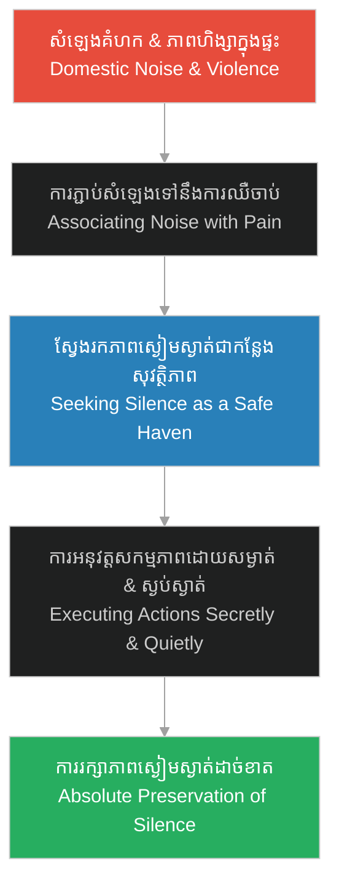

# ការរក្សាភាពស្ងៀមស្ងាត់ (Preserving the Silence)៖ Psychology of Herman Mudgett

**Author:** ichamrong  
**Date:** 2026-06-06  
**Tags:** #psychology #preserving-silence #holmes-analysis #defense-mechanism #secrecy  
**Category:** Keywords  
**Read Time:** ~4 min  

---

## 📌 មាតិកា (Table of Contents)
- [១. តើអ្វីជាការរក្សាភាពស្ងៀមស្ងាត់? (What is Preserving the Silence?)](#1)
- [២. របៀបដែលយន្តការនេះបានវិវឌ្ឍ (How this Mechanism Evolved)](#2)
- [៣. ករណីសិក្សា៖ ព្រៃស្ងប់ស្ងាត់ (Case Study: The Silent Woods)](#3)
- [៤. ផលវិបាករយៈពេលវែង៖ ពីការការពារខ្លួនទៅជាការសម្លាប់លាក់ដាន (Long-term Impact: From Defense to Silent Murder)](#4)
- [ឯកសារយោង (References)](#5)

---

## ១. តើអ្វីជាការរក្សាភាពស្ងៀមស្ងាត់? (What is Preserving the Silence?)

**ការរក្សាភាពស្ងៀមស្ងាត់ (Preserving the Silence)** នៅក្នុងចិត្តសាស្ត្រ និងចិត្តសាស្ត្រឧក្រិដ្ឋកម្ម គឺជាយន្តការទប់ទល់ (Coping Mechanism) មួយដែលបុគ្គលម្នាក់បង្កើតឡើងដើម្បីស្វែងរកសុវត្ថិភាព និងការគ្រប់គ្រង តាមរយៈការកាត់ផ្តាច់ការប្រាស្រ័យទាក់ទងខាងក្រៅ និងការរក្សារាល់សកម្មភាពរបស់ខ្លួននៅក្នុងភាពស្ងប់ស្ងាត់ និងអាថ៌កំបាំងបំផុត។ ជារឿយៗ ចំពោះកុមារដែលរងការធ្វើបាប ភាពស្ងៀមស្ងាត់គឺជាខែលការពារខ្លួនដ៏រឹងមាំពីការវាយដំ ឬការស្រែកគំហកពីសំណាក់អាណាព្យាបាល។

**Preserving the Silence** in psychology and criminal psychology is a coping mechanism where an individual seeks safety and control by cutting off external communication and maintaining all actions in absolute quietness and secrecy. For abused children, silence often serves as a sturdy shield to protect themselves from physical violence or verbal rage by caregivers.

---

## ២. របៀបដែលយន្តការនេះបានវិវឌ្ឍ (How this Mechanism Evolved)

ចំពោះកុមារដែលរស់ក្នុងបរិយាកាសគ្រួសារដែលពោរពេញដោយការស្រែកគំហក និងការប្រើអំពើហឹង្សា សំឡេងតំណាងឱ្យការគំរាមកំហែង និងការឈឺចាប់ ខណៈដែលភាពស្ងៀមស្ងាត់តំណាងឱ្យដែនជម្រកសុវត្ថិភាព។ យន្តការនេះវិវឌ្ឍតាមរយៈដំណាក់កាលដូចខាងក្រោម៖

For children raised in environments filled with yelling and domestic violence, noise represents threat and pain, whereas silence represents a safe haven. This mechanism evolves through the following stages:

---

## ៣. ករណីសិក្សា៖ ព្រៃស្ងប់ស្ងាត់ (Case Study: The Silent Woods)

នៅក្នុង [រឿងភាគទី ១ (Episode 1)](../episodes/ep-01-shadows-of-new-hampshire.md) ការរក្សាភាពស្ងៀមស្ងាត់របស់ Herman Mudgett ត្រូវបានបង្ហាញយ៉ាងច្បាស់នៅក្នុងប្លង់ទី ៣ (Scene 3)៖

1.  **ការរត់គេចពីផ្ទះទៅកាន់ព្រៃស្ងាត់៖** ដើម្បីចៀសឆ្ងាយពីការវាយដំ និងសំឡេងគំហកវិន័យតឹងរ៉ឹងរបស់ឪពុកគេ (Levi Mudgett) Herman បានរត់ទៅជ្រកកោននៅក្នុងព្រៃជ្រៅស្ងាត់ជ្រងំតែម្នាក់ឯង។
2.  **ការពិសោធន៍ដ៏ស្ងប់ស្ងាត់៖** នៅក្នុងព្រៃនោះ គេបានអនុវត្តការវះកាត់សាកសពសត្វតូចៗដោយភាពស្ងៀមស្ងាត់បំផុត។ ភាពស្ងៀមស្ងាត់ជួយឱ្យគេមានអារម្មណ៍ថាគេកំពុងគ្រប់គ្រងស្ថានការណ៍ទាំងស្រុង និងគ្មាននរណាអាចរំខាន ឬធ្វើបាបគេបានឡើយ។

In [Episode 1](../episodes/ep-01-shadows-of-new-hampshire.md), Herman Mudgett's practice of preserving silence is vividly illustrated in Scene 3:
*   **Escaping to the Silent Woods:** To escape the violent physical discipline and harsh voice of his father (Levi Mudgett), Herman retreated to the deep, silent woods alone.
*   **Quiet Experimentation:** In the solitude of the forest, he performed dissections of small animal carcasses in absolute silence. This stillness allowed him to feel in complete control, far removed from the threat of disruption or pain.

---

## ៤. ផលវិបាករយៈពេលវែង៖ ពីការការពារខ្លួនទៅជាការសម្លាប់លាក់ដាន (Long-term Impact: From Defense to Silent Murder)

យន្តការស្វែងរកភាពស្ងៀមស្ងាត់ដើម្បីការពារខ្លួនពីការឈឺចាប់ក្នុងវ័យកុមារភាព បានវិវឌ្ឍទៅជាវិធីសាស្ត្រឧក្រិដ្ឋកម្មដ៏សាហាវឃោរឃៅរបស់ H.H. Holmes នាពេលអនាគត៖

1.  **ការសាងសង់ «វិមានឃាតកម្ម» (The Murder Castle)៖** Holmes បានរៀបចំស្ថាបត្យកម្មអគាររបស់គេនៅ Chicago ឱ្យមានបន្ទប់សម្ងាត់ និងបន្ទប់ដែលធន់នឹងសំឡេង (Soundproof Chambers)។ គេបានប្រើប្រាស់ប្រព័ន្ធហ្គាសដើម្បីសម្លាប់ជនរងគ្រោះក្នុងបន្ទប់ដែលបិទជិតយ៉ាងស្ងៀមស្ងាត់បំផុត ដើម្បីកុំឱ្យសំឡេងស្រែក ឬការឈឺចាប់របស់ជនរងគ្រោះអាចឮទៅដល់ខាងក្រៅ។
2.  **ការលាក់បាំងអាថ៌កំបាំងដាច់ខាត (Absolute Secrecy)៖** គេរក្សាភាពស្ងៀមស្ងាត់អំពីជីវិតផ្ទាល់ខ្លួន និងផែនការរបស់គេយ៉ាងជិត ដោយមិនឱ្យភរិយា ឬដៃគូអាជីវកម្មណាម្នាក់ដឹងពីសកម្មភាពរបស់គេឡើយ។ ភាពស្ងៀមស្ងាត់បានក្លាយជាអាវុធដ៏មានឥទ្ធិពលបំផុតក្នុងការការពារអាណាចក្រឃាតកម្មរបស់គេ។

The childhood defense mechanism of seeking safety in silence eventually evolved into the sinister modus operandi of H.H. Holmes:
1.  **Soundproofing the "Murder Castle":** Holmes designed his Chicago building with secret compartments and soundproofed rooms. He engineered gas chambers controlled from his office to suffocate victims in absolute silence, ensuring their screams of agony never escaped to the street below.
2.  **Maintaining Absolute Secrecy:** Holmes kept a wall of silence around his personal life and financial schemes, keeping multiple wives, business associates, and assistants completely in the dark. Silence became his ultimate shield to sustain his murder enterprise.

---

## ឯកសារយោង (References)

*   **Bessel van der Kolk** — *The Body Keeps the Score: Brain, Mind, and Body in the Healing of Trauma* (2014)។ ពិពណ៌នាអំពីរបៀបដែលកុមារបង្កើតយន្តការការពារខ្លួនដូចជាការលាក់ខ្លួន និងការរក្សាភាពស្ងៀមស្ងាត់ពីអំពើហឹង្សា។
*   **Harold Schechter** — *Depraved: The Definitive True Story of H.H. Holmes, Whose Grotesque Crimes Shattered Turn-of-the-Century Chicago* (1994). Details the design of Holmes' soundproofed rooms and his meticulous secrecy.
