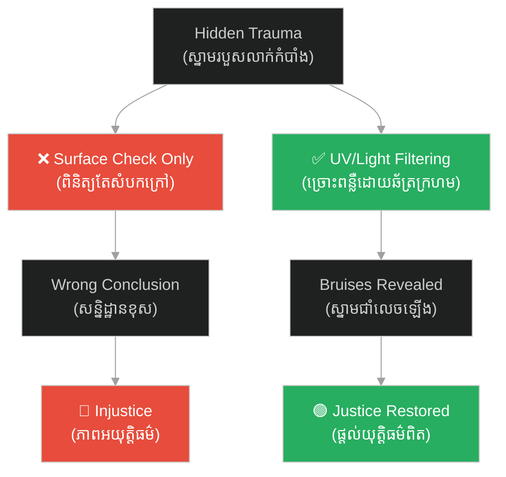

# កំណត់ត្រានៃការជម្រះភាពអយុត្តិធម៌ (Xi Yuan Ji Lu)៖ The World's First Forensic Manual

**Author:** ichamrong  
**Date:** 2026-06-11  
**Tags:** #song-ci #forensic-science #justice #history #investigation  
**Category:** Concepts  
**Read Time:** ~8 min  

---

## 📌 មាតិកា (Table of Contents)
- [អន្ទាក់ផ្លូវចិត្ត (The Trap)](#0)
- [១. បញ្ហា៖ យុត្តិធម៌ដោយគ្មានវិទ្យាសាស្ត្រ (The Issue: Justice Without Science)](#1)
- [២. ឧទាហរណ៍ជាក់ស្តែងក្នុងពិភពពិត (Real World Examples)](#2)
  - [ឧទាហរណ៍ទី ១ — ការរកស្នាមរបួសដោយពន្លឺ (Example 1: The Umbrella and Sunlight Technique)](#2-1)
  - [ឧទាហរណ៍ទី ២ — ការពិសោធន៍ជាតិពុល (Example 2: The Silver Needle Test)](#2-2)
- [៣. កត្តាជម្រុញ៖ ការប្រឆាំងនឹងអបិយជំនឿ (The Aggravator: Science vs. Superstition)](#3)
- [៤. ដំណោះស្រាយទូទៅ (The General Solution: Standardization of Protocols)](#4)
- [សេចក្តីសន្និដ្ឋាន (Conclusion)](#5)
- [ឯកសារយោង (References)](#6)
- [Related Posts](#7)

---

## អន្ទាក់ផ្លូវចិត្ត (The Trap)

តើអ្នកធ្លាប់ជឿថាការសារភាពរបស់ជនសង្ស័យ គឺជាភស្តុតាងដ៏រឹងមាំបំផុតឬទេ? 

* **ក្នុងប្រព័ន្ធយុត្តិធម៌បុរាណ** — ការស៊ើបអង្កេតច្រើនតែបញ្ចប់នៅពេលដែលជនសង្ស័យព្រមសារភាព (ទោះបីជាឆ្លងកាត់ការធ្វើទារុណកម្មក៏ដោយ)។
* **In ancient judicial systems** — Investigations often concluded when a suspect confessed (even if coerced through torture).
* **ក្នុងប្រព័ន្ធវិទ្យាសាស្ត្ររបស់ Song Ci** — ការសារភាពគ្មានតម្លៃនោះទេ លុះត្រាតែមានភស្តុតាងរាងកាយគាំទ្រទង្វើនោះ។
* **In Song Ci's scientific system** — A confession is worthless unless supported by physical, forensic evidence.

ខាងក្រោមនេះគឺជាដំណើររុករកទៅកាន់សៀវភៅ **Xi Yuan Ji Lu (Collected Cases of Injustice Rectified)** ដែលបានផ្លាស់ប្តូរប្រវត្តិសាស្ត្រពិភពលោក។
1. **បញ្ហា (The Issue)** — យុត្តិធម៌ដោយគ្មានវិទ្យាសាស្ត្រ
2. **ឧទាហរណ៍ជាក់ស្តែង (Real World Examples)** — បច្ចេកទេសស៊ើបអង្កេតដ៏អស្ចារ្យ
3. **កត្តាជម្រុញ (The Aggravator)** — ការប្រឆាំងនឹងអបិយជំនឿ
4. **ដំណោះស្រាយទូទៅ (The General Solution)** — ការធ្វើស្តង់ដារនីតិវិធី

---

## ១. បញ្ហា៖ យុត្តិធម៌ដោយគ្មានវិទ្យាសាស្ត្រ (The Issue: Justice Without Science)

មុនពេលមានសៀវភៅ Xi Yuan Ji Lu នៅឆ្នាំ ១២៤៧ ការស៊ើបអង្កេតឃាតកម្មពឹងផ្អែកយ៉ាងខ្លាំងលើការសន្មត អបិយជំនឿ និងការធ្វើទារុណកម្ម។ មន្ត្រីថ្នាក់ក្រោមច្រើនតែធ្វើរបាយការណ៍ក្លែងក្លាយ ឬធ្វេសប្រហែសក្នុងការពិនិត្យសាកសព ដែលបណ្តាលឱ្យមនុស្សស្លូតត្រង់រាប់មិនអស់ត្រូវជាប់ទោសប្រហារជីវិត ចំណែកឯឃាតកពិតប្រាកដបែរជារួចខ្លួន។ 

Prior to the publication of Xi Yuan Ji Lu in 1247, murder investigations relied heavily on assumptions, superstitions, and torture. Subordinate officials often fabricated reports or neglected careful examination of corpses, resulting in countless innocent people being sentenced to death while true murderers went free.

---

## ២. ឧទាហរណ៍ជាក់ស្តែងក្នុងពិភពពិត (Real World Examples)

Song Ci បានចងក្រងវិធីសាស្ត្រស៊ើបអង្កេតបែបវិទ្យាសាស្ត្រជាច្រើននៅក្នុងសៀវភៅរបស់គាត់ ដែលនៅតែគួរឱ្យស្ញប់ស្ញែងសូម្បីតែក្នុងពេលបច្ចុប្បន្ន។

---

### ឧទាហរណ៍ទី ១ — ការរកស្នាមរបួសដោយពន្លឺ (Example 1: The Umbrella and Sunlight Technique)

**ស្ថានភាព៖** ជនរងគ្រោះម្នាក់ត្រូវបានវាយដំរហូតដល់ស្លាប់ ប៉ុន្តែដោយសារសាកសពចាប់ផ្តើមរលួយ ស្នាមជាំខាងក្រៅមើលមិនឃើញច្បាស់ទេ ដែលធ្វើឱ្យមន្ត្រីសន្និដ្ឋានថាជាការស្លាប់ធម្មតា។

**Scenario:** A victim was beaten to death, but because the corpse had begun to decompose, external bruises were no longer clearly visible, leading officials to conclude natural causes.

* **សកម្មភាព Low EQ/Bias (ទម្លាប់/លំអៀង)៖** បិទសំណុំរឿងដោយសន្និដ្ឋានពីការស្លាប់ដោយជំងឺដោយមិនខិតខំស្វែងរកភស្តុតាងលាក់កំបាំង។
* **Low-EQ/Bias Action:** Closing the case as a natural death without digging deeper for hidden forensic evidence.

* **សកម្មភាព High EQ/Correct (ដំណោះស្រាយ)៖** Song Ci បានណែនាំឱ្យលាបទឹកខ្មេះនិងស្រាលើសាកសព រួចយកឆ័ត្រក្រណាត់ប្រេងពណ៌ក្រហមមកបាំងពីលើក្រោមពន្លឺព្រះអាទិត្យ ដើម្បីកាត់បន្ថយចំណាំងផ្លាត និងធ្វើឱ្យស្នាមរបួសដែលលាក់នៅក្រោមកស្បែកលេចចេញមក។
* **High-EQ/Correct Action:** Song Ci advised applying vinegar and liquor to the body, then using a red oil-cloth umbrella to filter sunlight, reducing glare and revealing the latent blood clots and bruises hidden beneath the skin.

* **លទ្ធផល៖** ស្នាមរបួសបង្ហាញឡើងយ៉ាងច្បាស់ ឃាតកត្រូវបានរកឃើញ។
* **The Result:** The fatal blunt force traumas were clearly visible, and the murderer was identified.

---

### ឧទាហរណ៍ទី ២ — ការពិសោធន៍ជាតិពុល (Example 2: The Silver Needle Test)

ក្នុងករណីសង្ស័យថាពុល Song Ci បានរៀបរាប់ពីការប្រើម្ជុលប្រាក់ (Silver Needle) ដោតចូលទៅក្នុងបំពង់កសាកសព។ ទោះបីជាបច្ចេកទេសនេះមិនអាចរកឃើញជាតិពុលគ្រប់ប្រភេទក៏ដោយ (វាមានប្រតិកម្មខ្លាំងជាមួយស្ពាន់ធ័រ - Sulfides ដែលច្រើនមាននៅក្នុងថ្នាំពុលសម័យនោះ) វាគឺជាការអនុវត្តជាក់ស្តែងនៃនីតិពុលវិទ្យា (Forensic Toxicology) លើកដំបូងបំផុត។

---

## ៣. កត្តាជម្រុញ៖ ការប្រឆាំងនឹងអបិយជំនឿ (The Aggravator: Science vs. Superstition)

ហេតុអ្វីបានជាអយុត្តិធម៌នៅតែបន្តកើតមាន? នៅក្នុងសង្គមបុរាណ ការរុករក ឬកាត់សាកសពត្រូវបានចាត់ទុកថាជាអំពើអសីលធម៌ និងមិនគោរពដល់ដួងព្រលឹងអ្នកស្លាប់។ Song Ci ត្រូវប្រឆាំងនឹងទំនៀមទម្លាប់សង្គមដ៏តឹងរ៉ឹងនេះ ដោយអះអាងថាអំពើអសីលធម៌ពិតប្រាកដគឺការបណ្តោយឱ្យឃាតករួចខ្លួន។

Why did injustice persist? In ancient society, tampering with or autopsying a corpse was considered deeply immoral and highly disrespectful to the dead. Song Ci had to fight this deeply ingrained societal taboo, arguing that the true immorality was allowing a murderer to go unpunished.

---

## ៤. ដំណោះស្រាយទូទៅ (The General Solution: Standardization of Protocols)

Xi Yuan Ji Lu មិនត្រឹមតែជាសៀវភៅបច្ចេកទេសប៉ុណ្ណោះទេ តែវាជាការកំណត់ស្តង់ដារច្បាប់។ វាណែនាំដំណោះស្រាយ៖
1. **ឯករាជ្យភាព (Independence)៖** ចៅក្រមត្រូវពិនិត្យសាកសពដោយផ្ទាល់ មិនត្រូវទុកចិត្តតែលើរបាយការណ៍ជំនួយការ។
2. **ការកត់ត្រាជាក់លាក់ (Documentation)៖** រាល់របួសទាំងអស់ត្រូវកត់ត្រាជាលាយលក្ខណ៍អក្សរដោយមានគំនូរបង្ហាញទីតាំង (diagrams) ច្បាស់លាស់។
3. **ការបែងចែកមូលហេតុ (Differentiation)៖** ត្រូវចេះបែងចែករវាងការចងកធ្វើអត្តឃាត និងការត្រូវបានគេច្របាច់កហើយយកទៅព្យួរដើម្បីបំបាត់ដាន (Strangulation vs. Hanging)។

---

## 🐇 ធ្លាក់ចូលក្នុងរន្ធទន្សាយ (Enter the Rabbit Hole)
ដើម្បីស្វែងយល់កាន់តែស៊ីជម្រៅអំពី Forensic Science សូមចាប់ផ្តើមដំណើររុករករបស់អ្នកដោយចុចលើតំណភ្ជាប់ខាងក្រោម៖

* 🚀 **[ចាប់ផ្តើមដំណើររុករក (Start the Journey) ➔ The Biography of Song Ci](01-song-ci-biography.md)**

---

## សេចក្តីសន្និដ្ឋាន (Conclusion)

> **«មានតែការសង្កេតផ្ទាល់ និងការវែកញែកដោយផ្អែកលើភស្តុតាងប៉ុណ្ណោះ ដែលអាចលាងជម្រះកំហុសបាន។»**
> 
> **“Only direct observation and evidence-based reasoning can wash away the wrongs.”**

សៀវភៅ Xi Yuan Ji Lu របស់ Song Ci គឺជាសក្ខីភាពបញ្ជាក់ថា វិទ្យាសាស្ត្រគឺជាពន្លឺដែលអាចឆ្លុះបញ្ចាំងការពិត សូម្បីតែនៅកន្លែងដែលងងឹតបំផុតក៏ដោយ។ ៨០០ ឆ្នាំមុនពេលដែលបស្ចិមប្រទេសមានកោសល្យវិច័យ Song Ci បានកសាងប្រព័ន្ធយុត្តិធម៌ដែលផ្តោតលើភាពត្រឹមត្រូវនៃវិទ្យាសាស្ត្រទៅហើយ។

---

## ឯករាជ្យយោង (References)

* **Song Ci** — *Collected Cases of Injustice Rectified (Xi Yuan Ji Lu)* (1247). The foundational manual of forensic science globally.

---

## Related Posts

* **[[01. The Biography of Song Ci]](01-song-ci-biography.md)** — The life of the world's first forensic scientist.
* **[[H.H. Holmes Biography]](../h-h-holmes/01-h-h-holmes-biography.md)** — A contrast in the application of anatomical science.
